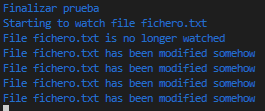
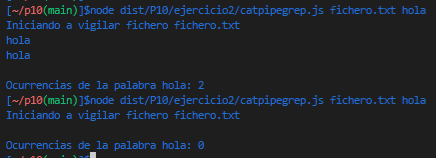
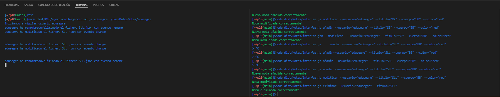
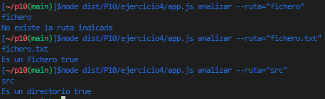
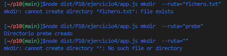
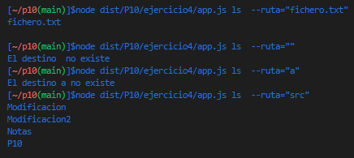
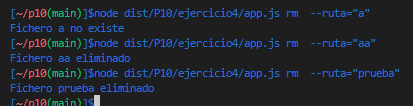
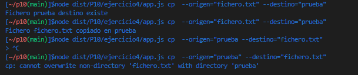

# Práctica 10

## **Índice**
 * [Tareas Previas](#dv1)
 * [Ejercicio 1](#dv2)
 * [Ejercicio 2](#dv3)
 * [Ejercicio 3](#dv4)
 * [Ejercicio 4](#dv5)
 * [Conclusión](#dv6)


<div id='dv1'/>

## Tareas Previas
> Typedoc: nos permitira realizar la documentación de nuestro código de manera automática. Para instalarlo y configurarlo pinche [aqui](https://drive.google.com/file/d/19LLLCuWg7u0TjjKz9q8ZhOXgbrKtPUme/view).

> Chai y mocha para aplicar metodología TDD en nuestro proyecto. Para instalarlo y configurarlo pinche [aqui](https://drive.google.com/file/d/1-z1oNOZP70WBDyhaaUijjHvFtqd6eAmJ/view).

> [TDD](https://en.wikipedia.org/wiki/Test-driven_development) Iremos desarrollando primero las pruebas de la funcionalidad que queremos desarrollar y luego escribiremos el código necesario para ello por ello estableceremos primero el fichero `.spec.ts` y luego el `.ts`.

> [Instanbul y Coveralls](https://coveralls.io/) añadiremos nuestro repositorio a la página de coveralls para llevar un seguimiento en la realización y cubrimiento de pruebas de nuestro código.

> [Principios Solid](https://profile.es/blog/principios-solid-desarrollo-software-calidad/) Aplicaremos los principios Solud para mantener una alta cohesión y por tanto un buen acoplamiento de software.

> [Sonar Cloud](https://sonarcloud.io/) Nos permitirá mejorar el flujo de trabajo con calidad y seguridad de codigo.

> [Github Action](https://github.com/features/actions) Usaremos las githubs Actions para aplicar 3 tareas a la hora de realizar un push en nuestro reporsitorio, pruebas con coveralls, pruebas con mocha y integración de Sonar Cloud.

> [Yargs](https://www.npmjs.com/package/yargs) Permite crear herramientas de línea de comandos interactivas analizando argumentos y generando una interfaz de usuario elegante

> [Chalk](https://www.npmjs.com/package/chalk) Permite crear herramientas de línea de comandos interactivas analizando argumentos y generando una interfaz de usuario elegante

> [Sistema de ficheros](https://nodejs.org/dist/latest-v18.x/docs/api/fs.html#synchronous-api) Api que nos permite crear y trabajar con ficheros

<div id='dv2'/>

## Ejercicio 1.

En el primer ejercicio se nos proporciona un código que importa varios metodos de `fs` . Lo primero que hace es comprobar que se han intoducido un numero correcto de argumentos. Si no se han introducido los argumentos correctos se muestra un mensaje de error y se termina el programa. En caso de que se introduzca correctamente se comprueba gracias a `access` si la ruta existe gracias a la opcion `constants.F_OK` y si no existe se muestra un mensaje de error, luego se utiliza `watch` para quedarse escuchando ese `path` en caso de que se produzca un cambio  ese metodo recibira un evento(change| rename) e indicara que se ha modificado el fichero. Acontinuación se muestra el código del ejercicio:

```typescript
import {access, constants, watch} from 'fs';

/**
 * Ejercicio proporcionano por el profesor
 */
if (process.argv.length !== 3) {
  console.log('Please, specify a file');
} else {
  const filename = process.argv[2];

  access(filename, constants.F_OK, (err) => {
    if (err) {
      console.log(`File ${filename} does not exist`);
    } else {
      console.log(`Starting to watch file ${filename}`);

      const watcher = watch(process.argv[2]);

      watcher.on('change', () => {
        console.log(`File ${filename} has been modified somehow`);
      });

      console.log(`File ${filename} is no longer watched`);
    }
  });
  console.log("Finalizar prueba");
}
```
La funcion `Access` se encarga de comporbar si el usuario tiene permisos en ese path pero en este caso como se comento anteriormente se le esta pasando `F_OK` indicando que solo se va a comprobar que la ruta existe. El objeto Constantes nos permite acceder a los valores de los permisos que nos interesan por ejemplo `constants.F_OK` que nos indica que solo se va a comprobar si la ruta existe, `constants.W_OK` que nos indica que se va a comprobar si el usuario tiene permisos de escritura en ese path y `constants.R_OK` que nos indica que se va a comprobar si el usuario tiene permisos de lectura en ese path y por ultimo `constants.X_OK` que nos indica que se va a comprobar si el usuario tiene permisos de ejecución en ese path. Luego se puede hacer combinaciones como la siguiente. He añadido despues del access un console log para verificar que mientras acces esta en la API, en la pila se hace un `console.log()`.

```typescript
access(filename, constants.R_OX| constants.W_OK, (err))
```
De esta manera se comprueba si el usuario tiene permisos de lectura y escritura en ese path.

A continuación se pide indicar la traza de ejecución de la prueba indicando el contenido de la pila, el registro de eventos API y la cola de manejadores además de lo que se va mostrando por consola.

En el primer paso entra por la pila la llamada del programa que es anónima, se comprueba la entrada de parámetros y se guarda el nombre del fichero:
```typescript
if (process.argv.length !== 3) {
  console.log('Please, specify a file');
} else {
  const filename = process.argv[2];
```
En el segundo paso la funcion access de `fs` entra en el registro de eventos API.
```typescript
  access(filename, constants.F_OK, (err) => {
```
En el tercer paso la funcion access de `fs` entra en la cola de manejadores

En el cuarto paso entra la callback de access y se muestra como output:

```typescript
  console.log(`Starting to watch file ${filename}`);
```
En el quinto paso se llama a la funcion watch:
```typescript
  const watcher = watch(process.argv[2]);
```
En el sexto paso `watcher.on` entra en el registro de eventos API mientras tanto se ve en el output:
```typescript
  console.log(`File ${filename} is no longer watched`);
```
En el septimo paso se pasa la funcion anterior para a la cola de manejadores
En el octavo paso se pasa de la cola a la pila y se muestra por el otuput:
```typescript
  console.log(`File ${filename} has been modified somehow`);
```
Y sale de la pila de llamadas.

En el noveno paso se queda la llamada de `watcher.on` hasta que el ususario cierre el proceso por la terminal `Control + c`.




<div id='dv3'/>

## Ejercicio 2.

Se nos pide un programa que devuelva el numero de ocurrencias de una palabra en un fichero. Usando cat y grep. Se nos pide implementarlo de dos formas una usando `Pipe` y otra sin usar `Pipe`. Además de programar defendisvamente para ello primero mostrare el código con `Pipe` y procederé a explicarlo.


```typescript
/**
 * @class CatNoPipeGrep
 */
export class CatPipeGrep extends EventEmitter {
  /**
   * Guardamos la informacion básica
   * @param fichero 
   * @param palabra 
   * @param argumentos 
   */
  constructor(private fichero: string, private palabra: string, private argumentos: number) {
    super();
  }

  /**
   * Método que escucha el fichero y ejecuta un cat que pasa a través de un pipe al
   * comando grep
   */
  run() {
    if (this.argumentos !== 4) {
      console.log("Error: El número de argumentos no es correcto");
      process.exit(1);
    }
    fs.access(this.fichero, fs.constants.R_OK, (err) => {
      if (err) {
        console.log(`Fichero ${this.fichero} no existe`);
        process.exit(1);
      }
      console.log(`Iniciando a vigilar fichero ${this.fichero}`);
      let data = "";
      const cat = spawn("cat", [this.fichero]);
      const grep = spawn("grep", [this.palabra]);
      cat.stdout.pipe(grep.stdin);
      grep.stdout.on("data", (chunk) => {
        data += chunk;
      });
      grep.on("close", () => {
        console.log(data);
        const regex = new RegExp(this.palabra, "g");
        console.log(`Ocurrencias de la palabra ${this.palabra}: ${data.match(regex)?.length ?? 0}`);
        this.emit("finish", "Se ha terminado la ejecución");
      });
    });
  }
}
```

Se ha incluido en una clase para seguir la porgramación orienta a objetos. La clase recibe el nombre del fichero, la palabra que se desea buscar y el número de argumentos que se le pasan para controlar errores.  Luego tenemos la función `run()` que se encarga de comprobar si el fichero existe, además comprueba si se tiene permisos de lectura en ese fichero en caso de que no se produzca ningun error por falta de permisos se hace uso de la funcion `spawn` para ejecutar los comandos cat pasandole el fichero y grep pasandole la palabra a buscar. Utilizamos `pipe` para conectar el cat con el grep y redirigir la salida cuando llegue evento data en grep vamos guardando en un string el stream que llega por stdout. Solo quedaría esperar al evento close del grep para mostrar por consola el contenido del string y el número de ocurrencias de la palabra para el cual se ha utilizado una expresión regular y la funcion `match`. Si no se esperaba a dicho evento lo más seguro es que no le hagga llegado toda la información al grep correctamente.

En vez de usar la función también se habría podido añadir los dos comandos en el `spawn`
```typescript
const cat = spawn("cat", "grep", [this.fichero]);
```

Para el ejercicio sin `pipe` se hace lo mismo pero ahora mientra el cat vaya recibiendo informacion se va enviando al grep en caso de que al cat le llegue el evento `close` se manda una señal al grep para que deje de escuchar. A continuación puede verse el código:

```typescript
 /**
 * Clase CatNoPipeGrep
 */
export class CatNoPipeGrep extends EventEmitter {
  /**
   * Guardamos información básica
   * @param fichero 
   * @param palabra 
   * @param argumentos 
   */
  constructor(private fichero: string, private palabra: string, private argumentos: number) {
    super();
  }

  /**
   * Método que escucha el fichero y ejecuta un cat pero usamos el write en vez del pipe
   */
  run() {
    if (this.argumentos !== 4) {
      console.log("Error: El número de argumentos no es correcto");
      process.exit(1);
    }
    fs.access(this.fichero, fs.constants.R_OK, (err) => {
      if (err) {
        console.log(`Fichero ${this.fichero} no existe`);
        process.exit(1);
      }
      console.log(`Iniciando a vigilar fichero ${this.fichero}`);
      let data = "";
      const cat = spawn("cat", [this.fichero]);
      const grep = spawn("grep", [this.palabra]);
      cat.stdout.on("data", (chunk) => {
        grep.stdin.write(chunk);
      });
      cat.on("close", () => {
        grep.stdin.end();
      });
      grep.stdout.on("data", (chunk) => {
        data += chunk;
      });
      grep.on("close", () => {
        console.log(data);
        const regex = new RegExp(this.palabra, "g");
        console.log(`Ocurrencias de la palabra ${this.palabra}: ${data.match(regex)?.length ?? 0}`);
        this.emit("finish", "Se ha terminado la ejecución");
      });
    });
  }
}
```

Si se introduce un fichero que no existe se indica por consola. Algo que no se ha comentado es que ambas clases herendan de EventEmitter. Esto nos permite emitir eventos y escucharlos. Gracias a esto se pueden generar pruebas similares a la siguientes por ello el `fichero.txt` se ha subido al Github. Cuando ambos finalizan emiten un evento `finish` que se usa en las pruebas para verificar que los mensajes coinciden.

```typescript
describe('Pruebas de la clase CatNoPipeGrep', () => {
    it('Se puede instanciar un objeto', () => {
        const ejecucion = new CatNoPipeGrep("fichero.txt", "BEBE", 4);
        expect(ejecucion).instanceOf(CatNoPipeGrep);
    });
    it('Método que escucha el fichero y ejecuta un cat que pasa a través de un pipe al comando grep', () => {
        const ejecucion = new CatNoPipeGrep("fichero.txt", "BEBE", 4);
        ejecucion.run();
        ejecucion.on("finish", (msg) => {
            expect(msg).to.be.equal("Se ha terminado la ejecución");
    });
    });
});

describe('Pruebas de la clase CatPipeGrep', () => {
    it('Se puede instanciar un objeto', () => {
        const ejecucion = new CatPipeGrep("fichero.txt", "BEBE", 4);
        expect(ejecucion).instanceOf(CatPipeGrep);
    });
    it('Método que escucha el fichero y ejecuta un cat que pasa a través de un pipe al comando grep', () => {
        const ejecucion = new CatPipeGrep("fichero.txt", "BEBE", 4);
        ejecucion.run();
        ejecucion.on("finish", (msg) => {
            expect(msg).to.be.equal("Se ha terminado la ejecución");
    });
    });
});
```
Ejemplo uso de este ejercicio:



<div id='dv4'/>

## Ejercicio 3.

Para la implementacion de este ejercicio se nos pide apoyarnos en la clase `Notas` de la práctica anterior. Para ello se ha creado la clase `Vigilar` que en el contructor recibe lo que se indica en el enunciado es decir el nombre y la ruta además de un numero de argumentos para comprobar posibles errores. El metodo `run` se encarga de escuchar el fichero para ello se comprueba con `access` que se puede acceder a la ruta es decir que existe por taanto ese usuario tiene en la base de datos Notas. Luego se utiliza la funcion `watch` para que escuhe en la rutas indicada y nos basaremos en los tipos de evento emitidos para mostrar por consola que se ha modificado el fichero o que se ha eliminado. Para responder a las preguntas del tipo de evento que se emite dependiendo de la accion del usuario adjunto captura de pantalla.




Puede verse que cuando se añade una nueva nota se emite ebento rename y change, si se modifica se emiten dos change y se elimina se emite un evento rename.

```typescript
/**
 * @class Vigilar
 */
export class Vigilar {
  /**
   * Recibimos la informacion del ususario y la ruta además de la cantidad
   * de argumentos que se han pasado para controlar errores
   * @param usuario 
   * @param ruta 
   * @param argumentos 
   */
  constructor(private usuario: string, private ruta:string, private argumentos: number) {}

  /**
   * Método que escucha al usuario indicado en la ruta que se pasa al constructor
   */
  run() {
    if (this.argumentos !== 4) {
      console.log("Error: El número de argumentos no es correcto");
      process.exit(1);
    }
    fs.access(this.ruta, fs.constants.F_OK, (err) => {
      if (err) {
        console.log(`Usuario ${this.usuario} no existe o ruta incorrecta`);
        process.exit(1);
      }
      console.log(`Iniciando a vigilar usuario ${this.usuario}`);
      fs.watch(this.ruta, (eventType, filename) => {
        if (eventType === "change") {
          console.log(`${this.usuario} ha modificado el fichero ${filename} con evento ${eventType}`);
        } else if (eventType === "rename") {
          console.log(`${this.usuario} ha renombrado/eliminado el fichero ${filename} con evento ${eventType}`);
        }
      });
    });
  }
}
```

Para mostrar el contenido del fichero se utiliza el comando `cat` con el uso de la función `spawn`. Dentro de watch cuando se emita el evento correspondiente. Para vigilar más de un path  se podría hacer uso de `chokidar` o [mikeal](https://github.com/mikeal/watch) que se basa en el modulo `fs`. Podemos ver el siguiente ejemplo donde a través de expresiones regulares se puede estar escuchando más de un path.


```typescript
chokidar.watch(paths, [options])

const  observador  =  chokidar . watch ( 'file, dir, glob, or array' ,  { 
  ignorado : / ( ^ | [ \/ \\ ] ) \. . / ,  // ignore los archivos de puntos 
  persistentes : true 
} ) ;
```

<div id='dv5'/>

## Ejercicio 4

Se nos pide hacer de wrapper de los distintos comando de linux en concreto se nos pide implementar varios comandos. Para la entrada de comando se ha hecho uso de yargs. Ya que permite realizar una correcta entrada de parámetros además de una sección help que muestra como se van a utilizar dichos comandos.

```typescript
/**
 * Comando que comprueba si es un directorio o un fichero
 */
yargs.command({
  command: 'analizar',
  describe: 'Comprueba si es un directorio o un fichero',
  builder: {
    ruta: {
      describe: 'Ruta del fichero o directorio',
      demandOption: true,
      type: 'string',
    },
  },
  handler(argv) {
    if (typeof argv.ruta === 'string') {
      comandos.analizar(argv.ruta);
    } else {
      console.log(chalk.red('Argument invalid'));
    }
  },
});
```
Metodos dentro de la clase Comandos:

```typescript
  /**
   * Comando que comprueba si es un directorio o un fichero primero debemos saber
   * 
   * @param ruta 
   */
  analizar(ruta: string) {
    fs.access(ruta, fs.constants.F_OK, (err) => {
      console.log(ruta);
      if (err) {
        console.log("Hay un error con la ruta indicada");
        process.exit(1);
      } else {
        fs.stat(ruta, (err, stats) => {
          if ( !err ) {
            if (stats.isFile()) {
              console.log('Es un fichero ' + stats.isFile());
            } else if (stats.isDirectory()) {
              console.log('Es un directorio ' + stats.isDirectory());
            }
          } else {
            console.log("Error");
            process.exit(1);
          } 
        });
      }
    });
  }
```

En este primer comando `analizar` se nos pide implementar que dado una ruta indicar si es un directorio o un fichero. Para ello se podría usar el `spawn` usando como comando ls y con la opción -ld comprobar el el `data[0]` si hay una `d` o también se puede usar `stat` que pasándole una ruta gracias a `isFile` nos indicare si es un fichero, `isDirectory` que nos indica si es un directorio. Antes de eso se comprueba que la ruta es accesible y si no se muestra un error.

>Ejemplo de uso:



```typescript	
/**
 * Crea un directorio en la ruta indicada
 */
yargs.command({
  command: 'mkdir',
  describe: 'Crea un directorio en una ruta',
  builder: {
    ruta: {
      describe: 'Ruta de destino',
      demandOption: true,
      type: 'string',
    },
  },
  handler(argv) {
    if (typeof argv.ruta === 'string') {
      comandos.mkdir(argv.ruta);
    } else {
      console.log(chalk.red('Argument invalid'));
    }
  },
});

```

```typescript
  /**
   * Crea un directorio en la ruta indicada comrpobando
   * que el susuario
   * @param ruta 
   */
  mkdir(ruta: string) {
    const mkdir = spawn('mkdir', [ruta]);
    mkdir.stderr.on("data", (chunk) => {
      console.log(chunk.toString());
      process.exit(1);
    });
    mkdir.on("close", () => {
      console.log(`Directorio ${ruta} creado`);
    });
  }
```

Para el comando `mkdir` se hace uso del spawn y además se usar `stderr` para que nos muestre el error que se produce en caso de que no se pueda crear el directorio. Solo quedaría esperar al evento `close` e impirmir que se ha creado correctamente.

>Ejemplo de uso:



```typescript
  /**
   * Muestra los ficheros de un directorio con los
   * permisos de lectura y ejecucion
   * @param ruta 
   */
  ls(ruta: string) {
    fs.access(ruta, fs.constants.R_OK, (err) => {
      if (err) {
        console.log(`El destino ${ruta} no existe`);
        process.exit(1);
      }
      const ls = spawn('ls', [ruta]);
      let data = "";
      ls.stdout.on("data", (chunk) => {
        data += chunk;
      });
      ls.on("close", () => {
        if (data.length > 0) {
          console.log(data);
        } else {
          console.log(`No hay contenido en ${ruta}`);
        }
      });
    });
  }
```
 
Para el comando `ls` se comprueba que hay permisos de lectura en la ruta con `R_OK` en caso de que si se usa `spawn` y lo unico que quedaría es mirar si data tiene algun contenido gracias a `data.lenght > 0` y si no se muestra que no había contenido.

>Ejemplo de uso:



```typescript
  /**
   * Muestra el contenido de un fichero con 
   * solo permiso de lectura
   * @param ruta 
   */
  cat(ruta: string) {
    fs.access(ruta, fs.constants.R_OK, (err) => {
      if (err) {
        console.log(`Fichero ${ruta} no existe`);
        process.exit(1);
      }
      fs.stat(ruta, (err, stats) => {
        if (!err) {
          if (stats.isFile()) {
            const cat = spawn('cat', [ruta]);
            let data = "";
            cat.stdout.on("data", (chunk) => {
              data += chunk;
            });
            cat.on("close", () => {
              if (data.length > 0) {
                console.log(data);
              } else {
                console.log(`El fichero esta vacio`);
              }
            });
          } else {
            console.log(`${ruta} no es un fichero`);
          }
        } else {
          console.log("Error");
        }
      });
    });
  }
```

Para el comando `cat` se comprueba que hay permisos de lectura en caso de que si se comprueba que se este haciendo uso en un fichero gracias a `stat` por último se repite lo mismo que el comando ls.


```typescript
  /**
   * Eliminar un fichero o directorio de la ruta indicada
   * con los permisos correspondientes
   * @param ruta 
   */
  rm(ruta: string) {
    fs.access(ruta, fs.constants.F_OK, (err) => {
      if (err) {
        console.log(`Fichero ${ruta} no existe`);
        process.exit(1);
      }
      const rm = spawn('rm', ["-rf", ruta]);

      rm.stderr.on("data", (chunk) => {
        console.log(chunk.toString());
        process.exit(1);
      });

      rm.on("close", () => {
        console.log(`Fichero ${ruta} eliminado`);
      });
    });
  }
```

Para el comando `rm` se comprueba que la ruta que se desea eliminar exista en caso de que si se ejecuta el comando rm con `spawn` pasándole las opciones -rf para que sea recursivo y forzado en caso de que sean directorio y que no solo borre el contenido superior. Se ha añadido un `stderr` para controlar posible fallos. Por último se añade un evento `close` para que se imprima que se ha eliminado correctamente.

>Ejemplo de uso:



```typescript
  /**
   * Comando cp para copiar/mover ficheros/directorios
   * @param ruta puede ser un directorio o fichero
   * @param destino solo un directorio
   */
  cp(origen: string, destino: string) {
    fs.access(origen, fs.constants.F_OK, (err) => {
      if (err) {
        console.log(`Fichero ${origen} origen no existe`);
        process.exit(1);
      }
      fs.access(destino, fs.constants.F_OK, (err) => {
        if (err) {
          console.log(`Fichero ${destino} destino existe`);
          return;
        }
        const cp = spawn('cp', ["-r", origen, destino]);

        cp.stderr.on("data", (chunk) => {
          console.log(chunk.toString());
          process.exit(1);
        });

        cp.on("close", () => {
          console.log(`Fichero ${origen} copiado en ${destino}`);
        });
      });
    });
  }
```

Para el comando `cp` primero se compruba que se tenga acceso, es decir que exista la ruta de origen y a la de destino se utiliza `spawn` con la opción -r para que haga una copia recursiva por si hay varios niveles. Tambien se hace uso de `stderr` para controlar posibles errores. Cuando se emita el evento `close` se indica que se ha copiado correctamente el fichero. 

>Ejemplo de uso:



<div id='dv5'/>

## Conclusión

Ha sido muy interesante el uso de la funciones `spawn`, `pipe`, `access` y demás para trabajar conn comando o vigilar rutas además de co mporbar permisos concretos de un usuario en una ruta espcifica. Además trabajar con la función `watch` haciendo uso de los eventos que nos proporcionas para saber que es lo que ha ocurrido en una ruta y en cosecuencia realizar una u otra acción. Otra funcion interesante de usar fue `stderr` para mostrar posibles error al ejecuar un copmando en un `path`. 