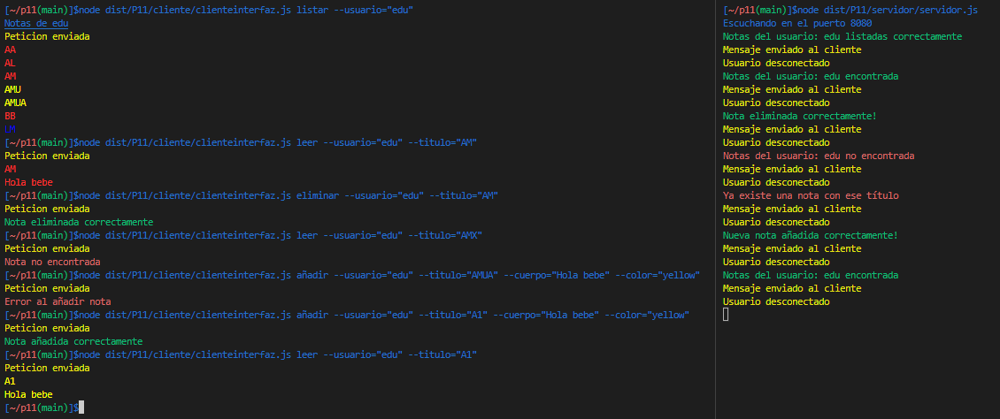

# Práctica 11 - Cliente y servidor para una aplicación de procesamiento de notas de texto

## **Índice**
 * [Tareas Previas](#dv1)
 * [Justificación del diseño](#dv2)
 * [Conclusión](#dv3)


<div id='dv1'/>

## Tareas Previas
> Typedoc: nos permitira realizar la documentación de nuestro código de manera automática. Para instalarlo y configurarlo pinche [aqui](https://drive.google.com/file/d/19LLLCuWg7u0TjjKz9q8ZhOXgbrKtPUme/view).

> Chai y mocha para aplicar metodología TDD en nuestro proyecto. Para instalarlo y configurarlo pinche [aqui](https://drive.google.com/file/d/1-z1oNOZP70WBDyhaaUijjHvFtqd6eAmJ/view).

> [TDD](https://en.wikipedia.org/wiki/Test-driven_development) Iremos desarrollando primero las pruebas de la funcionalidad que queremos desarrollar y luego escribiremos el código necesario para ello por ello estableceremos primero el fichero `.spec.ts` y luego el `.ts`.

> [Instanbul y Coveralls](https://coveralls.io/) añadiremos nuestro repositorio a la página de coveralls para llevar un seguimiento en la realización y cubrimiento de pruebas de nuestro código.

> [Principios Solid](https://profile.es/blog/principios-solid-desarrollo-software-calidad/) Aplicaremos los principios Solud para mantener una alta cohesión y por tanto un buen acoplamiento de software.

> [Sonar Cloud](https://sonarcloud.io/) Nos permitirá mejorar el flujo de trabajo con calidad y seguridad de codigo.

> [Github Action](https://github.com/features/actions) Usaremos las githubs Actions para aplicar 3 tareas a la hora de realizar un push en nuestro reporsitorio, pruebas con coveralls, pruebas con mocha y integración de Sonar Cloud.

> [Yargs](https://www.npmjs.com/package/yargs) Permite crear herramientas de línea de comandos interactivas analizando argumentos y generando una interfaz de usuario elegante

> [Chalk](https://www.npmjs.com/package/chalk) Permite crear herramientas de línea de comandos interactivas analizando argumentos y generando una interfaz de usuario elegante

> [Sistema de ficheros](https://nodejs.org/dist/latest-v18.x/docs/api/fs.html#synchronous-api) Api que nos permite crear y trabajar con ficheros

<div id='dv2'/>

## Justificación del diseño

Se nos pide implementar un cliente servidor para una aplicación de procesamiento de notas de texto. Para ello dentro de la estructura ./src tendremos /P11 y dentro de estas habrá una carpeta /cliente y otra /servidor donde estarán implementando las respectivas clases para el cliente y el servidor. Para ello lo primero será crear los posibles tipos de peticiones `RequestType` y `ResponseType` .


```typescript
/**
 * Peticion del cliente
 */
export type RequestType = {
    tipo: 'add' | 'update' | 'remove' | 'read' | 'list';
    usuario: string;
    titulo?: string;
    cuerpo?: string;
    color?: typeColor;
  }

/**
* Respuesta del servidor
*/
export type ResponseType = {
    tipo: 'add' | 'update' | 'remove' | 'read' | 'list';
    success: boolean;
    notes?: Nota[];
}

```
`Request` sera la peticion del cliente al servidor para ello tendremos que mandarle el tipo por ejemplo si queremos añadir una nota en la base de datos , eliminarla, leer , actualizarla o listar las nota de los usuarios teniendo en cuenta la clase `ManejadorNotas`. Por ello si queremos contemplar todos los casos los campos titulo cuerpo y color serán opcionales.

`Reponse` será la respuesta del servidor al cliente una vez hecha las operaciones correspondientes en la base de datos para ello tendremos que mandarle el tipo de peticion y un booleano que nos indica si la operación se realizó correctamente y las notas en caso de que se quiera listar o leer notas. Para ello notes sera un array de Notas, es decir objetos de la clase Notas desarrollada en la clase anterior.


Una cez creado la anterior procederemos a clear la clase clienteinterfaz para la cual se ha hecho uso de yargs y chalck para trabajar con los parámetros de entrada y los mensajes con colores para la salida por consola.
```typescript
/**
 * Cliente
 */
const cliente = new Cliente(8080);


/**
 * Comando añadir que permite añadir una nota a un usuario
 * especificando el titulo0, el cuerpo y el color
 */
yargs.command({
  command: 'añadir',
  describe: 'Añadir una nota',
  builder: {
    usuario: {
      describe: 'Nombre del usuario',
      demandOption: true,
      type: 'string',
    },
    titulo: {
      describe: 'Titulo de la nota',
      demandOption: true,
      type: 'string',
    },
    cuerpo: {
      describe: 'Cuerpo de la Nota',
      demandOption: true,
      type: 'string',
    },
    color: {
      describe: "Color de la nota",
      demandOption: true,
      type: "string",
    },
  },
  handler(argv) {
    if (typeof argv.usuario === 'string' && typeof argv.titulo === 'string' &&
    typeof argv.cuerpo === 'string' && typeof argv.color === "string") {
      if (argv.color == 'red' || argv.color == 'green' || argv.color == 'blue' || argv.color == 'yellow' ) {
        cliente.run({tipo: 'add', usuario: argv.usuario, titulo: argv.titulo, cuerpo: argv.cuerpo, color: argv.color});
      } else {
        console.log(chalk.red('Color no valido'));
      }
    } else {
      console.log(chalk.red('Argument invalid'));
    }
  },
});

/**
 * Comando elimnar que permite eliminar una nota
 * especificando el usuario y el titulo
 */
yargs.command({
  command: 'eliminar',
  describe: 'Eliminar una nota',
  builder: {
    usuario: {
      describe: 'Nombre del usuario',
      demandOption: true,
      type: 'string',
    },
    titulo: {
      describe: 'Titulo de la nota',
      demandOption: true,
      type: 'string',
    },
  },
  handler(argv) {
    if (typeof argv.usuario === 'string' && typeof argv.titulo === 'string') {
      cliente.run({tipo: 'remove', usuario: argv.usuario, titulo: argv.titulo});
    } else {
      console.log(chalk.red('Argument invalid'));
    }
  },
});

/**
 * Comando modificar que permite modificar una nota a un usuario
 * especificando el titulo0, el cuerpo y el color
 */
yargs.command({
  command: 'modificar',
  describe: 'Modificar una nota',
  builder: {
    usuario: {
      describe: 'Nombre del usuario',
      demandOption: true,
      type: 'string',
    },
    titulo: {
      describe: 'Titulo de la nota',
      demandOption: true,
      type: 'string',
    },
    cuerpo: {
      describe: 'Cuerpo de la Nota',
      demandOption: true,
      type: 'string',
    },
    color: {
      describe: "Color de la nota",
      demandOption: true,
      type: "string",
    },
  },
  handler(argv) {
    if (typeof argv.usuario === 'string' && typeof argv.titulo === 'string' &&
    typeof argv.cuerpo === 'string' && typeof argv.color === "string") {
      if (argv.color == 'red' || argv.color == 'green' || argv.color == 'blue' || argv.color == 'yellow' ) {
        cliente.run({tipo: 'update', usuario: argv.usuario, titulo: argv.titulo, cuerpo: argv.cuerpo, color: argv.color});
      }
    } else {
      console.log(chalk.red('Argumento no contemplado'));
    }
  },
});

/**
 * Comando listar que permite listar las notas de un usuario
 */
yargs.command({
  command: 'listar',
  describe: 'Listar todas las notas',
  builder: {
    usuario: {
      describe: 'Nombre del usuario',
      demandOption: true,
      type: 'string',
    },
  },
  handler(argv) {
    if (typeof argv.usuario === 'string') {
      console.log(chalk.underline('Notas de ' + argv.usuario));
      cliente.run({tipo: 'list', usuario: argv.usuario});
    } else {
      console.log(chalk.red('Argumento no contemplado'));
    }
  },
});

/**
 * Comando leer que permite leer el contenido de una nota
 */
yargs.command({
  command: 'leer',
  describe: 'Leer una nota',
  builder: {
    usuario: {
      describe: 'Nombre del usuario',
      demandOption: true,
      type: 'string',
    },
    titulo: {
      describe: 'Titulo de la nota',
      demandOption: true,
      type: 'string',
    },
  },
  handler(argv) {
    if (typeof argv.usuario === 'string' && typeof argv.titulo === 'string') {
      cliente.run({tipo: 'read', usuario: argv.usuario, titulo: argv.titulo});
    } else {
      console.log(chalk.red('Argumento no contemplado'));
    }
  },
});

// Para poder procesar los argumentos pasados desde línea de comandos a la aplicación 
// es importante que el punto de entrada o programa principal incluya la siguiente sentencia
yargs.parse();
```
Esta clase se ha desarrollado de manera similar a `interfaz.ts` de la anterior práctica pero esta vez se crea en el handler un objeto tipo requestType que se envia al metodo run de la clase cliente. Dicha clase se ha estructurado de la siguiente forma:

```typescript
/**
 * @class Cliente
 */
export class Cliente {
  /**
	* Almacena el puerto del servidor
	* @param puerto 
	*/
  constructor(private puerto: number) {}

  /**
	 * Metodo que se encarga de enviar una peticion al servidor
	 * @param request 
	 */
  public run(request: RequestType) {
    const cliente = net.connect({port: this.puerto});
    const emitter = new MessageEventEmitterClient(cliente);

    emitter.on('response', (response: ResponseType) => {
      switch (response.tipo) {
        case 'add':
          if (response.success) {
            console.log(chalk.green("Nota añadida correctamente"));
          } else {
            console.log(chalk.red("Error al añadir nota"));
          }
          break;
        case 'update':
          if (response.success) {
            console.log(chalk.green("Nota modificada correctamente"));
          } else {
            console.log(chalk.red("Error al modificar nota"));
          }
          break;
        case 'remove':
          if (response.success) {
            console.log(chalk.green("Nota eliminada correctamente"));
          } else {
            console.log(chalk.red("Nota no encontrada"));
          }
          break;
        case 'read':
          if (response.success) {
            response.notes?.forEach((note: Nota) => {
              console.log(chalk.keyword(note.color)(note.titulo));
              console.log(chalk.keyword(note.color)(note.cuerpo));
            });
          } else {
            console.log(chalk.red("Nota no encontrada"));
          }
          break;
        case 'list':
          if (response.success) {
            response.notes?.forEach((note: Nota) => {
              console.log(chalk.keyword(note.color)(note.titulo));
            });
          } else {
            console.log(chalk.red("Error al listar las notas"));
          }
          break;
        default:
          console.log(chalk.red('Error: tipo de peticion no soportado'));
          break;
      }
    });
    cliente.write(JSON.stringify(request) + "\n", (err) => {
      if (err) {
        console.log(chalk.red(err));
      }
      console.log(chalk.yellow('Peticion enviada'));
    });
  }
}
```
Cosas a destacar sobre esta clase serían que se crea un socket a traves del puerto pasado en el constructor y luego se crear una variable emmiter
que no es más que una clase creada para emitir eventos pertsonalizados ya que dicha clase herada de la clase EventEmitter.Más adelante se explicará mejor su funcionamiento.

Cuando al objeto emmiter le llega el evento response es porque el servidor ha terminado de enviar el mensaje acontinuacion se procede a procesar la respuesta. Dependiendo del tipo de peticion y el valor del booleano se indicará en la consola del cliente que la operación se ha ejecutado correctamente o no en el servidor. Antes de lo anterior tenemos que enviar el mensaje `request` al servidor para ello haremos uso de la función `write` pasandole por parámetro JSON.stringify(request) + "\n" que es un string que contiene el objeto request en formato JSON y un salto de linea para indicar el final del mensaje por si no llega de una que es lo mas normal.

La clase `MessageEventEmitterClient` se ha estructurado de la siguiente forma:

```typescript
/**
 * Recibimos  la informacion del servidor
 */
export class MessageEventEmitterClient extends EventEmitter {
  constructor(connection: EventEmitter) {
    super();

    let wholedata = '';
    connection.on('data', (chunk) => {
      wholedata += chunk;

      let messageLimit: number = wholedata.indexOf('\n');

      while (messageLimit !== -1) {
        const message: ResponseType = JSON.parse(wholedata.substring(0, messageLimit));
        wholedata = wholedata.substring(messageLimit + 1);
        this.emit('response', message);
        messageLimit = wholedata.indexOf('\n');
      }
    });
  }
}
```
Lo unico que estamnos haciiendo aqui es que cuando el servidor ejecute un `write` se emitira un evento `data` en el socket y se procedera a procesar la informacion que se le ha enviado para ello haremos uso del /n en caso de que el mensaje llegue a trozos por ultimo cuando detectamos el `/n` procedemos e emitir el evento response que es el cual se captura en la clase `Cliente`.


Respecto a la clase Servidor se ha seguido la misma lógica para crear el evento personalizado pero esta vez creando un objeto `RequestType` por ello solo procedere al mostrar el código

```typescript
/**
 * Recibimos la informacion del cliente
 */
export class MessageEventEmitterServer extends EventEmitter {
  constructor(connection: EventEmitter) {
    super();

    let wholeData = '';
    connection.on('data', (dataChunk) => {
      wholeData += dataChunk;

      let messageLimit = wholeData.indexOf('\n');
      while (messageLimit !== -1) {
        const message: RequestType = JSON.parse(wholeData.substring(0, messageLimit));
        wholeData = wholeData.substring(messageLimit + 1);
        this.emit('request', message);
        messageLimit = wholeData.indexOf('\n');
      }
    });
  }
}
```

Luego procedemos a crear la clase servidor:

```typescript
/**
 * @class Servidor
 */
export class Servidor {
  private manejar = new ManejarNotas();
  constructor(private puerto: number) {}

  public run() {
    let response: ResponseType;
    const server = net.createServer((connection) => {
      const emitter = new MessageEventEmitterServer(connection);

      emitter.on("request", (request: RequestType) => {
        switch (request.tipo) {
          case "add":
            if (request.titulo !== undefined && request.cuerpo !== undefined && request.color !== undefined) {
              const salida = this.manejar.añadirNota(request.usuario, request.titulo, request.cuerpo, request.color);
              response = {tipo: "add", success: salida};
            }
            break;
          case "update":
            if (request.titulo !== undefined && request.cuerpo !== undefined && request.color !== undefined) {
              const salida = this.manejar.modificarNota(request.usuario, request.titulo, request.cuerpo, request.color);
              response = {tipo: "update", success: salida};
            }
            break;
          case "remove":
            if (request.titulo !== undefined) {
              const salida = this.manejar.eliminarNota(request.usuario, request.titulo);
              response = {tipo: "remove", success: salida};
            }
            break;
          case "read":
            if (request.titulo !== undefined) {
              const nota = this.manejar.leerNota(request.usuario, request.titulo);
              if (nota) {
                response = {tipo: "read", success: true, notes: [nota]};
              } else {
                response = {tipo: "read", success: false};
              }
            }
            break;
          case "list":
            const notas = this.manejar.listarNotas(request.usuario);
            if (notas) {
              response = {tipo: "list", success: true, notes: notas};
            } else {
              response = {tipo: "list", success: false};
            }
            break;
          default:
            console.log("Error: Unknown request tipo");
            break;
        }

        connection.write(JSON.stringify(response) + "\n", (err) => {
          if (err) {
            console.log(err);
          }
          console.log("Mensaje enviado al cliente");
          connection.end();
        });

        connection.on("close", () => {
          console.log("Usuario desconectado");
        });
      });
    });
    server.listen(this.puerto, () => {
      console.log(`Escuchando en el puerto ${this.puerto}`);
    });
  }
}


const servidor = new Servidor(8080);
servidor.run();

```

Esta clase al igual que el cliente abre el socket por el puerto que se indica en el constructor y emmitter que hemos explicado anteriormente. Cuando emitter recibe el evento personalizado `request` es porque se ha terminado de procesar toda la peticion del cliente gracias al /n a continuacion destructuramos ese obejto request y se procede a realizar la accion que se indica en el tipo de peticion. En caso de añadir se comprueba que los campos correspondientes no estén vacios por posibles errores y llamamos a `añadir nota` que es el metodo de la clase `ManejarNotas` si todo va correctamente se crea el objeto `response` con los correspondientes valores. Luego de eso se usa `write` se envia el objeto. Con esto tendríamos la conexión realizada correctamente.Solo quedaría cerrar el lado cliente del socket. De esta manera el servidor seguira listo para esperar nuevos clientes y el cliente que envio la petición se desconecte.

Algunas modificaciones en los metodos de la clase `ManejarNotas`:

```typescript
      const Notas: Nota[] = [];
      fs.readdirSync(`BaseDatosNotas/${usuario}`).forEach((notas) => {
        const vaciarContenido = fs.readFileSync(`BaseDatosNotas/${usuario}/${notas}`);
        const stringNota = JSON.parse(vaciarContenido.toString());
        const nota = new Nota(stringNota.titulo, stringNota.cuerpo, stringNota.color);
        Notas.push(nota);

        console.log(chalk.keyword(nota.getColor())(nota.getTitulo()));
      });
      return Notas;

```

Esto se ha realizado así ya que si el cliente quiere leer o listar tendremos que modificar erstos metodos para que ya no lo muestren por el servidor por ello tal y como se indico antes el objeto `ReponseType` tendra dentro un `Note[]`. Con esto tendríamos toda la explicación del desarrollo.

A continuación se han realizado pruebas forzando un evento data y recibiendo el evento reponse o request dependiendo de la clase empleada:

```typescript
describe('EventEmitterCliente', () => {
    it('Debería emitir una respuesta', (done) => {
      const socket = new EventEmitter();
      const auxEventEmitterCliente = new MessageEventEmitterClient(socket);
      // Recibimos la informacion del cliente
      auxEventEmitterCliente.on('response', (message) => {
        expect(message).to.be.eql({'user': 'User1', 'nota': 'Amazing', 'contenido': 'azucar', 'color': 'green'});
        done();
      });
      // Simulamos el data
      socket.emit('data', '{"user": "User1", "nota": "Amazing"');
      socket.emit('data', ', "contenido": "azucar", "color": "green"}');
      socket.emit('data', '\n');
    });
  });
  describe('EventEmitterServidor', () => {
    it('Debería emitir una respuesta', (done) => {
      const socket = new EventEmitter();
      const auxEventEmitterCliente = new MessageEventEmitterServer(socket);
      // Recibimos la informacion del servidor
      auxEventEmitterCliente.on('request', (message) => {
        expect(message).to.be.eql({'tipo': 'add', 'sucess': 'true', 'notes': '{user: User1, nota: Amazing, contenido: azucar, color: green}'});
        done();
      });
      // Simulamos el data
      socket.emit('data', '{"tipo": "add", "sucess": "true"');
      socket.emit('data', ',"notes": "{user: User1, nota: Amazing, contenido: azucar, color: green}"}');
      socket.emit('data', '\n');
    });
  });
```

A continuación se muestra una ejecución para comprobar el correcto funcionamiento:




<div id='dv5'/>

## Conclusión

El uso de socket para establecer la conexion entre los dos puntos al principio no lo entendia mucho pero gracia a esta práctica creo entender mejor el funcionamiento de los mismos. Sobre todo la parte de Emmiter y sus eventos, que nos permite crear evento de forma personalizada para no depender del evento end que se produce al finalizar la conexión. Otra parte que tampoco entendia mucho eran las pruebas descritas en los apuntes pero despues del desarrollo de la práctica si lo entiendo mejor.