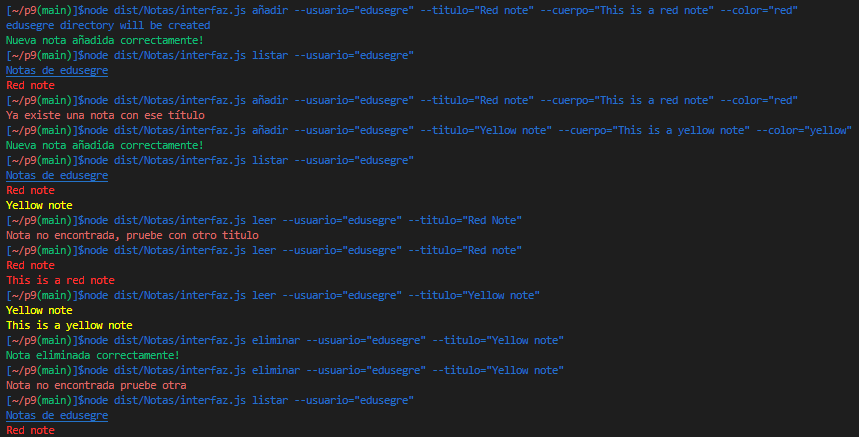
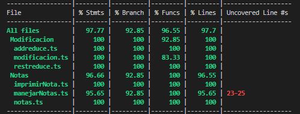

# Práctica 9

## **Índice**
 * [Tareas Previas](#dv1)
 * [Explicación de solucion diseñada](#dv2)


<div id='dv1'/>

## Tareas Previas
> Typedoc: nos permitira realizar la documentación de nuestro código de manera automática. Para instalarlo y configurarlo pinche [aqui](https://drive.google.com/file/d/19LLLCuWg7u0TjjKz9q8ZhOXgbrKtPUme/view).

> Chai y mocha para aplicar metodología TDD en nuestro proyecto. Para instalarlo y configurarlo pinche [aqui](https://drive.google.com/file/d/1-z1oNOZP70WBDyhaaUijjHvFtqd6eAmJ/view).

> [TDD](https://en.wikipedia.org/wiki/Test-driven_development) Iremos desarrollando primero las pruebas de la funcionalidad que queremos desarrollar y luego escribiremos el código necesario para ello por ello estableceremos primero el fichero `.spec.ts` y luego el `.ts`.

> [Instanbul y Coveralls](https://coveralls.io/) añadiremos nuestro repositorio a la página de coveralls para llevar un seguimiento en la realización y cubrimiento de pruebas de nuestro código.

> [Principios Solid](https://profile.es/blog/principios-solid-desarrollo-software-calidad/) Aplicaremos los principios Solud para mantener una alta cohesión y por tanto un buen acoplamiento de software.

> [Sonar Cloud](https://sonarcloud.io/) Nos permitirá mejorar el flujo de trabajo con calidad y seguridad de codigo.

> [Github Action](https://github.com/features/actions) Usaremos las githubs Actions para aplicar 3 tareas a la hora de realizar un push en nuestro reporsitorio, pruebas con coveralls, pruebas con mocha y integración de Sonar Cloud.

> [Yargs](https://www.npmjs.com/package/yargs) Permite crear herramientas de línea de comandos interactivas analizando argumentos y generando una interfaz de usuario elegante

> [Chalk](https://www.npmjs.com/package/chalk) Permite crear herramientas de línea de comandos interactivas analizando argumentos y generando una interfaz de usuario elegante

> [Sistema de ficheros](https://nodejs.org/dist/latest-v18.x/docs/api/fs.html#synchronous-api) Api que nos permite crear y trabajar con ficheros

<div id='dv2'/>

## Explicación de solucion diseñada.

El primer paso sería el desarrollo de la clase Notas para poder almacenar los valores que se nos indican en el enunciado en este caso se ha respetado el Single responsibility principle separando lo que es la clase encargada de almacenar el contenido de la nota con la clase encargada de impirmir/devolver el contenido de la nota de una manera que comentaremos más adelante. Para limitar los colores se ha introducido un tipo de dato que solo contempla los colores del enunciado.

```typescript
/**
 * Nos permitira limitar los tipos de colores en Chalk
 * 
 */
export type typeColor = ("red" | "green" | "blue" | "yellow");
```
Clase para almacenar la `Nota`:

```typescript
/**
 * Clase Notas que alamacenara el titulo de la nota,
 * el cuerpo y el color
 */
export class Nota {
  /**
   * Constructor que permitirá crear la Nota
   * @param titulo titulo de la nota
   * @param cuerpo contenido de la nota
   * @param color  color de la nota
   */
  constructor(private titulo: string, private cuerpo: string, private color: typeColor) {}

  /**
   * Conocer el titulo de la nota
   * @returns string
   */
  getTitulo(): string {
    return this.titulo;
  }

  /**
   * Conocer el contenido de la nota
   * @returns string
   */
  getCuerpo(): string {
    return this.cuerpo;
  }

  /**
   * Obtener el color de la nota
   * @returns string
   */
  getColor(): string {
    return this.color;
  }

  /**
   * Cambiar el titulo de la nota
   * @param newTitulo 
   */
  setTitulo(newTitulo: string) {
    this.titulo = newTitulo;
  }

  /**
   * Cambiar el contenido de la nota
   * @param newCuerpo 
   */
  setCuerpo(newCuerpo: string) {
    this.cuerpo = newCuerpo;
  }

  /**
   * Cambiar el color de la nota
   * @param newColor 
   */
  setColor(newColor: typeColor) {
    this.color = newColor;
  }
}

```
Clase para `impirmir` nota:

```typescript
/**
 * Clase que nos permite imprimir una nota
 */
export class PrintNota {
  /**
   * Contructor que recibe el objeto nota
   * @param nota 
   */
  constructor(private nota: Nota) {}

  /**
   * Metodo que permite construir un string y imprimirlo
   * o visualizarlo por consola
   * @returns string
   */
  print(): string {
    const contenido = '{\n "titulo": \"' + this.nota.getTitulo() + "\"," +
      '\n "cuerpo": \"' + this.nota.getCuerpo() + "\"," +
      '\n "color": \"' + this.nota.getColor() + "\"" +
      '\n}';
  
    console.log(contenido);
    return contenido;
  }
}
```
Algo importante a destacar es que este metodo debe devolver un string en formato [JSON](https://en.wikipedia.org/wiki/JSON) ya que este será el que almacenemos en la base de datos por ello el formato debe ser el mostrado encima es decir el objeto debe estar encerrado en llaves y cada par clave-valor debe tener comillas simples, teniendo en cuenta que cada par debe estar separado por una coma.

Pruebas desarrolladas para verificar la correcta implementacion de lo anterior:
```typescript
let color: typeColor = "red";
const nota= new Nota("Lista de la compra", "->Leche", color);
describe("Pruebas clase Nota", () => {
    it('Se puede instanciar un objeto', () => {
      expect(nota).instanceOf(Nota);
    });
    describe('Getters', () => {
      it('La nota tiene un titulo', () => {
        expect(nota.getTitulo()).to.eql('Lista de la compra');
      });
      it('La nota tiene un cuerpo', () => {
        expect(nota.getCuerpo()).to.eql('->Leche');
      });
      it('La nota tiene un color', () => {
        expect(nota.getColor()).to.eql('red');
      });
    });
    describe('Setter', () => {
        it('Se puede cambiar el titulo', () => {
            nota.setTitulo("AA")
          expect(nota.getTitulo()).to.eql('AA');
        });
        it('Se puede cambiar el cuerpo', () => {
            nota.setCuerpo("BB")
          expect(nota.getCuerpo()).to.eql('BB');
        });
        it('Se puede cambiar el color', () => {
            nota.setColor("blue")
          expect(nota.getColor()).to.eql('blue');
        });
      });
  });

  const printnota = new PrintNota(nota);
  describe("Pruebas de la clase PrintNota", () => {
    it('Se puede instanciar un objeto', () => {
        expect(printnota).instanceOf(PrintNota);
    });
    it('Metodo para imprimir una nota', () => {
        expect(printnota.print()).to.eql(`{
 "titulo": "AA",
 "cuerpo": "BB",
 "color": "blue"
}`)
    });
  })
```

Una vez ya tenemos la clase que almacena la nota y la clase "imprime" la nota, nos quedaría crear una clase que manipule las notas es decir que permite añadir, modificar, eliminar, listar y leer tal y como se nos indica en el enunciado para ello he desarrollado una clase `ManejarNotas`.

`añadirNotas` recibe como parametros el usuario, el titulo, cuerpo y color de la nota, Lo primero que tendremos que hacer es mediante la API síncrona comrpobar si ese usuario ya dispone de un archivo dentro de la base de datos en caso de que no lo este se crear el directorio `BaseDatosNotas/usuario` para ello haremos uso del metodo [mkdirSync](https://nodejs.org/dist/latest-v18.x/docs/api/fs.html#fsmkdirsyncpath-options). Una vez creado el directorio del usuario comprobamos si el titulo de la nota que quiere añadir ya existe en caso de que si informamos de que no se ha creado imprimiendo por pantalla usando ckalk para que el mensaje se muestre rojo, en caso de que ese titulo no exista para ese usuario escribimos gracias a [writeFileSync](https://nodejs.org/dist/latest-v18.x/docs/api/fs.html#fsmkdirsyncpath-options) para ello el parámetro que le pasamos es el string que devuelve la clase PrintNote en formarto JSON. Imprimiendo de color verde la nota añadida correctamente.

```typescript
  /**
   * Permite crear una nueva Nota en la base de Datos
   * @param usuario 
   * @param titulo 
   * @param cuerpo 
   * @param color 
   * @returns 
   */
  añadirNota(usuario: string, titulo: string, cuerpo: string, color: typeColor) {
    /**
     * Comprobamos que el usuario exista
     */
    if (!fs.existsSync(`BaseDatosNotas/${usuario}`)) {
      console.log(`${usuario}  Directorio creado correctamente`);
      fs.mkdirSync(`BaseDatosNotas/${usuario}`, {

        recursive: true,

      });
    }
    const nota = new Nota(titulo, cuerpo, color);
    /**
     * Se añade la nota a la base de Datos
     */
    if (!fs.existsSync(`BaseDatosNotas/${usuario}/${titulo}.json`)) {
      fs.writeFileSync(`BaseDatosNotas/${usuario}/${titulo}.json`, new PrintNota(nota).print());

      console.log(chalk.green("Nueva nota añadida correctamente!"));
      return true;
    } else {
      console.log(chalk.red("Ya existe una nota con ese título"));

      return false;
    }
  }
```

El metodo eliminarNota y modificar nota realizan exactamente lo mismo que add pero elimar utiliza el metodo `rmSync` indicando dentro de la base de datos cual es el titulo que quiere elimnar de ese usuario y modificar nota utiliza el metodo indicado anteriormente para escribir en la base de datos.

```typescript
  /**
   * Eliminar una nota de un usuario mediante
   * el titulo y el nombre
   * @param usuario 
   * @param titulo 
   * @returns 
   */
  eliminarNota(usuario: string, titulo: string) {
    if (fs.existsSync(`BaseDatosNotas/${usuario}/${titulo}.json`)) {
      fs.rmSync(`BaseDatosNotas/${usuario}/${titulo}.json`);

      console.log(chalk.green("Nota eliminada correctamente!"));
      return true;
    } else {
      console.log(chalk.red("Nota no encontrada pruebe otra"));

      return false;
    }
  }

  /**
   * Modificar la nota de un usuario en base a un titulo
   * @param usuario 
   * @param titulo 
   * @param cuerpo 
   * @param color 
   * @returns 
   */
  modificarNota(usuario: string, titulo: string, cuerpo: string, color: typeColor) {
    if (fs.existsSync(`BaseDatosNotas/${usuario}/${titulo}.json`)) {
      const nota = new Nota(titulo, cuerpo, color);
      fs.writeFileSync(`BaseDatosNotas/${usuario}/${titulo}.json`, new PrintNota(nota).print());

      console.log(chalk.green("Nota modificada correctamente!"));
      return true;
    } else {
      console.log(chalk.red("Nota no encontrada pruebe otra"));

      return false;
    }
  }
```

Por último nos quedaría el metodo para `listarNotas` para ello lo primero sería comporbar que el usuario tiene una carpeta en la base de datos y además gracias a readdirSync podemos comprobar si el contenido no esta vacio una vez realizadas esas comprobaciones nos quedaría recorrer las notas  y para cada JSON guardamos el contenido en una variable que luego nos permitira gracias a JSON.parse convertir dicho objeto JSON en un objeto al cual podremos acceder a su contenido es decir a su valor de titulo, su valor de cuerpo y su valor de color, gracias a ello podremos crear un nuevo objeto nota. Solo quedaría mostrar esos titulo con el color que se nos indica. Como hemos usado un tipo de dato para los colores nunca `keyword` recibirá un color que no exista.


```typescript
  listarNotas(usuario: string) {
    if (fs.existsSync(`BaseDatosNotas/${usuario}`) && 
    fs.readdirSync(`BaseDatosNotas/${usuario}`).length > 0) {
      fs.readdirSync(`BaseDatosNotas/${usuario}`).forEach((notas) => {
        const vaciarContenido = fs.readFileSync(`BaseDatosNotas/${usuario}/${notas}`);
        const stringNota = JSON.parse(vaciarContenido.toString());
        const nota = new Nota(stringNota.titulo, stringNota.cuerpo, stringNota.color);

        console.log(chalk.keyword(nota.getColor())(nota.getTitulo()));
      });
      return true;
    } else {
      console.log(chalk.red("No se ha encontrado al usuario en la base de Datos"));

      return false;
    }
  }
```

El último método de esta clase será `leerNota` en el cual comprobaremos que el titulo que se nos indica exista para ese usuario en caso de que si repetiremos el proceso anterior de recibir un JSON y convertirlo en un objeto para acceder a sus propiedades, solo quedaría imprimir gracias a ckalk el correspondiente titulo y cuerpo de la nota.

```typescript
  /**
   * Leer contenido de una nota
   * @param usuario 
   * @param titulo 
   * @returns 
   */
  leerNota(usuario: string, titulo: string) {
    if (fs.existsSync(`BaseDatosNotas/${usuario}/${titulo}.json`)) {
      const vaciarContenido = fs.readFileSync(`BaseDatosNotas/${usuario}/${titulo}.json`);
      const stringNota = JSON.parse(vaciarContenido.toString());
      const nota = new Nota(stringNota.titulo, stringNota.cuerpo, stringNota.color);

      console.log(chalk.keyword(nota.getColor())(nota.getTitulo()));
      console.log(chalk.keyword(nota.getColor())(nota.getCuerpo()));

      return true;
    } else {
      console.log(chalk.red("Nota no encontrada, pruebe con otro titulo"));

      return false;
    }
  }
```

Pruebas para comprobar el correcto funcionamiento de la clase:

Algo a destacar es el metodo `rmSync` para borrar el contenido de la base de datos pero debido a que en el gitignore esta añadida la base de datos, la github action lanza error. Por ello esta comentada.


```typescript
// Vaciamos la base de datos
// fs.rmSync(`BaseDatosNotas/User1`, { recursive: true });

const manejarNotas = new ManejarNotas();
describe ("Pruebas clase ManejarNotas", () => {
    it('Crear una instancia de la clase', () => {
        expect(manejarNotas).instanceOf(ManejarNotas);
    })
    it('Añadir una nota', () => {
        expect(manejarNotas.añadirNota("User1", "Amazing", "azucar", "green")).to.eql(true)
    });
    it('Añadir una nota', () => {
        expect(manejarNotas.añadirNota("User1", "Amazing", "azucar", "green")).to.eql(false)
    });
    it('Modificar una nota', () => {
        expect(manejarNotas.modificarNota("User1", "Amazing", "azucar 2", "green")).to.eql(true)
    });
    it('Modificar una nota que no existe', () => {
        expect(manejarNotas.modificarNota("User1", "Amazing2", "azucar 4", "green")).to.eql(false)
    });
    it('Listar Notas', () => {
        expect(manejarNotas.listarNotas("User1")).to.eql(true)
    });
    it('Listar Notas de un usuario que no existe', () => {
        expect(manejarNotas.listarNotas("User2")).to.eql(false)
    });
    it('Leer una Nota', () => {
        expect(manejarNotas.leerNota("User1", "Amazing")).to.eql(true)
    });
    it('Leer una Nota no existente', () => {
        expect(manejarNotas.leerNota("User1", "Amazing2")).to.eql(false)
    });
    it('Eliminar una nota', () => {
        expect(manejarNotas.eliminarNota("User1", "Amazing")).to.eql(true)
    });
    it('Eliminar una nota no existente', () => {
        expect(manejarNotas.eliminarNota("User1", "Amazing")).to.eql(false)
    });
})
```

Solo quedaría hacer uso de `yargs` para  que el usuario introduzca los respectivos comandos por consola para ello se seguirá la siguiente estructura:

```typescript
/**
 * Comando añadir que permite añadir una nota a un usuario
 * especificando el titulo0, el cuerpo y el color
 */
yargs.command({
  command: 'añadir',
  describe: 'Añadir una nota',
  builder: {
    usuario: {
      describe: 'Nombre del usuario',
      demandOption: true,
      type: 'string',
    },
    titulo: {
      describe: 'Titulo de la nota',
      demandOption: true,
      type: 'string',
    },
    cuerpo: {
      describe: 'Cuerpo de la Nota',
      demandOption: true,
      type: 'string',
    },
    color: {
      describe: "Color de la nota",
      demandOption: true,
      type: "string",
    },
  },
  handler(argv) {
    if (typeof argv.usuario === 'string' && typeof argv.titulo === 'string' &&
    typeof argv.cuerpo === 'string' && typeof argv.color === "string") {
      if (argv.color == 'red' || argv.color == 'green' || argv.color == 'blue' || argv.color == 'yellow' ) {
        manejadorNotas.añadirNota(argv.usuario, argv.titulo, argv.cuerpo, argv.color);
      }
    } else {
      console.log(chalk.red('Argument invalid'));
    }
  },
});
```

Gracias a `yargs.command` podemos especificar el tipo de comando en el apartado command, describe para explicar que es lo que hace el comando(esto luego se verá en la opción help) y la parte más importante builder que recibirá una serie de flags en este caso --usuario, --titulo, --cuerpo, --color de esta manera se han indicado que son flags obligatorios y de tipo string. En la seccion handler recibimos un objeto que almacena las respuesta, se comprueba que los tipos son string y que el color es uno de los permitidos en el tipo de dato que se menciono anteriormente. Solo quedaría llamar al metodo encargado de añadir nota con los valores almacenados en `argv` . El resto de comandos siguen el mismo esquema.

```typescript
/**
 * Comando elimnar que permite eliminar una nota
 * especificando el usuario y el titulo
 */
yargs.command({
  command: 'eliminar',
  describe: 'Eliminar una nota',
  builder: {
    usuario: {
      describe: 'Nombre del usuario',
      demandOption: true,
      type: 'string',
    },
    titulo: {
      describe: 'Titulo de la nota',
      demandOption: true,
      type: 'string',
    },
  },
  handler(argv) {
    if (typeof argv.usuario === 'string' && typeof argv.titulo === 'string') {
      manejadorNotas.eliminarNota(argv.usuario, argv.titulo);
    } else {
      console.log(chalk.red('Argument invalid'));
    }
  },
});

/**
 * Comando modificar que permite modificar una nota a un usuario
 * especificando el titulo0, el cuerpo y el color
 */
yargs.command({
  command: 'modificar',
  describe: 'Modificar una nota',
  builder: {
    usuario: {
      describe: 'Nombre del usuario',
      demandOption: true,
      type: 'string',
    },
    titulo: {
      describe: 'Titulo de la nota',
      demandOption: true,
      type: 'string',
    },
    cuerpo: {
      describe: 'Cuerpo de la Nota',
      demandOption: true,
      type: 'string',
    },
    color: {
      describe: "Color de la nota",
      demandOption: true,
      type: "string",
    },
  },
  handler(argv) {
    if (typeof argv.usuario === 'string' && typeof argv.titulo === 'string' &&
    typeof argv.cuerpo === 'string' && typeof argv.color === "string") {
      if (argv.color == 'red' || argv.color == 'green' || argv.color == 'blue' || argv.color == 'yellow' ) {
        manejadorNotas.modificarNota(argv.usuario, argv.titulo, argv.cuerpo, argv.color);
      }
    } else {
      console.log(chalk.red('Argumento no contemplado'));
    }
  },
});

/**
 * Comando listar que permite listar las notas de un usuario
 */
yargs.command({
  command: 'listar',
  describe: 'Listar todas las notas',
  builder: {
    usuario: {
      describe: 'Nombre del usuario',
      demandOption: true,
      type: 'string',
    },
  },
  handler(argv) {
    if (typeof argv.usuario === 'string') {
      console.log(chalk.underline('Notas de ' + argv.usuario));
      manejadorNotas.listarNotas(argv.usuario);
    } else {
      console.log(chalk.red('Argumento no contemplado'));
    }
  },
});

/**
 * Comando leer que permite leer el contenido de una nota
 */
yargs.command({
  command: 'leer',
  describe: 'Leer una nota',
  builder: {
    usuario: {
      describe: 'Nombre del usuario',
      demandOption: true,
      type: 'string',
    },
    titulo: {
      describe: 'Titulo de la nota',
      demandOption: true,
      type: 'string',
    },
  },
  handler(argv) {
    if (typeof argv.usuario === 'string' && typeof argv.titulo === 'string') {
      manejadorNotas.leerNota(argv.usuario, argv.titulo);
    } else {
      console.log(chalk.red('Argumento no contemplado'));
    }
  },
});
```

Con esto el usuario podrá introducir mediante linea de comando los diferentes flags para modificar, añadir, eliminar, listar y leer notas.

Algunas pruebas de ejecución podrían ser las siguientes:





Coverage:

