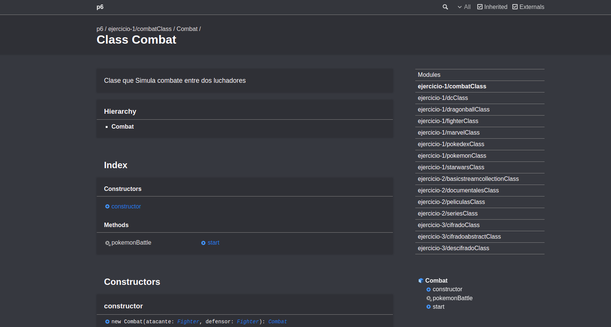
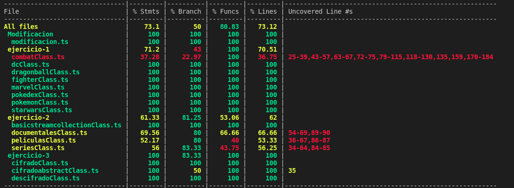

# Práctica 6 - Clases e interfaces genéricas. Principios SOLID

En esta práctica continuaremos utilizando herramientas como jsdoc, mocha, chai para generar documentacion y segui metodología TDD. Además incorporaremos nuevas herramientas para cubrimiento de código como Instanbul y Coveralls. Por útimo nos familizaremos con el uso de clases abstractas y genéricas en Typescript

[](https://coveralls.io/github/ULL-ESIT-INF-DSI-2122/ull-esit-inf-dsi-21-22-prct06-generics-solid-alu0101329161?branch=main)

## **Índice**
 * [Tareas Previas](#dv1)
 * [Ejercicio 1](#dv2)
 * [Ejercicio 2](#dv3)
 * [Ejercicio 3](#dv4)
 * [Autor](#dv5)


<div id='dv1'/>

## Tareas Previas

> Typedoc: nos permitira realizar la documentación de nuestro código de manera automática. Para instalarlo y configurarlo pinche [aqui](https://drive.google.com/file/d/19LLLCuWg7u0TjjKz9q8ZhOXgbrKtPUme/view)

> Chai y mocha para aplicar metodología TDD en nuestro proyecto. Para instalarlo y configurarlo pinche [aqui](https://drive.google.com/file/d/1-z1oNOZP70WBDyhaaUijjHvFtqd6eAmJ/view)

> [TDD](https://en.wikipedia.org/wiki/Test-driven_development) Iremos desarrollando primero las pruebas de la funcionalidad que queremos desarrollar y luego escribiremos el código necesario para ello por ello estableceremos primero el fichero `.spec.ts` y luego el `.ts`.

> [Instanbul y Coveralls](https://coveralls.io/) añadiremos nuestro repositorio a la página de coveralls para llevar un seguimiento en la realización y cubrimiento de pruebas de nuestro código.

> [Principios Solid](https://profile.es/blog/principios-solid-desarrollo-software-calidad/) Aplicaremos los principios Solud para mantener una alta cohesión y por tanto un buen acoplamiento de software

---

<div id='dv2'/>

## Ejercicio 1

Se nos pide impelementar una clase `Fighter` abstracta de la cual van a heredar varias clases según el tipo de Universo en mi caso los Universos contemplados son Star wars, Pokemon, Marvel, DC y Dragon Ball cada uno con sus particularidades por ejemplo los tipos o razas dentro se cada Universo son saiyan o un jedi y muchas más comparaciones. Primero declaramos nuestra clase abstracta.

```typescript
/**
 * Definimos los posibles universos
 */
export type universeType = ("Pokemon" | "DC" | "Marvel" | "StarWars" | "DragonBall");
/**
 * Estadisticas compartidas entre universos
 */
export type estadisticasType = {
  vida: number;
  ataque: number;
  defensa: number;
  velocidad: number;
};

/**
 * Clase abstractas donde se apoyarán los universos
 */
export abstract class Fighter {
  /**
   * Creamos el objeto fighter
   * @param  {string} privatenombre
   * @param  {number} privatepeso
   * @param  {number} privatealtura
   * @param  {estadisticasType} privateestadisticas
   * @param  {string} privatefrase
   * @param  {universeType} privateuniverso
   */
  constructor(private nombre: string, private peso: number, private altura: number,
    private estadisticas: estadisticasType, private frase: string, private universo: universeType) {
    // Si se introduce un parámetro mal ponemos valores por defecto 
    if (nombre === "") {
      this.nombre = "Defecto";
    }
    if (peso <= 0) {
      this.peso = 99;
    }
    if (altura <= 0) {
      this.peso == 99;
    }
    if (estadisticas.ataque <= 0) {
      this.estadisticas.ataque = 99;
    }
    if (estadisticas.defensa <= 0) {
      estadisticas.defensa = 99;
    }
    if (estadisticas.velocidad <= 0) {
      estadisticas.velocidad = 99;
    }
    if (estadisticas.vida <= 0) {
      estadisticas.vida = 99;
    }
    if (frase === "") {
      this.frase = "Olalala muamuasel";
    }
  };

  /**
   * @returns ataque del luchador
   */
  public getAtaque(): number {
    return this.estadisticas.ataque;
  }
  /**
   * @returns defensa del luchador
   */
  public getDefensa(): number {
    return this.estadisticas.defensa;
  }
  /**
   * @returns velocidad del luchador
   */
  public getVelocidad(): number {
    return this.estadisticas.velocidad;
  }
  /**
   * @returns vida del luchador
   */
  public getVida(): number {
    return Math.round(this.estadisticas.vida);
  }
  /**
   * @returns nombre del luchador
   */
  public getNombre(): string {
    return this.nombre;
  }
  /**
   * @returns peso del luchador
   */
  public getPeso(): number {
    return this.peso;
  }
  /**
   * @returns altura del luchador
   */
  public getAltura(): number {
    return this.altura;
  }
  /**
   * @returns Universo del luchador
   */
  public getUniverso(): string {
    return this.universo;
  }
  /**
  * @returns frase del luchador
  */
  public getFrase(): string {
    return this.frase;
  }
  /**
 * @returns ataque del luchador
 */
  public setAtaque(value: number): void {
    this.estadisticas.ataque = value;
  }
  /**
   * @returns defensa del luchador
   */
  public setDefensa(value: number): void {
    this.estadisticas.defensa = value;
  }
  /**
   * actualiza velocidad del luchador
   */
  public setVelocidad(value: number): void {
    this.estadisticas.velocidad = value;
  }
  /**
   * @returns vida 
   */
  public setVida(value: number): void {
    this.estadisticas.vida = value;
  }
  /**
   * @returns nombre 
   */
  public setNombre(value: string): void {
    this.nombre = value;
  }
  /**
   * @returns peso 
   */
  public setPeso(value: number): void {
    this.peso = value;
  }
  /**
   * @returns altura
   */
  public setAltura(value: number): void {
    this.altura = value;
  }
  /**
   * @returns altura
   */
  public setUniverso(value: universeType): void {
    this.universo = value;
  }
  /**
  * @returns altura
  */
  public setFrase(value: string): void {
    this.frase = value;
  }
}
```

Esta clase hace comprobaciones en el contructor para comprobar la correcta introducción de parámetros y no meter nombres vacios, estadísticas negativas y demás. También tiene definido getters y setters de todos sus atributos además de usar un tipo `estadisticasType` que almacenará las estadísticas básicas de cada luchador y un tipo `universeType` para almacenar cuales son los Universos posibles. A continuación creamos todas las clases de las que van a heredar de `Fighter`.

Primero la clase Pokemon con sus tipos definidos en `pokemonType` además de llamar al contructor de Fighter con el super y definir una clase `PokemonPrint` para respetar los principios Solid(Single Responsability)

```typescript
/**
 * Posibilidades entre los tipos de pokemons
 */
type pokemonType = ("planta" | "fuego" | "agua" | "electrico");

/**
 * @class Clase que permite representar Pokemon
 * ```typescript
 * const pikachu = new Pokemon("Pikachu", 10, 2.3, "electrico", [2, 3, 5, 6]);
 * ```
 */
export class Pokemon extends Fighter {
  constructor(nombre: string, peso: number, altura: number, estadisticas: estadisticasType,
      frase: string, universo: universeType, private tipo: pokemonType) {
    super(nombre, peso, altura, estadisticas, frase, universo);
  }
  /**
   * @returns el tipo del pokemon
   */
  public getTipo() {
    return this.tipo;
  }
  /**
   * Cambiamos el tipo del pokemon
   * @param value 
   */
  setTipo(value: pokemonType) {
    this.tipo = value;
  }
}

/**
 * Clase para imprmir al pokemon
 */
export class PokemonPrint {
  /**
   * Creamos el objeto con el que podemos
   * imprimir
   * @param  {Pokemon} privatepokemon
   */
  constructor(private pokemon: Pokemon) {
  }
  /**
   * Imprimimos el objeto pokemonPrint
   * @returns string
   */
  print(): string {
    const result = `El nombre es ${this.pokemon.getNombre()}, tiene un peso de ${this.pokemon.getPeso()}, una altura de ${this.pokemon.getAltura()}, 
    es de tipo ${this.pokemon.getTipo()} y sus estadisticas son:
    Ataque = ${this.pokemon.getAtaque()},
    Defensa = ${this.pokemon.getDefensa()},
    Velocidad = ${this.pokemon.getVelocidad()},
    Vida = ${this.pokemon.getVida()},
    Frase = ${this.pokemon.getFrase()},
    Universo = ${this.pokemon.getUniverso()}`;
    console.log(result);
    return result;
  }
}

```
Repetimos los mismo con los demás universos pero cada uno con sus tipos 

```typescript
/**
 * Posibles bandos de starwars
 */
type bandoType = ("Imperio" | "Rebeldes" | "Jedi" | "Siths" | "Fuerza")

/**
 * Clase que representa a starWars
 */
export class StarWars extends Fighter {
  /**
   * Creamos el objeto starwars
   * @param  {string} nombre
   * @param  {number} peso
   * @param  {number} altura
   * @param  {estadisticasType} estadisticas
   * @param  {string} frase
   * @param  {universeType} universo
   * @param  {bandoType} privatetipo
   */
  constructor(nombre: string, peso: number, altura: number,
      estadisticas: estadisticasType, frase: string, universo: 
        universeType, private tipo: bandoType) {
    super(nombre, peso, altura, estadisticas, frase, universo);
  }
  /**
 * @returns a que faccion pertenece
 */
  public getTipo() {
    return this.tipo;
  }
  /**
   * @returns cambiamos la faccion
   */
  setTipo(value: bandoType) {
    this.tipo = value;
  }
}

/**
 * Clase para imprmir el objeto starWars
 */
export class StarWarsPrint {
  /**
   * Objeto con el que impirmimos
   * @param  {StarWars} privatestarwars
   */
  constructor(private starwars: StarWars) {
  }
  /**
   * Impirmos el objeto starWars
   * @returns string
   */
  print(): string {
    const result = `El nombre es ${this.starwars.getNombre()}, tiene un peso de ${this.starwars.getPeso()}, una altura de ${this.starwars.getAltura()}, 
    es de tipo ${this.starwars.getTipo()} y sus estadisticas son:
    Ataque = ${this.starwars.getAtaque()},
    Defensa = ${this.starwars.getDefensa()},
    Velocidad = ${this.starwars.getVelocidad()},
    Vida = ${this.starwars.getVida()},
    Frase = ${this.starwars.getFrase()},
    Universo = ${this.starwars.getUniverso()}`;
    console.log(result);
    return result;
  }
}
```
```typescript
/**
 * Tipo de soldado villano o heroe
 */
type entidadType = ("Superhéroes" | "Supervillanos");

/**
 * Clase que representa al Universo Marvel
 */
export class Marvel extends Fighter {
  /**
   * Añadimos el objeto de la clase Marvel
   * @param  {string} nombre
   * @param  {number} peso
   * @param  {number} altura
   * @param  {estadisticasType} estadisticas
   * @param  {string} frase
   * @param  {universeType} universo
   * @param  {entidadType} privatetipo
   */
  constructor(nombre: string, peso: number, altura: number,
      estadisticas: estadisticasType, frase: string, 
      universo: universeType, private tipo: entidadType) {
    super(nombre, peso, altura, estadisticas, frase, universo);
  }
  /**
 * @returns tipo del Superheroes o Villano
 */
  public getTipo() {
    return this.tipo;
  }
  /**
   * @returns Cambiamos el tipo de objeto
   */
  setTipo(value: entidadType) {
    this.tipo = value;
  }
}

/**
 * Clase para imprimir el obejto de la clase
 * Marvel
 */
export class MarvelPrint {
  /**
   * Creamos el objeto
   * @param  {Marvel} privatemarvel
   */
  constructor(private marvel: Marvel) {
  }
  /**
   * Atributos del universo Marvel
   * @returns string
   */
  print(): string {
    const result = `El nombre es ${this.marvel.getNombre()}, tiene un peso de ${this.marvel.getPeso()}, una altura de ${this.marvel.getAltura()}, 
      es de tipo ${this.marvel.getTipo()} y sus estadisticas son:
      Ataque = ${this.marvel.getAtaque()},
      Defensa = ${this.marvel.getDefensa()},
      Velocidad = ${this.marvel.getVelocidad()},
      Vida = ${this.marvel.getVida()},
      Frase = ${this.marvel.getFrase()},
      Universo = ${this.marvel.getUniverso()}`;
    console.log(result);
    return result;
  }
}
```
```typescript
/**
 * Razas del universo DragonBall
 */
type razaType = ("Androides" | "Animales" | "Dragones" | "Terrícolas" | "Namekianos" | "Ogro" | "Saiyan");


/**
 * Clase que representa al universo DragonBall
 */
export class DrangonBall extends Fighter {
  constructor(nombre: string, peso: number, altura: number,
      estadisticas: estadisticasType, frase: string, 
      universo: universeType, private tipo: razaType) {
    super(nombre, peso, altura, estadisticas, frase, universo);
  }
  /**
   * Conseguir la raza
   * @returns razaType
   */
  public getTipo(): razaType {
    return this.tipo;
  }
  /**
   * Cambiar la raza
   * @param value 
   */
  setTipo(value: razaType): void {
    this.tipo = value;
  }
}

/**
 * Clase para imprimir el objeto DragonBall
 */
export class DragonBallPrint {
  /**
   * Creamos el objeto
   * @param  {DrangonBall} privatedragonball
   */
  constructor(private dragonball: DrangonBall) {
  }
  /**
   * Imprimimos el objeto dragonBall
   * @returns string
   */
  print(): string {
    const result = `El nombre es ${this.dragonball.getNombre()}, tiene un peso de ${this.dragonball.getPeso()}, una altura de ${this.dragonball.getAltura()}, 
        es de tipo ${this.dragonball.getTipo()} y sus estadisticas son:
        Ataque = ${this.dragonball.getAtaque()},
        Defensa = ${this.dragonball.getDefensa()},
        Velocidad = ${this.dragonball.getVelocidad()},
        Vida = ${this.dragonball.getVida()},
        Frase = ${this.dragonball.getFrase()},
        Universo = ${this.dragonball.getUniverso()}`;
    console.log(result);
    return result;
  }
}

```
```typescript
/**
 * Posibles entidades dentro del universo Marvel
 */
type entidadType = ("Gods" | "Death" | "Elementals" | "Endless" | "Wizards" | "Demons");

/**
 * Clase que representa al universo DC
 */
export class DC extends Fighter {
  /**
   * Creamos el objeto del universo
   * @param  {string} nombre
   * @param  {number} peso
   * @param  {number} altura
   * @param  {estadisticasType} estadisticas
   * @param  {string} frase
   * @param  {universeType} universo
   * @param  {entidadType} privatetipo
   */
  constructor(nombre: string, peso: number, altura: number,
      estadisticas: estadisticasType, frase: string, 
      universo: universeType, private tipo: entidadType) {
    super(nombre, peso, altura, estadisticas, frase, universo);
  }
  /**
   * Retornaos el tipo de DC
   */
  public getTipo() {
    return this.tipo;
  }
  /**
   * Cambiamos el tipo de DC
   * @param  {entidadType} value
   */
  setTipo(value: entidadType) {
    this.tipo = value;
  }
}

/**
 * Clase para imprimir el objeto DC
 */
export class DCPrint {
  /**
   * Creamos el objeto
   * @param  {DC} privatedc
   */
  constructor(private dc: DC) {
  }
  /**
   * Imprimimos el objeto DC
   * @returns string
   */
  print(): string {
    const result = `El nombre es ${this.dc.getNombre()}, tiene un peso de ${this.dc.getPeso()}, una altura de ${this.dc.getAltura()}, 
          es de tipo ${this.dc.getTipo()} y sus estadisticas son:
          Ataque = ${this.dc.getAtaque()},
          Defensa = ${this.dc.getDefensa()},
          Velocidad = ${this.dc.getVelocidad()},
          Vida = ${this.dc.getVida()},
          Frase = ${this.dc.getFrase()},
          Universo = ${this.dc.getUniverso()}`;
    console.log(result);
    return result;
  }
}
```

Una vez tenemos todos los posibles universos nos quedaría implementar una clase `Combat` que reciba un objeto de tipo Fighter y dentro de un metodo `pokemonBatle` se contemplen las efectividades entre ataques ya no solo de pokemons sino de luchadores de universos diferentes. En la escala de poder he situado a Dragon Ball por encima de todos seguido de Marvel, DC y por último Pokemon ya también dependerá de la vida, resistencia y demás parámetros de los luchadores. El método `start` simulará el combate como en la práctica anterior pero se han añadido nuevas funcionalidades como la frase del luchador que esta atacando.

```typescript
import {DrangonBall} from "./dragonballClass";
import {Fighter} from "./fighterClass";
import {Pokemon} from "./pokemonClass";
import {DC} from "./dcClass";
import {StarWars} from "./starwarsClass";
/**
 * Clase que Simula combate entre dos luchadores
 */
export class Combat {
  constructor(private atacante: Fighter, private defensor: Fighter) { }

  private pokemonBattle(universo: string, opponentUniverso: string,
      attack: number, opponentDefense: number): number {
    let neutral: number = 0;
    let result: number = 0;
    let type;
    let opponentType;

    if (universo === opponentUniverso) {
      if (this.atacante instanceof Pokemon && this.defensor instanceof Pokemon) {
        type = this.atacante.getTipo();
        opponentType = this.defensor.getTipo();
        if (type === "agua") {
          switch (opponentType) {
            case "agua":
              result = 0.5;
              break;
            case "fuego":
              result = 2;
              break;
            case "planta":
              result = 0.5;
              break;
            case "electrico":
              result = 0.5;
              break;
            default:
              result = -1;
          }
        }
        if (type === "fuego") {
          switch (opponentType) {
            case "fuego":
              result = 0.5;
              break;
            case "planta":
              result = 2;
              break;
            case "agua":
              result = 0.5;
              break;
            case "electrico":
              result = 1;
              break;
            default:
              result = -1;
          }
        }
        if (type === "electrico") {
          switch (opponentType) {
            case "electrico":
              result = 0.5;
              break;
            case "fuego":
              result = 1;
              break;
            case "agua":
              result = 2;
              break;
            case "planta":
              result = 1;
              break;
            default:
              result = -1;
          }
        }
        if (type === "planta") {
          switch (opponentType) {
            case "planta":
              result = 0.5;
              break;
            case "fuego":
              result = 0.5;
              break;
            case "agua":
              result = 2;
              break;
            case "electrico":
              result = 1;
              break;
            default:
              result - 1;
          }
        }
      } else if (this.atacante instanceof DrangonBall && this.defensor instanceof DrangonBall) {
        type = this.atacante.getTipo();
        opponentType = this.defensor.getTipo();
        if (type === 'Saiyan' && opponentType !== 'Saiyan') {
          result = 1000;
        } else {
          result = 10;
        }
      } else if (this.atacante instanceof DC && this.defensor instanceof DC) {
        result = 50;
      } else if (this.atacante instanceof StarWars && this.defensor instanceof StarWars) {
        type = this.atacante.getTipo();
        opponentType = this.defensor.getTipo();
        if (type === 'Jedi' && opponentType !== 'Jedi') {
          result = 1000;
        } else {
          result = 10;
        }
      } else {
        result = 50;
      }
    } else if (universo === 'Pokemon') {
      switch (opponentUniverso) {
        case 'DragonBall':
          result = 0;
          break;
        case 'StarWars':
          result = 0;
          break;
        case 'DC':
          result = 0;
          break;
        case 'Marvel':
          result = 0;
          break;
      }
    } else if (universo === 'DragonBall') {
      result = 10000;
    } else if (universo === 'Marvel') {
      result = 100;
    } else if (universo === 'DC') {
      result = 100;
    }
    neutral = 50 * (attack / opponentDefense);
    return result * neutral;
  }
  /**
   * Realizamos simulacion del combate hasta que la vida de alguno llegue
   * a cero
   */
  public start(): string {
    let result;
    let daño: number = 0;
    let quienAtaca: number = 0;
    console.log(this.atacante.getNombre());
    console.warn("VS");
    console.log(this.defensor.getNombre());
    console.log("///////////////");
    while (true) {
      console.log(`Ataca ${this.atacante.getNombre()} ${this.atacante.getFrase()}`);
      daño = this.pokemonBattle(this.atacante.getUniverso(), this.defensor.getUniverso(),
          this.atacante.getAtaque(), this.defensor.getDefensa());
      if (this.defensor.getVida() - daño > 0) {
        this.defensor.setVida(this.defensor.getVida() - daño);
      } else {
        // Para no imprimir vida negativa
        this.defensor.setVida(0);
      }
      console.log(`La vida del ${this.defensor.getNombre()} es ${this.defensor.getVida()}`);
      if (this.defensor.getVida() === 0) {
        result = `EL ganador es ${this.atacante.getNombre()} !!!!!!!!!!`;
        console.log(result);
        return result;
      }
      console.log(`Ataca ${this.defensor.getNombre()} ${this.defensor.getFrase()}`);
      daño = this.pokemonBattle(this.defensor.getUniverso(), this.atacante.getUniverso(),
          this.defensor.getAtaque(), this.atacante.getDefensa());
      if (this.atacante.getVida() - daño > 0) {
        this.atacante.setVida(this.atacante.getVida() - daño);
      } else {
        // Para no imprimir vida negativa
        this.atacante.setVida(0);
      }
      console.log(`La vida del ${this.atacante.getNombre()} es ${this.atacante.getVida()}`);
      quienAtaca = 0;
      if (this.atacante.getVida() == 0) {
        result = `EL ganador es ${this.defensor.getNombre()} !!!!!!!!!!`;
        console.log(result);
        return result;
      }
    }
  }
}

```

Por último quedaría implementar una clase que reciba un array de Fighter y pueda mostrar la informacion de cada luchador, en esta ocasión no he usado el `console.table` ya que para realizar las pruebas era mejor usar una clase que se encargue de imprimir resepetando los principios Solid.

```typescript
import {DC, DCPrint} from './dcClass';
import {DragonBallPrint, DrangonBall} from './dragonballClass';
import {estadisticasType, Fighter} from './fighterClass';
import {Marvel, MarvelPrint} from './marvelClass';
import {Pokemon, PokemonPrint} from './pokemonClass';

/**
 * Clase que representa a la Pokedex
 */
export class Pokedex {
  /**
   * Recine un array de fighter
   * @param  {Fighter[]} privateluchadores
   */
  constructor(private luchadores: Fighter[]) { }
  /**
   * COnseguir luchador de la pokedex
   * @param  {number} index
   * @returns Fighter
   */
  getLuchador(index: number): Fighter {
    return this.luchadores[index];
  }
  /**
   * Getter del numero de luchadores de
   * la pokedex
   * @returns number
   */
  getNumeroLuchadores(): number {
    return this.luchadores.length;
  }
  /**
   * Añadimos luchador a la pokedex
   * @param  {Fighter} luchador
   */
  añadirLuchador(luchador: Fighter): void {
    this.luchadores.push(luchador);
  }
  /**
   * Eliminamos luchador de la pokedex
   * @param  {Fighter} luchador
   * @returns void
   */
  eliminarLuchador(luchador: Fighter): string {
    let result= "";
    const indice: number = this.luchadores.indexOf(luchador);
    if (indice === -1) {
      result = "EL luchador que intenta eliminar no existe";
      console.log(result);
      return result;
    }
    this.luchadores.splice(indice, 1);
    return "Eliminado correctamente";
  }
}

/**
 * Clase para imprimir la Pokedex
 */
export class PokedexPrint {
  /**
   * Recibimos el objeto Pokedex
   * @param  {Pokedex} privatepokedex
   */
  constructor(private pokedex: Pokedex) {}
  /**
   * Dependiendo de la instancia llamamos al
   * metodo de la clase que le corresponda
   * @returns string
   */
  print(): string {
    let result = "";
    let luchador: Fighter;
    for (let index = 0; index < this.pokedex.getNumeroLuchadores(); index++) {
      luchador = this.pokedex.getLuchador(index);
      if (luchador instanceof Pokemon) {
        const pokemonprint = new PokemonPrint(luchador);
        result += pokemonprint.print();
      }
      if (luchador instanceof Marvel) {
        const marvelprint = new MarvelPrint(luchador);
        result += marvelprint.print();
      }
      if (luchador instanceof DC) {
        const dcprint = new DCPrint(luchador);
        result += dcprint.print();
      }
      if (luchador instanceof DrangonBall) {
        const dragonballprint = new DragonBallPrint(luchador);
        result += dragonballprint.print();
      }
    }
    return result;
  }
}
```
La cantidad de pruebas realizadas solo para este primer ejecicio es de 400 lineas por ello no pondré todas en el informe. Están separadas mediante `Describe` en el fichero `/test/ejercicio1`. A continuación se pueden visualizar algunas:

```typescript
const objeto: estadisticasType = {
  vida: -10,
  ataque: -20,
  defensa: -30,
  velocidad: -200,
};
const objeto1: estadisticasType = {
  vida: 100,
  ataque: 20,
  defensa: 30,
  velocidad: 200,
};
const pikachu = new Pokemon("Pikachu", -10, -2, objeto,
    "Raatatatatatat", "Pokemon", "electrico");
const bulbasur = new Pokemon("Bulbasur", 10, 20, objeto,
    "", "Pokemon", "agua");

describe('Test class Pokemon', () => {
  describe('Se puede instanciar un Pokemon', () => {
    it('expect(pikachu).not.be.equal(null);', () => {
      expect(pikachu).not.be.equal(null);
    });
    it('expect(bulbasur).not.be.equal(null);', () => {
      expect(bulbasur).not.be.equal(null);
    });
  });
  describe('Tiene atributos para almacenar los tipos del pokemon', () => {
    it('expect(pikachu.getNombre()).to.be.equal Pikachu;', () => {
      expect(pikachu.getTipo()).to.be.equal("electrico");
    });
    it('expect(bulbasur.getNombre()).to.be.equal agua;', () => {
      expect(bulbasur.getTipo()).to.be.equal("agua");
    });
    it('expect(bulbasur.gettipo("agua")).to.be.equal agua;', () => {
      bulbasur.setTipo("planta");
      expect(bulbasur.getTipo()).eql("planta");
    });
  });
});
const print = new PokemonPrint(pikachu);
describe('Test class PokemonPrint', () => {
  describe('Metods de la clase PokemonPrint', () => {
    it('expect(print).not.be.equal(null);', () => {
      expect(print.print()).eql(`El nombre es Pikachu, tiene un peso de 99, una altura de -2, 
    es de tipo electrico y sus estadisticas son:
    Ataque = 99,
    Defensa = 99,
    Velocidad = 99,
    Vida = 99,
    Frase = Raatatatatatat,
    Universo = Pokemon`);
    });
  });
});

const ObiWanKenobi = new StarWars("ObiWanKenobi", 10, 20, objeto,
    "Hola pequeño padawan", "StarWars", "Jedi");
const AnakinSkywalker = new StarWars("AnakinSkywalker", 10, 20, objeto,
    "", "StarWars", "Jedi");

describe('Test class StarWars', () => {
  describe('Se puede instanciar un StarWars', () => {
    it('expect(ObiWanKenobi).not.be.equal(null);', () => {
      expect(ObiWanKenobi).not.be.equal(null);
    });
    it('expect(AnakinSkywalker).not.be.equal(null);', () => {
      expect(AnakinSkywalker).not.be.equal(null);
    });
  });
  describe('Tiene atributos para almacenar los tipos del StarWars', () => {
    it('expect(ObiWanKenobi.getNombre()).to.be.equal ObiWanKenobi;', () => {
      expect(ObiWanKenobi.getTipo()).to.be.equal("Jedi");
    });
    it('expect(AnakinSkywalker.getNombre()).to.be.equal Jedi;', () => {
      expect(AnakinSkywalker.getTipo()).to.be.equal("Jedi");
    });
    it('expect(AnakinSkywalker.gettipo("agua")).to.be.equal Jedi;', () => {
      AnakinSkywalker.setTipo("Jedi");
      expect(AnakinSkywalker.getTipo()).eql("Jedi");
    });
  });
});
const Hulk = new Marvel("Hulk", 10, 20, objeto,
    "ahhhhhgggg", "Marvel", "Superhéroes");
const Thanos = new Marvel("Thanos", 10, 20, objeto,
    "", "Marvel", "Supervillanos");

describe('Test class Marvel', () => {
  describe('Se puede instanciar un Marvel', () => {
    it('expect(Hulk).not.be.equal(null);', () => {
      expect(Hulk).not.be.equal(null);
    });
    it('expect(Thanos).not.be.equal(null);', () => {
      expect(Thanos).not.be.equal(null);
    });
  });
  describe('Tiene atributos para almacenar los tipos del Marvel', () => {
    it('expect(Hulk.getTipo()).to.be.equal Superhéroes;', () => {
      expect(Hulk.getTipo()).to.be.equal("Superhéroes");
    });
    it('expect(Thanos.getTipo()).to.be.equal Supervillanos;', () => {
      expect(Thanos.getTipo()).to.be.equal("Supervillanos");
    });
    it('expect(Thanos.gettipo("agua")).to.be.equal agua;', () => {
      Thanos.setTipo("Superhéroes");
      expect(Thanos.getTipo()).eql("Superhéroes");
    });
  });
});
describe('Test class Combat', () => {
  const pikachu1 = new Pokemon("Pikachu", -10, -2, objeto,
      "Raatatatatatat", "Pokemon", "electrico");
  const bulbasur1 = new Pokemon("Bulbasur", 10, 20, objeto,
      "", "Pokemon", "agua");
  const Goku1 = new DrangonBall("Goku", 10, 20, objeto,
      "kamehamehaaaaaaaa", "DragonBall", "Saiyan");
  const Freezer1 = new DrangonBall("Freezer", 10, 20, objeto,
      "", "DragonBall", "Ogro");
  const Presence1 = new DC("Presence", 10, 20, objeto,
      "kamehamehaaaaaaaa", "DC", "Gods");
  const RedTornado1 = new DC("", 10, 20, objeto,
      "", "DC", "Elementals");
  const combate = new Combat(Goku1, Presence1);
  const combate1 = new Combat(Presence1, Freezer1);
  const combate2 = new Combat(pikachu1, bulbasur1);
  const combate3 = new Combat(RedTornado1, Goku1);
  describe('Se puede instanciar un Combate', () => {
    it('expect(combate).not.be.equal(null);', () => {
      expect(combate).not.be.equal(null);
    });
    it('expect(combate).not.be.equal(null);', () => {
      expect(combate1).not.be.equal(null);
    });
  });
  describe('Se pueden simular combates', () => {
    it('expect(combate).not.be.equal(null);', () => {
      expect(combate.start()).eql("EL ganador es Goku !!!!!!!!!!");
    });
    it('expect(combate1).not.be.equal(null);', () => {
      expect(combate1.start()).eql("EL ganador es Presence !!!!!!!!!!");
    });
    it('expect(combate2).not.be.equal(null);', () => {
      expect(combate2.start()).eql("EL ganador es Pikachu !!!!!!!!!!");
    });
    it('expect(combate3).not.be.equal(null);', () => {
      expect(combate3.start()).eql("EL ganador es Defecto !!!!!!!!!!");
    });
  });
});
```

Un ejemplo donde Goku destruye al universos DC es el siguiente:
```typescript
Goku --> Presentacion de los peleadores
VS
Presence
///////////////
Ataca Goku kamehamehaaaaaaaa -->Frase
La vida del Presence es 0 -->Cambio de vida
EL ganador es Goku !!!!!!!!!! -->Indicador del Ganador

Se muestra la información del combate y la frase del luchador que esta atacando
```

<div id='dv3'/>

## Ejercicio 2

Se nos pide implementar una interfaz que tenga métodos de búsqueda, filtrado y demás por ello he decidido dividir esa interfaz en varias interfaces `StreamableAdd` se encargara de añadir emisiones a la coleciones, `StreamableLenght` nos dará la cantidad de elementos en nuestra colección, `StreamableFilter` nos permitirá filtrar en la coleccion dado un argumentos y la palabra a buscar y por último la interfaz `StreamableShow` que nos motrará el catálogo, por útimo he creado un tipo `argumentosType` que va a indicar cuales son los arguemntos posibles dentro de ese filtrado de la colleción.


```typescript
/**
 * @param  {} "titulo"|"año"|"duracion"|"temporada"|"genero"|"clasificacion"
 */
export type argumentosType = ("titulo"|"año"|"duracion"|"temporada"|"genero" | "clasificacion");
/**
 * @param  {T} newItem
 * @returns void
 */
interface StreamableAdd<T> {
  añadir(newItem: T): void;
}

/**
 * @returns number
 */
interface StreamableLenght<T> {
  numeroElementos(): number;
}

/**
 * @param  {argumentosType} parametro
 * @param  {string} searchTerm
 * @returns T
 */
interface StreamableFilter<T> {
  filtrar(parametro: argumentosType, searchTerm: string): T[]|undefined;
}

/**
 * Interfaz con metodo
 * mostrar catalogo
 * @returns void
 */
interface StreamableShow<T> {
  mostrarCatalogo(): void;
}
```
Creamos nuestra clase abstracta genérica `BasicStreamableCollection` que implementará las interfaces mencionadas anteriormente ya que de está heredarán las clase especificas de películas, documentales y series. Los métodos `filter` y `mostrarcatálogo` serán abstractos para definirlos en cada clase hija.

```typescript
/**
 * Clase abstracta que representa una coleccion de
 * @param  {T[]} protecteditems
 * @returns void
 */
export abstract class BasicStreamableCollection<T> implements StreamableFilter<T>, StreamableShow<T>, 
StreamableAdd<T>, StreamableLenght<T> {
  /**
   * @param  {T[]} protecteditems
   */
  constructor(protected items: T[]) {}

  /**
   * Añadir elemnto al conjunto
   * @param  {T} newItem
   */
  añadir(newItem: T): void {
    this.items.push(newItem);
  }

  /**
   * Sacar el numero de elementos
   */
  numeroElementos(): number {
    return this.items.length;
  }

  /**
   * Metodo abstracto para filtrar el array
   * @param  {argumentosType} parametro
   * @param  {string} searchTerm
   * @returns T
   */
  abstract filtrar(parametro: argumentosType, searchTerm: string): T[]|undefined;

  /**
   * Mostramso el catálogo
   * @returns void
   */
  abstract mostrarCatalogo(): void;
}

```
A continuación definimos cada clase hija con sus párametros específicos

```typescript
/**
 * Tipos de documentales
 * @param  {} "ciencia"|"fauna"|"historia"
 */
export type documentalType = ("ciencia" | "fauna" | "historia");
/**
 * Obejto que almacena las propiedades de los 
 * documentales
 */
export type documentales = {
  titulo: string;
  año: number;
  duracion: number;
  genero: documentalType;
};

/**
 * Clase que representa las peliculas
 * @param  {documentales[]} items
 */
export class StreamableDocumentales extends BasicStreamableCollection<documentales> {
  /**
   * @param  {documentales[]} items
   */
  constructor(items: documentales[]) {
    super(items);
  }
  /**
   * Retornamos el titulo
   * @param  {} {returnthis.items.filter((item
   * @param  {} =>item.titulo
   */
  getTitulo(searchTerm: string) {
    return this.items.filter((item) => item.titulo === searchTerm);
  }
  /**
   * Retornamos el año
   * @param  {} {returnthis.items.filter((item
   * @param  {} =>item.año
   */
  getAño(searchTerm: number) {
    return this.items.filter((item) => item.año === searchTerm);
  }
  /**
   * Retornamos la duracion
   * @param  {} {returnthis.items.filter((item
   * @param  {} =>item.duracion
   */
  getDuracion(searchTerm: number) {
    return this.items.filter((item) => item.duracion === searchTerm);
  }
  /**
   * Retornamos el genero
   * @param  {} {returnthis.items.filter((item
   * @param  {} =>item.genero
   */
  getGenero(searchTerm: documentalType) {
    return this.items.filter((item) => item.genero === searchTerm);
  }
  /**
   * Mostramos el catalogo
   * @param  {} {console.table(this.items
   */
  mostrarCatalogo() {
    console.table(this.items);
  }

  /**
   * Filtramos los documentales
   * @param  {argumentosType} parametro
   * @param  {string} searchTerm
   * @returns documentales
   */
  filtrar(parametro: argumentosType, searchTerm: string): documentales[]|undefined {
    switch (parametro) {
      case 'titulo':
        return this.items.filter((item) => item.titulo === searchTerm);
      case 'año':
        return this.items.filter((item) => String(item.año) === searchTerm);
      case 'duracion':
        return this.items.filter((item) => String(item.duracion) === searchTerm);
      case 'genero':
        return this.items.filter((item) => item.genero === searchTerm);
      default:
        console.log("No ha aparecido ninguna coincidencia");
        return undefined;
    }
  }
}

```
Se han definidos los métodos abstractos mencionados anteriormente además de una serie de getters para poder filtrar sin necesidad de usar filter ya que filtras directamente con el parámetro del getter. Filter permite recorrer cada objeto del array y acceder a la posición título por ejemplo e ir guardando en un array los objetos que vayan cumpliendo dicha coincidencia sin mutar el array original.

```typescript
/**
 * Posibles clasificaciones en la peliculas
 * @param  {} "+7"|"+12"|"+18"
 */
type clasificacionType = ("+7" | "+12" | "+18");
/**
 * Almacenamos las propiedades de las peliculas
 */
export type peliculas = {
  titulo: string;
  año: number;
  duracion: number;
  clasificacion: clasificacionType;
};
/**
 * Clase que representa las peliculas
 * @param  {peliculas[]} items
 */
export class StreamablePeliculas extends BasicStreamableCollection<peliculas> {
  /**
   * @param  {peliculas[]} items
   */
  constructor(items: peliculas[]) {
    super(items);
  }
  /**
   * Retornamos el Titulo
   * @param  {} {returnthis.items.filter((item
   * @param  {} =>item.titulo
   */
  getTitulo(searchTerm: string) {
    return this.items.filter((item) => item.titulo === searchTerm);
  }
  /**
   * Retornamos el Año
   * @param  {} {returnthis.items.filter((item
   * @param  {} =>item.año
   */
  getAño(searchTerm: number) {
    return this.items.filter((item) => item.año === searchTerm);
  }
  /**
   * Retornamos la duracion
   * @param  {} {returnthis.items.filter((item
   * @param  {} =>item.duracion
   */
  getDuracion(searchTerm: number) {
    return this.items.filter((item) => item.duracion === searchTerm);
  }
  /**
   * Retornamos la clasificacion
   * @param  {} {returnthis.items.filter((item
   * @param  {} =>item.clasificacion
   */
  getClasificacion(searchTerm: clasificacionType) {
    return this.items.filter((item) => item.clasificacion === searchTerm);
  }
  /**
   * Retornamos el catalogo
   * @param  {} {console.table(this.items
   */
  mostrarCatalogo() {
    console.table(this.items);
  }
  /**
   * Filtramos las peliculas
   * @param  {argumentosType} parametro
   * @param  {string} searchTerm
   * @returns peliculas
   */
  filtrar(parametro: argumentosType, searchTerm: string): peliculas[]|undefined {
    switch (parametro) {
      case 'titulo':
        return this.items.filter((item) => item.titulo === searchTerm);
      case 'año':
        return this.items.filter((item) => String(item.año) === searchTerm);
      case 'duracion':
        return this.items.filter((item) => String(item.duracion) === searchTerm);
      case 'clasificacion':
        return this.items.filter((item) => item.clasificacion === searchTerm);
      default:
        console.log("No ha aparecido ninguna coincidencia");
        return undefined;
    }
  }
}
```
```typescript
/**
 * @param  {} "anime"|"romace"|"aventuras"
 */
type generoType = ("anime" | "romace" | "aventuras");
export type series = {
  titulo: string;
  temporadas: number;
  año: number;
  duracion: number;
  genero: generoType;
};
/**
 * Clase que representa las series
 * @param  {series[]} items
 */
export class StreamableSeries extends BasicStreamableCollection<series> {
  /**
   * @param  {series[]} items
   */
  constructor(items: series[]) {
    super(items);
  }
  /**
   * Retornamos el titulo
   * @param  {} {returnthis.items.filter((item
   * @param  {} =>item.titulo
   */
  getTitulo(searchTerm: string): series[] {
    return this.items.filter((item) => item.titulo === searchTerm);
  }
  /**
   * Sacamos los que cumplan ese año
   * @returns series
   */
  getAño(searchTerm: number): series[] {
    return this.items.filter((item) => item.año === searchTerm);
  }
  /**
   * Retornamos la duracion
   * @param  {} {returnthis.items.filter((item
   * @param  {} =>item.duracion
   */
  getDuracion(searchTerm: number): series[] {
    return this.items.filter((item) => item.duracion === searchTerm);
  }
  /**
   * Retornamos el genero
   * @param  {} {returnthis.items.filter((item
   * @param  {} =>item.genero
   */
  getGenero(searchTerm: generoType): series[] {
    return this.items.filter((item) => item.genero === searchTerm);
  }
  /**
   * Retornamos el catalogo
   * @param  {} {console.table(this.items
   */
  mostrarCatalogo(): void {
    console.table(this.items);
  }
  /**
   * @param  {argumentosType} parametro
   * @param  {string} searchTerm
   * @returns series
   */
  filtrar(parametro: argumentosType, searchTerm: string): series[]|undefined {
    switch (parametro) {
      case 'titulo':
        return this.items.filter((item) => item.titulo === searchTerm);
      case 'año':
        return this.items.filter((item) => String(item.año) === searchTerm);
      case 'duracion':
        return this.items.filter((item) => String(item.duracion) === searchTerm);
      case 'temporada':
        return this.items.filter((item) => String(item.temporadas) === searchTerm);
      case 'genero':
        return this.items.filter((item) => item.genero === searchTerm);
      default:
        console.log("No ha aparecido ninguna coincidencia");
        return undefined;
    }
  }
}
```

Ya tenemos las clase que heredan de la clase abstract solo nos quedaría realizar las pruebas:

```typescript
const objeto: series = {
  titulo: `BOKUNOHERO`,
  temporadas: 4,
  año: 2005,
  duracion: 600,
  genero: 'anime',
};
const objeto1: series = {
  titulo: `SWORD ART ONLINE`,
  temporadas: 5,
  año: 1999,
  duracion: 1200,
  genero: 'anime',
};
const misSeries = new StreamableSeries([objeto1, objeto]);
describe('Test class Stremeable Series', () => {
  describe('Se puede instanciar un Series', () => {
    it('expect(misSeries).not.be.equal(null);', () => {
      expect(misSeries).not.be.equal(null);
    });
  });
  describe('Tiene las siguientes funcionalidades', () => {
    it('Sacar el titulo', () => {
      expect(misSeries.filtrar('titulo', "BOKUNOHERO")).to.be.eql([objeto]);
    });
    it('Sacar el año', () => {
      expect(misSeries.filtrar('año', "1999")).to.be.eql([objeto1]);
    });
    it('Sacar el genero', () => {
      expect(misSeries.filtrar('genero', "anime")).to.be.eql([objeto1, objeto]);
    });
    it('Sacar la temporada', () => {
      expect(misSeries.filtrar('temporada', "4")).to.be.eql([objeto]);
    });
    it('Sacar la duracion', () => {
      expect(misSeries.filtrar('duracion', "1200")).to.be.eql([objeto1]);
    });
  });
});

const objeto3: peliculas = {
  titulo: `FOREVER`,
  año: 2005,
  duracion: 600,
  clasificacion: '+7',
};
const objeto4: peliculas = {
  titulo: `BATMAN`,
  año: 2001,
  duracion: 200,
  clasificacion: '+18',
};
const misPeliculas = new StreamablePeliculas([objeto3, objeto4]);
describe('Test class Stremeable Peliculas', () => {
  describe('Se puede instanciar una pelicula', () => {
    it('expect(pikachu).not.be.equal(null);', () => {
      expect(misPeliculas).not.be.equal(null);
    });
  });
  describe('Tiene las siguientes funcionalidades', () => {
    it('Sacar el titulo', () => {
      expect(misPeliculas.filtrar('titulo', "BATMAN")).to.be.eql([objeto4]);
    });
    it('Sacar el año', () => {
      expect(misPeliculas.filtrar('año', "2005")).to.be.eql([objeto3]);
    });
    it('Sacar la clasificacion', () => {
      expect(misPeliculas.filtrar('clasificacion', "+18")).to.be.eql([objeto4]);
    });
    it('Sacar la duracion', () => {
      expect(misPeliculas.filtrar('duracion', "600")).to.be.eql([objeto3]);
    });
  });
});


const objeto5: documentales = {
  titulo: `FOREVER`,
  año: 2005,
  duracion: 600,
  genero: 'ciencia',
};
const objeto6: documentales = {
  titulo: `FAUNA SALVAJE`,
  año: 2001,
  duracion: 200,
  genero: 'fauna',
};
const misdocumentales = new StreamableDocumentales([objeto5, objeto6]);
describe('Test class Stremeable documentales', () => {
  describe('Se puede instanciar un documental', () => {
    it('expect(pikachu).not.be.equal(null);', () => {
      expect(misdocumentales).not.be.equal(null);
    });
  });
  describe('Tiene las siguientes funcionalidades', () => {
    it('Sacar el titulo', () => {
      expect(misdocumentales.filtrar('titulo', "FOREVER")).to.be.eql([objeto5]);
    });
    it('Sacar el año', () => {
      expect(misdocumentales.filtrar('año', "2005")).to.be.eql([objeto5]);
    });
    it('Sacar la genero', () => {
      expect(misdocumentales.filtrar('genero', "fauna")).to.be.eql([objeto6]);
    });
    it('Sacar la duracion', () => {
      expect(misdocumentales.filtrar('duracion', "600")).to.be.eql([objeto5]);
    });
    expect(misdocumentales.getTitulo("FOREVER")).eql([objeto5]);
    expect(misdocumentales.getAño(2005)).eql([objeto5]);
  });
});

const objeto7: documentales = {
  titulo: `FAUNA--`,
  año: 200123,
  duracion: 200333,
  genero: 'historia',
};

describe('Test class StremeableCollection', () => {
  describe('Tiene las siguientes funcionalidades', () => {
    it('añadirUnelemnto', () => {
      misdocumentales.añadir(objeto7);
      expect(misdocumentales.filtrar('genero', "historia")).to.eql([objeto7]);
    });
    it('longitud de la coleccion', () => {
      expect(misdocumentales.numeroElementos()).to.eql(3);
    });
  });
});
```

<div id='dv4'/>

## Ejercicio 3

Se nos pide implementar un cifrado con desplazamiento, pero en este caso la clave recibida indicará el desplazamiento para la posicíon en la que se encuentra, en caso de que el el carácter nos pertenezca al alfabeto de entrada se desplaza con 0. He decidido crear una clase abstracta `Cesar` que recibirá el alfabeto y la clave, además tiene un método abstracto que se va a definir en las clase hijas `Cifrar` y `Descrifrar`


```typescript
/**
 * Interfaz Alfabeto
 */
interface CesarAlphabet {
  alfabeto: string;
}

/**
 * Interfaz Clave
 */
interface CesarKey {
  clave: string;
}
/**
 * Clase para cifrar Cesar
 * @param  {string} publicalfabeto
 * @param  {string} publicclave
 * @returns string
 */
export abstract class Cesar implements CesarAlphabet, CesarKey {
  /**
   * @param  {string} publicalfabeto
   * @param  {string} publicclave
   */
  constructor(public alfabeto: string, public clave: string) {}

  /**
   * Rellenamos la clave hasta el tamaño del mensaje
   * @param  {string} str
   */
  protected rellenarClave(str: string): void {
    let claveNew = "";
    if (this.clave.length < str.length) {
      for (let step = 0; step < str.length; step++) {
        claveNew += this.clave[step % this.clave.length];
      }
    }
    this.clave = claveNew;
  }
  /**
   * Metodo que se define en cada subclase
   * @param  {string} mensaje
   * @returns string
   */
  abstract cifradoIndescifrable(mensaje:string): string|undefined;
}
```

Ahora creamos las clases que implementarán dichos métodos abstractos:

```typescript
/**
 * Realizamos cifrado
 * @param  {string} alfabeto
 * @param  {string} clave
 */
export class Cifrado extends Cesar {
  /**
   * @param  {string} alfabeto
   * @param  {string} clave
   */
  constructor(alfabeto: string, clave: string) {
    super(alfabeto, clave);
  }
  /**
   * Ciframos el mensaje pasado parámetros
   * @param  {string} str
   * @returns string
   */
  cifradoIndescifrable(str: string): string {
    this.rellenarClave(str);
    let result = "";
    for (let step = 1; step <= str.length; step++) {
      // compruebo que el alfabeto pertenece al mensaje
      if (this.alfabeto.indexOf(str[step - 1]) === -1) {
        result += str[step - 1];
      } else {
        // saco la psoicion que hay q sumar
        const bit = this.alfabeto.indexOf(this.clave[step - 1]);
        result += this.alfabeto[(this.alfabeto.indexOf(str[step - 1]) + bit) % 
              this.alfabeto.length];
      }
    }
    return result;
  }
};

```
Recorreremos el mensaje  si ese carácter nos pertenece al alfabeto se cifra con desplazamiento cero en caso contrario sacamos el desplazamiento viendo la posicion de la clave en el alfabeto que se nos ha proporcionado y sumamos a la posicion del mensaje original el desplazamiento aplicando el modulo para no salirnos del objeto alfabeto por último retornamos result que tiene el mensaje crifrado.

```typescript
/**
 * Clase para descifrar mensaje
 * @param  {string} alfabeto
 * @param  {string} clave
 */
export class Descifrado extends Cesar {
  constructor(alfabeto: string, clave: string) {
    super(alfabeto, clave);
  }
  /**
   * Desciframos el mensaje
   * @param  {string} str
   * @returns string
   */
  cifradoIndescifrable(str: string): string | undefined {
    this.rellenarClave(str);
    let result = "";
    for (let step = 1; step <= str.length; step++) {
      // compruebo que el alfabeto pertenece al mensaje
      if (this.alfabeto.indexOf(str[step - 1]) === -1) {
        result += str[step - 1];
      } else {
        // saco la psoicion que hay q restar
        const bit = this.alfabeto.indexOf(this.clave[step - 1]) - 
        this.alfabeto.length;
        // modulo para no salirnos
        result += this.alfabeto[(this.alfabeto.indexOf(str[step - 1]) - bit) % 
        this.alfabeto.length];
      }
    }
    return result;
  }
};
```
Al igual que el cifrado ahora lo que hacemos es restar a la longitud el desplazamiento para descifrar ese carácter aplicando el modulo para no salirnos.
A continuación solo nos quedarían las pruebas:

```typescript
// Definimos el alfabeto y la clave
const variable1 = new Descifrado("ABCDEFGHIJKLMNÑOPQRSTUVWXYZ", "CLAVE");
const variable = new Cifrado("ABCDEFGHIJKLMNÑOPQRSTUVWXYZ", "CLAVE");
describe('Test class Cifrado', () => {
  describe('Se puede instanciar un Pokemon', () => {
    it('expect(pikachu).not.be.equal(null);', () => {
      expect(variable).not.be.equal(null);
    });
  });
  describe('Tiene las siguientes funcionalidades', () => {
    it('Cifrar mensaje HOLAESTOESUNAPRUEBA eql JZLVIUEOZWWXALVWOBV ', () => {
      expect(variable.cifradoIndescifrable("HOLAESTOESUNAPRUEBA")).eql("JZLVIUEOZWWXALVWOBV");
    });
    it('Cifrar mensaje HOLA111 eql JZLV11 ', () => {
      expect(variable.cifradoIndescifrable("HOLAESTOESUNAPRUEBA1")).eql("JZLVIUEOZWWXALVWOBV1");
    });
  });
});

describe('Test class Descifrado', () => {
  describe('Se puede instanciar un Pokemon', () => {
    it('expect(pikachu).not.be.equal(null);', () => {
      expect(variable1).not.be.equal(null);
    });
  });
  describe('Tiene las siguientes funcionalidades', () => {
    it('descifrar mensaje JZLVIUEOZWWXALVWOBV eql HOLAESTOESUNAPRUEBA ', () => {
      expect(variable1.cifradoIndescifrable("JZLVIUEOZWWXALVWOBV")).eql("HOLAESTOESUNAPRUEBA");
    });
    it('descifrar mensaje que tiene caracter que no es del alfabeto JZLVIUEOZWWXALVWOBV2 eql HOLAESTOESUNAPRUEBA2 ', () => {
      expect(variable1.cifradoIndescifrable("JZLVIUEOZWWXALVWOBV2")).eql("HOLAESTOESUNAPRUEBA2");
    });
  });
});

```

---
<div id='dv4'/>

En conclusión
Hemos aprendido a usar clases genéricas y clases abstractas además de interfaces de ese tipo en Typescript. Tambíen me he acostumbrado a usar la herramientas de cubrimiento de código y a intentar en la medida de los posible respetas los principios SOLID.

Imágenes de la documentacion generada por jsdoc:

Imágenes de coverage LOCAL

Imágenes de coverage ONLINE

## Autor

* [Joseph Gabino Rodríguez](https://github.com/alu0101329161)