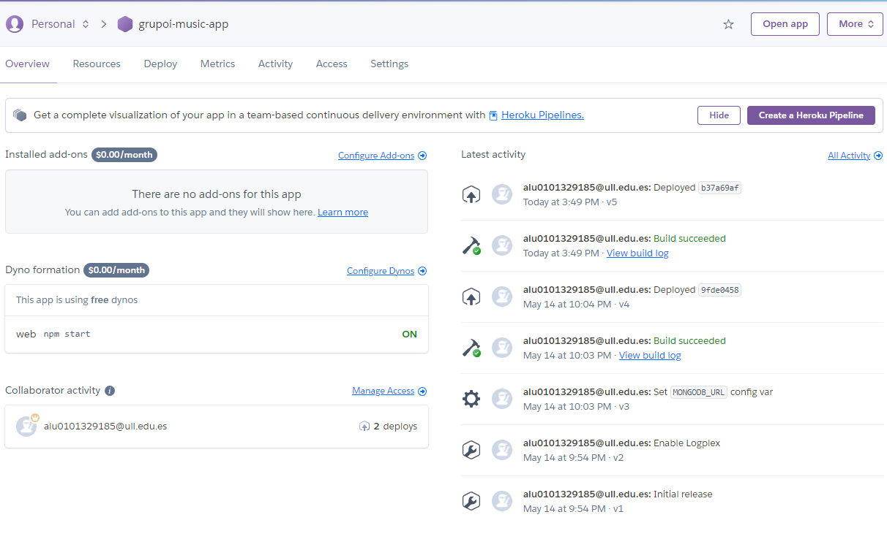
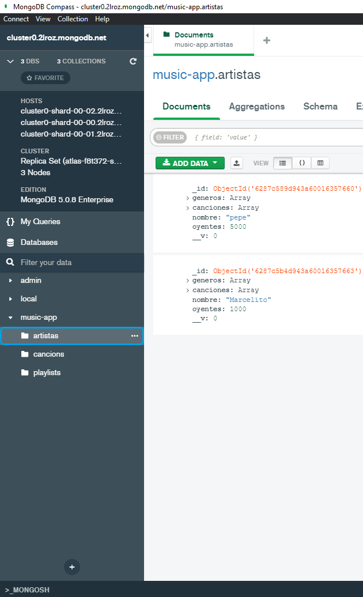
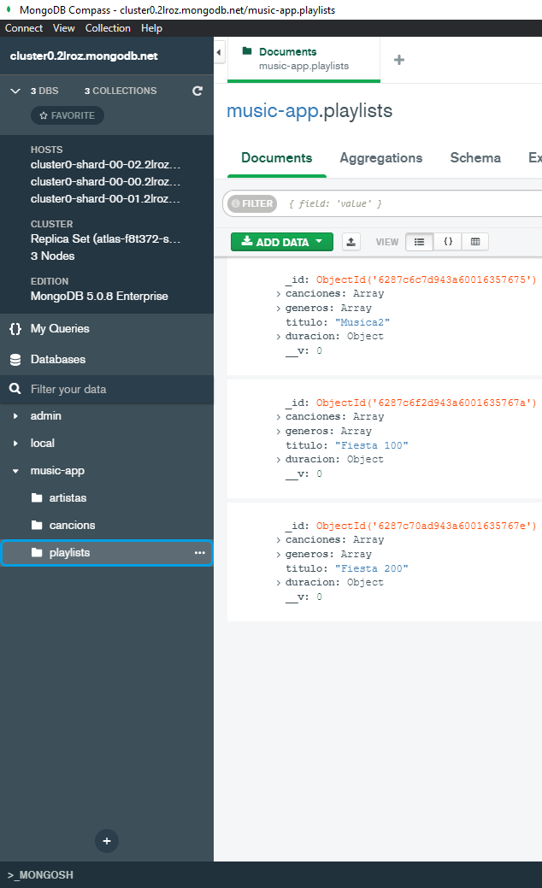
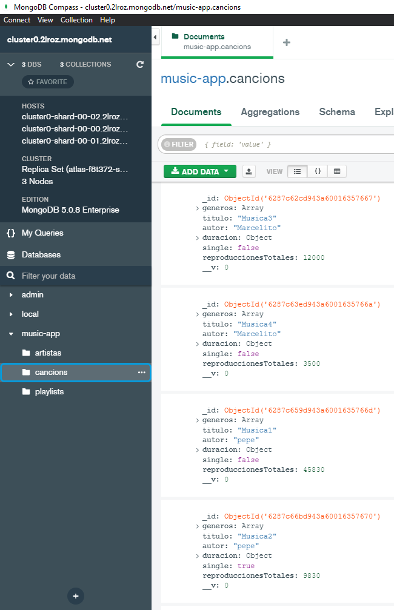

## **Índice**
 * [Tareas Previas.](#dv1)
 * [Metodología de trabajo.](#dv2)
 * [Estructura del proyecto.](#dv3)
 * [Implementación Music App.](#dv4)
 * [Conclusión.](#dv5)


<div id='dv1'/>

## Tareas Previas
> Typedoc: nos permitira realizar la documentación de nuestro código de manera automática. Para instalarlo y configurarlo pinche [aqui](https://drive.google.com/file/d/19LLLCuWg7u0TjjKz9q8ZhOXgbrKtPUme/view).

> Chai y mocha para aplicar metodología TDD en nuestro proyecto. Para instalarlo y configurarlo pinche [aqui](https://drive.google.com/file/d/1-z1oNOZP70WBDyhaaUijjHvFtqd6eAmJ/view).

> [TDD](https://en.wikipedia.org/wiki/Test-driven_development) Iremos desarrollando primero las pruebas de la funcionalidad que queremos desarrollar y luego escribiremos el código necesario para ello por ello estableceremos primero el fichero `.spec.ts` y luego el `.ts`.

> [Instanbul y Coveralls](https://coveralls.io/) añadiremos nuestro repositorio a la página de coveralls para llevar un seguimiento en la realización y cubrimiento de pruebas de nuestro código.


> [Sonar Cloud](https://sonarcloud.io/) Nos permitirá mejorar el flujo de trabajo con calidad y seguridad de codigo.

> [Github Action](https://github.com/features/actions) Usaremos las githubs Actions para aplicar 3 tareas a la hora de realizar un push en nuestro reporsitorio, pruebas con coveralls, pruebas con mocha y integración de Sonar Cloud.

> [Heroku](https://id.heroku.com/login) Nos permitirá publicar nuestra aplicación en Heroku. 

> [MongoDB/MongoDB Atlas](https://www.mongodb.com/es) Nos permitirá tener un cluster, base de datos en la nube y no depender de base local.

<div id='dv2'/>

## Metodología de trabajo.

Al tratarse esta práctica de una práctica `grupal` la organización entre los miembros del equipo juega un papel super importante, en nuestro caso hemos optado por realizar un desarrollo del código de manera grupal y síncrona, es decir, los miembros del equipo que quedamos nos reuniamos y utilizando la extensión del VSCode [Live Share](https://visualstudio.microsoft.com/es/services/live-share/) codificabamos a la vez, esta forma de trabajar tiene diferentes `aspectos positivos` y `negativos`. Los aspectos positivos son que todos codificabamos a la vez por ende no nos pisabamos, la comunicación era fluida, no necesitabamos trabajar en diferentes ramas ya que todos estabamos trabajando en los mismos ficheros de la misma rama y no teniamos que esperar a que otro miembro del equipo terminara su parte para empezar la nuestra; el principal `aspecto negativo` es que los miembros tienen que cuadrar sus horarios para poder trabajar aunque este punto no es tan malo ya que no siempre necesitamos que estén todos lo miembros para codificar ciertas partes.

<div id='dv3'/>

## Estructura del proyecto

```console
├───docs/
│   └───index.md
├───src/
│   ├───db/
│   │   └───mongoose.ts
│   ├───models/
│   │   ├───artista.ts
│   │   ├───cancion.ts
│   │   └───playlist.ts
│   ├───routers/
│   │   ├───artista/
│   │   │   ├───artistaDelete.ts
│   │   │   ├───artistaGet.ts
│   │   │   ├───artistaPatch.ts
│   │   │   ├───artistaPost.ts
│   │   ├───cancion/
│   │   │   ├───cancionDelete.ts
│   │   │   ├───cancionGet.ts
│   │   │   ├───cancionPatch.ts
│   │   │   └───cancionPost.ts
│   │   ├───playlist/
│   │   │   |───playlistDelete.ts
│   │   │   |───playlistGet.ts
│   │   │   └───playlistPatch.ts
│   │   │   └───playlistPost.ts
│   │   |
│   │   └───default.ts
│   ├───tiposDatos/
│   │   └───duracionTipo.ts
│   └───index.ts
├───tests/
│   ├───delete.spec.ts
│   ├───deleteID.spec.ts
│   ├───get.spec.ts
│   ├───getID.spec.ts
│   ├───patch.spec.ts
│   ├───patchID.spec.ts
│   └───post.spec.ts
├───.eslintignore
├───.eslintrc.json
├───.mocharc.json
├───README.md
├───package-lock.json
├───package.json
├───sonar-project.properties
└───tsconfig.jso
```

<div id='dv4'/>

## Implementación Music App

Para la implementación de esta aplicación lo primero es prerarar la conexión con MongoDB para ello se hará uso de `moongose`.

```typescript
/**
 * URL de la base de datos, variable de entorno MONGODB_URL o URL por defecto
 */
const dbURL = process.env.MONGODB_URL || 'mongodb://127.0.0.1:27017/music-app';

/**
 * Conexión a la URL.
 */
connect(dbURL, {
  useNewUrlParser: true,
  useUnifiedTopology: true,
  useCreateIndex: true,
  useFindAndModify: false,
}).then(() => {
  console.log('Conexión con el servidor de MongoDB establecida');
}).catch(() => {
  console.log('No se ha podido establecer la conexión con el servidor de MongoDB');
});

```
Hemos definido `dbURL` donde indicamos la url de conexión y además pensando en que la aplicación pueda ser implementada en un entorno de producción, en este caso la url de conexión será la que nos proporcionen en el entorno de producción, en caso de que no exista la variable de entorno MONGODB_URL, la url será la que se utiliza cuando se despliega el servidor de forma local.

A continuación gracias a `Moongose` crearemos una interfaz para cada modelo que nos permitirá interactuar con la base de datos. Por ejemplo para los artistas, crearemos una interfaz para el modelo `Artista` que tendrá las siguientes propiedades:

```typescript
/**
 * @interface ArtistaInterfaz
 */
interface ArtistaInterfaz extends Document {
  nombre: string,
  generos: string[],
  canciones: string[],
  oyentes: number,
}
```
Una vez definida la interfaz que hereda de `Document` podemos crear el modelo `Artista`:

```typescript
/**
 * Schema de Artista
 */
const ArtistaSchema = new Schema<ArtistaInterfaz>({
  nombre: {
    type: String,
    unique: true,
    required: true,
    trim: true,
    validate: (value: string) => {
      if (value.length === 0) {
        throw new Error("El nombre del artista no puede ser un string vacío");
      }
    }, 
  },
  generos: {
    type: [String],
    required: true,
    validate: (value: string[]) => {
      if (value.length === 0) {
        throw new Error("Los generos no pueden estar vacíos");
      } else {
        value.forEach((genero) => {
          if (genero !== "Rock" && genero !== "Jazz" && genero !== "Rap" && genero !== "Trap" &&
              genero !== "Pop" && genero !== "Metal" && genero !== "Drill" && genero !== "K-pop") {
            throw new Error("Los géneros son incorrectos");
          }
        });
      }
    },
  },
  canciones: {
    type: [String],
    required: true,
    validate: (value: string[]) => {
      if (value.length === 0) {
        throw new Error("El artista tiene que tener alguna canción");
      } else {
        value.forEach((cancion) => {
          if (cancion.length === 0) {
            throw new Error("Una canción no puede estar vacía");
          }
        });
      }
    }, 
  },
  oyentes: {
    type: Number,
    required: true,
    min: 0,
    validate: (value: number) => {
      if (!Number.isInteger(value)) {
        throw new Error("El número de reproducciones tiene que ser un valor entero");
      }
    },
  },
});

/**
 * Modelo del Artista
 */
export const Artista = model<ArtistaInterfaz>("Artista", ArtistaSchema);
```
Como puede observarse se han usado opciones como `trim` para eliminar espacios antes y despues de la cadena de texto por si el usuario introduce espacios en blanco donde no procede, además se hace uso de `unique` en el `nombre` ya que no queremos que en nuestra base datos haya más de un artista con el mismo nombre y `required` ya que necesitamos toda la información de la interfaz nos proporciona para guardarla en la base de datos.

También se hace uso de `validate` para validar los datos que se van a insertar en la base de datos, comprobando por ejemplo que los strings no estén vacíos, que los arrays tampoco estén vacíos y que los géneros a añadir pertenecen a un subconjunto de los géneros que hemos establecido previamente.

Cabe destacar que se han hecho uso types como `duracionMinSegType` y `duracionHorMinType` para asegurar que el formato de entrada sea igual al especificado en el enunciado.

```typescript
/**
 * @type duracionType en minutos y segundos
 */
export type duracionMinSegType = {
    min: number,
    seg: number
}

/**
 * @type duracionType en formato horas y minutos
 */
export type duracionHorMinType = {
    hor: number,
    min: number
}
```

Se ha realizado el mismo procedimiento para `canciones` y `playlist`, como el código de estos no añade nada nuevo a nuestro informe no los hemos añadido, pero su código se puede encontrar en el `directorio src/models/`. A continuación nos quedaría incluir el código de los manejadores delete, get, patch y post para cada uno de los modelos. Como hicimos en los `schema` en el informe solo pondremos el código de los diferentes manejadores para `Artistas`, el código de los manejadores para `canciones` y `playlist` se puede encontrar en la ruta `src/routers/`. Por ejemplo para borrar artistas según un nombre el código del manejador correspondiente será el siguiente:

```typescript
/**
 *  Petición DELETE para eliminar un artista con query string
 */
deleteRouterArtista.delete('/artist', async (req, res) => {
  if (!req.query.name) {
    return res.status(400).send({
      error: 'Se debe ingresar el nombre del artista',
    });
  }

  try {
    const artista = await Artista.findOneAndDelete({nombre: req.query.name.toString()});

    if (!artista) {
      return res.status(404).send();
    }

    return res.send(artista);
  } catch (error) {
    return res.status(400).send();
  }
});
```
Puede observarse como se comprueba que en la query string se ha ingresado el nombre del artista que se quiere eliminar, si no se ha ingresado ninguna se devuelve un error. Los tipos de errores se han especificado siguiendo la siguiente documentación: [Https](https://www.webfx.com/web-development/glossary/http-status-codes/)

Los que más se han usado son los siguientes:

>201: La solicitud se cumplió y resultó en la creación de uno o más recursos nuevos.

>400: El servidor no puede o no procesará la solicitud debido a algo que se percibe como un error del cliente.

>404: El servidor de origen no encontró una representación actual para el recurso de destino o no está dispuesto a revelar que existe.

>500: El servidor encontró una condición inesperada que le impidió cumplir con la solicitud.

>501: El servidor no admite la funcionalidad requerida para cumplir con la solicitud.

Tambíen podemos observar que se nos pide implementar el manejador mediante el uso de `params`, para ser exactos el `id` de la base de datos, para ello se ha usado el siguiente código:

```typescript
/**
 *  Petición DELETE para eliminar un artista con params
 */
deleteRouterArtista.delete('/artist/:id', async (req, res) => {
  try {
    const artista = await Artista.findByIdAndDelete(req.params.id);

    if (!artista) {
      return res.status(404).send();
    }

    return res.send(artista);
  } catch (error) {
    return res.status(400).send();
  }
});
```
Puede verse que para eliminar una canción es requerido el identificador único que añade Mongo en la base de datos, por lo que se ha usado el `params` para especificar que se va a recibir en el `id` de la petición.

Se ha hecho uso de la función `findByIdAndDelete` para eliminar una canción de la base de datos mediante el `_id`, pero también se puede usar `findOneAndDelete` para eliminar una canción por el nombre de la misma, o por otro parámetro según el desarrollador decida en su implementación.

Para el manejador de get se ha usado el siguiente código:

```typescript
/**
 *  Petición GET para obtener un artista con query string
 */
getRouterArtista.get('/artist', async (req, res) => {
  const filter = req.query.name?{nombre: req.query.name.toString()}:{};

  try {
    const artista = await Artista.find(filter);

    if (artista.length !== 0) {
      return res.send(artista);
    }

    return res.status(404).send();
  } catch (error) {
    return res.status(500).send();
  }
});

/**
 *  Petición GET para obtener un artista con params
 */
getRouterArtista.get('/artist/:id', async (req, res) => {
  try {
    const artista = await Artista.findById(req.params.id);

    if (!artista) {
      return res.status(404).send();
    }

    return res.send(artista);
  } catch (error) {
    return res.status(500).send();
  }
});
```
La función `find` de Mongoose nos permite buscar varias entradas en la base de datos, el resultado de la búsqueda lo guarda en un array, en este caso se ha usado `find` para buscar mediante `filter` que es una variable que almacena el nombre de la cancion, pero también se puede usar `findById` para buscar una entrada en la base de datos por el `_id` de la misma. Se ha usado `find` ya que en el caso de que no nos introduzcan ningún nombre en la query devolveremos todos los artistas almacenados en la base de datos, si no hicieramos esta implementación podríamos haber usado en este caso `findOne` y quedarnos con un único elemento, ya que el nombre de los artistas es único en la base de datos (lo definimos así en el schema).

Para el manejador patch se ha usado el siguiente código:

```typescript
/**
 *  Petición PATCH para modificar un artista con query string
 */
patchRouterArtista.patch('/artist', async (req, res) => {
  if (!req.query.name) {
    return res.status(400).send({
      error: 'Nombre de artista no especificado',
    });
  }

  const allowedUpdates = ['generos', 'canciones', 'oyentes'];
  const actualUpdates = Object.keys(req.body);
  const isValidUpdate =
    actualUpdates.every((update) => allowedUpdates.includes(update));

  if (!isValidUpdate) {
    return res.status(400).send({
      error: 'La actualización no es válida',
    });
  }

  try {
    const artista =
    await Artista.findOneAndUpdate({nombre: req.query.name.toString()}, req.body, {
      new: true,
      runValidators: true,
    });

    if (!artista) {
      return res.status(404).send();
    }

    return res.send(artista);
  } catch (error) {
    return res.status(400).send(error);
  }
});

/**
 *  Petición PATCH para modificar un artista con params
 */
patchRouterArtista.patch('/artist/:id', async (req, res) => {
  const allowedUpdates = ['nombre', 'generos', 'canciones', 'oyentes'];
  const actualUpdates = Object.keys(req.body);
  const isValidUpdate =
      actualUpdates.every((update) => allowedUpdates.includes(update));

  if (!isValidUpdate) {
    return res.status(400).send({
      error: 'La actualización no es válida',
    });
  }

  try {
    const artista = await Artista.findByIdAndUpdate(req.params.id, req.body, {
      new: true,
      runValidators: true,
    });

    if (!artista) {
      return res.status(404).send();
    }

    return res.send(artista);
  } catch (error) {
    return res.status(400).send(error);
  }
});
```
Para desarrollar este manejador se ha creado un vector `allowedUpdates` que contiene los campos que se pueden actualizar, y se ha creado un vector `actualUpdates` que contiene los campos que se han actualizado, para ello se ha usado la función `Object.keys` para obtener los campos que se han actualizado, y se ha usado la función `every` para comprobar que todos los campos que se han actualizado están dentro del vector `allowedUpdates`.

En caso de que la validación sea correcta se ha usado la función `findOneAndUpdate` para buscar una canción por el nombre de la misma, pero también se puede usar `findByIdAndUpdate` para buscar una canción por el `_id` de la misma.

En caso del manejador de post se ha usado el siguiente código:

```typescript
/**
 * Peticion Post para crear un artista
 */
postRouterArtista.post('/artist', async (req, res) => {
  const artista = new Artista(req.body);
  try {
    await artista.save();
    res.status(201).send(artista);
  } catch (error) {
    res.status(400).send(error);
  }
});
```
Nos permite crear un modelo Artista gracias al JSON que esta almacenado en `req.body` si todo se ha creado correctamente se usa `save` y se muestra el status 201, en caso contrario se muestra el status 400.

Llegados a este punto se ha podido apreciar como se ha utilizado `async/await` en los manejadores de cada ruta, esto se ha hecho ya que facilita el uso de promesas y también hace mucho más legible y limpio nuestro código.

Nos quedaría controlar el caso de que el usuario introduzca una ruta que no esta contemplada en las especificadas anteriormente para ello se ha usado el siguiente codigo:

```typescript
/**
 * Manejador para ruta por defecto
 */
defaultRouter.all('*', (_, res) => {
  res.status(501).send();
});
```

Debido a una mayor estructuración del código se ha hecho uso de `express.Router()`

```typescript
export const defaultRouter = express.Router();
```

Gracias es esto en el `Index` se han importado todas las rutas que se han creado. Nos quedaría usar `use` para que se controlen las rutas.

```typescript
// Express
const app = express();
app.use(express.json());

// Delete
app.use(deleteRouterArtista);
app.use(deleteRouterCancion);
app.use(deleteRouterPlaylist);
```

Nos quedaría implementar las pruebas para controlar que todo funciona correctamente para ello hacemos uso de:

```typescript
import chaiHttp from 'chai-http';
chai.use(chaiHttp);
const url = 'https://grupoi-music-app.herokuapp.com/';
```
De esta manera gracias a la importación de `chaiHttp` podemos hacer uso de la función `chai.request` para hacer las pruebas:

Algunos ejemplos de pruebas son los siguientes:
```typescript
  describe('Artistas', () => {
    it('Sacar todos los Artistas', (done) => {
      chai.request(url)
      .get('/artist')
      .end((err, res) => {
        if (err) {
          throw new Error('Error');
        }
        expect(res).to.have.status(200);
        done();
      });
    });
    it('Sacar un artista', (done) => {
      chai.request(url)
      .get('/artist?name=El%20duro')
      .end((err, res) => {
        if (err) {
          throw new Error('Error');
        }
        expect(res).to.have.status(200);

        chai.request(url)
        .get(`/artist/${res.body[0]._id}`)
        .end((err, res) => {
          if (err) {
            throw new Error('Error');
          }
          expect(res).to.have.status(200);
          done();
        });
      });
    });
    it('Sacar un artista que no existe', (done) => {
      chai.request(url)
      .get('/artist?name=Error')
      .end((err, res) => {
        if (err) {
          throw new Error('Error');
        }
        expect(res).to.have.status(404);

        chai.request(url)
        .get(`/artist/000000000000000000000000`)
        .end((err, res) => {
          if (err) {
            throw new Error('Error');
          }
          expect(res).to.have.status(404);
          done();
        });
      });
    });
  });

```

Se puede observar que se realiza una petición get a la aplicación desplejada en heroku, en este caso se sacan todos los artista y se espera un código de respuesta 200 y 404 ya que contemplamos casos donde la petición no es correcta. Las peticiones se realizarán primero con query string y luego en la varible `res` tendremos el id para realizar la petición mediante params.

Salida de la consola:

```console
Solicitud GET
    Artistas
      ✔ Sacar todos los Artistas (318ms)
      ✔ Sacar un artista (626ms)
      ✔ Sacar un artista que no existe (627ms)
    Canciones
      ✔ Sacar todas las canciones (315ms)
      ✔ Sacar una canción (623ms)
      ✔ Sacar una canción que no existe (628ms)
    Playlist
      ✔ Sacar todas las Playlist (312ms)
      ✔ Sacar una playlist (629ms)
      ✔ Sacar una playlist que no existe (621ms)
```

Con esto tendríamos la aplicación finalizadas, el resto de pruebas se pueden encontrar en el directorio tests/ además en el vídeo realizado se puede ver la ejecución de las pruebas y como estas cumplen las expectativas. Se aportan imágenes sobre el despliegue en Heroku y la creación del Cluster en MongoDB Atla









<div id='dv5'/>

## Conclusión

Ha resultado bastante interesante el uso de herramientas como `Heroku` y `MongoDB Atlas` para el desarrollo de una aplicación de música, además ha sido interesante aprender como trabaja `moongose` con la creación de modelos que además antes de su creacion permite ejecutar ciertas validaciones para mantener la base de datos coherente y actualizada. Además gracias a la documentación aportada por el profesorado se ha podido realizar una correcta implementación de las pruebas con código asíncrono. 
