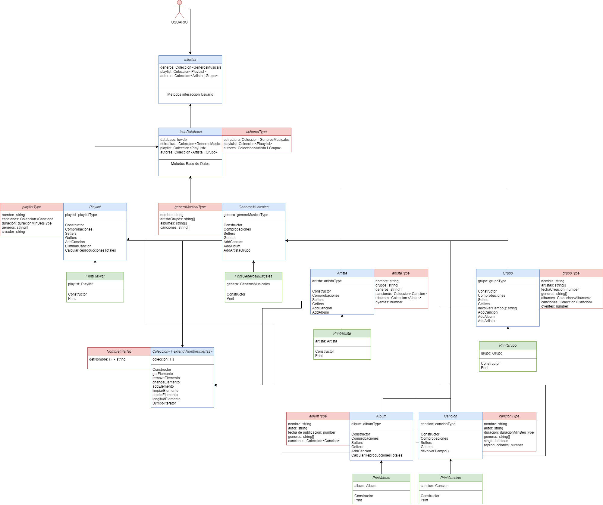

# Práctica 7 

## **Índice**
 * [Tareas Previas](#dv1)
 * [Metodología de trabajo](#dv2)
 * [Planteamiento del problema](#dv3)
 * [Desarrollo de la solución escogida](#dv4)
 * [Conclusión](#dv5)


<div id='dv1'/>

## Tareas Previas
> Typedoc: nos permitira realizar la documentación de nuestro código de manera automática. Para instalarlo y configurarlo pinche [aqui](https://drive.google.com/file/d/19LLLCuWg7u0TjjKz9q8ZhOXgbrKtPUme/view).

> Chai y mocha para aplicar metodología TDD en nuestro proyecto. Para instalarlo y configurarlo pinche [aqui](https://drive.google.com/file/d/1-z1oNOZP70WBDyhaaUijjHvFtqd6eAmJ/view).

> [TDD](https://en.wikipedia.org/wiki/Test-driven_development) Iremos desarrollando primero las pruebas de la funcionalidad que queremos desarrollar y luego escribiremos el código necesario para ello por ello estableceremos primero el fichero `.spec.ts` y luego el `.ts`.

> [Instanbul y Coveralls](https://coveralls.io/) añadiremos nuestro repositorio a la página de coveralls para llevar un seguimiento en la realización y cubrimiento de pruebas de nuestro código.

> [Principios Solid](https://profile.es/blog/principios-solid-desarrollo-software-calidad/) Aplicaremos los principios Solud para mantener una alta cohesión y por tanto un buen acoplamiento de software.

> [Sonar Cloud](https://sonarcloud.io/) Nos permitirá mejorar el flujo de trabajo con calidad y seguridad de codigo.

> [Github Action](https://github.com/features/actions) Usaremos las githubs Actions para aplicar 3 tareas a la hora de realizar un push en nuestro reporsitorio, pruebas con coveralls, pruebas con mocha y integración de Sonar Cloud.

> [Inquirer](https://www.npmjs.com/package/inquirer) Módulo que nos permitirá integrar una consola interactiva para que el usuario este más comodo con la interacción con el programa.

> [Lowdb](https://www.npmjs.com/package/lowdb) Módulo que nos permitirá tener una base de datos propia donde guardar nuestra colección de canciones, autores, albumes y demás.

<div id='dv2'/>

## Metodología de trabajo.

Al tratarse esta práctica de una práctica `grupal` la organización entre los miembros del equipo juega un papel super importante, en nuestro caso hemos optado por realizar un desarrollo del código de manera grupal y síncrona, es decir, todos los miembros del equipo nos reuniamos y utilizando la extensión del VSCode [Live Share](https://visualstudio.microsoft.com/es/services/live-share/) codificabamos a la vez, esta forma de trabajar tiene diferentes `aspectos positivos` y negativos. Los aspectos positivos es que todos codificabamos a la vez por ende no nos pisabamos, la comunicación era fluida, no necesitabamos trabajar en diferentes ramas ya que todos estabamos trabajando en los mismos ficheros de la misma rama y no teniamos que esperar a que otro miembro del equipo terminara su parte para empezar la nuestra; el principal `aspecto negativo` es que todos los miembros tienen que cuadrar sus horarios para poder trabajar aunque este punto no es tan malo ya que no siempre necesitamos que estén todos lo miembros para codificar ciertas partes.


<div id='dv3'/>

## Planteamiento del problema.



La jerarquía que hemos seguido para la realización de la práctica es la que puede observarse en la imagen:

Respecto a la clase `Cancion` en el enunciado se nos pide que contenga nombre de la cancion, autor, duración, genero al que pertenece, booleano para indidcar si la canción es un single o no y el número de reproducciones totales. Por ello se ha implementado una interfaz que almacene dichos, a su vez la clase Cancion en su constructor recibira un objeto de la interfaz que hemos creado asi nos aseguramos quer todas las canciopnes cumplan con la mima estructura. Algunas fucniones a destacar sería el calculo total de lña duracion en segundo ya que usamos un tipo de dato que almacena dos numeros, minutos y segundos repestivamente. Además de la clase Cancion se ha implementado la clase PrintCancion que recibira una instancia de la clase Cancion e imprimirá dicho objeto gracias al metopdo print para respetar Single-responsibility principle. Todo esto podrá observarse en la imagen de encima con los colores azul y verde indicando aquellas clases que están respetando dicho principio.

Luego podemos ver la clase `Album` que tambien tiene un tipo de datos para almacenar los valores que se nos indicaban en el enunciado, algo a destacar sería que esta clase dispondrá de una propiedad canciones que almacenará una Coleccion de objetos Cancion es decir en esta clase dispondrimaos de toda la infoprmacion de las canciones. Además disponemos de unos metodo como `comprobarCanciones` para asegurarnos de que las canciones cumplen con los requisitos, además de métodos para añadir canciones a la propiedad que se meciono anteriormente. Un metodo interesante podría ser el `calculodeReporduciionesTotales` donde se recorren las canciones del objeto album y se van sumando las reproducciones de cada cancion. Tambíen respeta el principio Single-responsibility ya que se implemento una clase PrintAlbum para devolver una cadena correctamente formateada con la informacion del album.

La clase `Artista` y la clase `Grupo` dispone de su propio tipo donde almacenar la informacion, se decidio implementar que el artista o grupo guardará colecciones de Album y Canciones ya que si guardamos solo los nombre en un string eso nos obligaría a almacenar la canciones y albumes por separado de esta forma si nos basamos en que una cancion o algun siempre va a pertenecer a un artista las búsqueda en la base de datos serán más rápidas, en cambio su almacenáramos un string tendrimos que recorrer en otro objeto para buscar la canciones o albumes y como en javascript no hay punteros(es decir que si cambiaramos esa cancion en un sitio no se cambiaría en los demás) hemos optado por esta solución. Dicha clase dispone de métodos para comporbar los requisitos de los albumes y canciones, además de métodos para añadir los mismo respectivamente.

La clase `GenerosMusicales` almacenará la informacion mediante string o array de string, en ester caso no se ha incluido una coleccion de canciones, albumes o artistas ya que eso añadiría mucha redundancia en la base de datos un ejemplo de codigo podría ser el siguiente:

```typescript
[...this.generos].forEach ((genero) => {
  [...genero.getCanciones()].forEach ((cancion) =>{
    if(cancion.getNombre() === x) {
      // modificacion
    }
    });
  [...genero.getAlbumes()].forEach((album) => {
    [...album.getCanciones()].forEach ((cancion) =>{
      if(cancion.getNombre() === x) {
      // modificacion
      }
    });
   });
 });
 [...this.autores].forEach ((autor) => {
  [...autor.getCanciones()].forEach ((cancion) =>{
    if(cancion.getNombre() === x) {
      // modificacion
    }
    });
  [...autor.getAlbumes()].forEach((album) => {
    [...album.getCanciones()].forEach ((cancion) =>{
      if(cancion.getNombre() === x) {
      // modificacion
      }
    });
   });
 });
```

Hemos implementado una clase ` Coleccion` de tipo Genérica que almacenará un un array de tipo `T` esto nos ayudara para agrupar todas la canciones, albumes y artistas ya que dentro se implemento:

```typescript
  [Symbol.iterator](): Iterator<T> {
    return this.coleccion.values();
  }
```
De esta manera ya tendríamos nuestra colección iterable gracias al operador (...). Dentro de esta clase se dispone de métodos de añadir elemtos, eliminarlo, devolver un elemto en concreto y demás. Todas las clase mencionadas anteriormente hará uso de dicha Coleccion.


La clase `Playlist` almacenara la informacion en un tipo playlistType que puede observarse en la imagen y dentro aparte de su información esencial hemos almacenado una coleccion de canciones en vez de un array con los nombres de las canciones por el problema que hemos mencionado anteriormente. Además dispone de metodos para identificar los generos de una playlist a partir de la canciones que la componen y un metodo para calcular la duracion de la playlist a partir de las canciones que la componen, metodos para añadir y eliminar canciones además de calculodeReproduccionesTotales, es decir sumatorio de las reproducciones de cada canción que la compone.

Por último nos quedaría hablar de la base de datos implementada con el modulo lowdb y la interfaz implementada con inquirer.

Comezaremos con la clase `JsonDataBase` para ello primero deberemos hablar del esquema de la base de datos:

```typescript
type schemaType = {
  estructura: Coleccion<GenerosMusicales>,
  playList: Coleccion<PlayList>,
  autores: Coleccion<Artista | Grupo>,
}
```

Si nos fijamos nuestra base de datos almacenará una propiedad estructura, dicha propiedad contiene colecciones de generos musicales y sabemos que cada genero almacena nombre del genero y sus repestivos artistas, albumes y canciones en un array de string. La segunda propiedad playlist almacenará una coleccion de playlist y cada playlist almacenará además de su informacion la coleccion de canciones mencionada anteriormente y por ultimo tenemos la propiedad autores que es una coleccion de Artista / Grupo y cada uno contendrá colecciones de albumes y canciones. Como hemos dicho anteriormente esta sería la estructura más optima a la hora de realizar las búsquedas o realizar las modificaciones además de que siempre se guardará la relacion es decir no habrá canciones sin artistas o no habrá canciones que no pertenezcan a ningun genero y demás. Dentro de la clase se dispondrá de metodos para realizar las modificaciones en la base de datos y la extracción de información.

Se ha creado un archivo en `src/BaseDeDatos/dataBase.ts` donde se han creado cual es la información que tendrá la base de datos incialmente:

* Al menos 50 canciones distintas.
* Incluir al menos diez géneros musicales distintos. Las canciones deben estar uniformemente distribuidas entre estos diez géneros.
* Un mínimo de cinco grupos musicales.
* Al menos cinco artistas.
* Entre cinco y diez álbumes musicales.
* Incluir tres playlists distintas.

En las lineas finales de dicho archivo se puede ver la coleccion de generos, playlist y autores que se ha exportado ya que esa es la información que almacenará la base de datos como mecionamos anteiormente.

Nos quedaría hablar de la clase `Interfaz` para la cual se ha implementado suguiendo el patrón singleton, ya que no tiene sentido que dicha interfaz tenga más de una instancia en el programa que estamos implementado. Algunas cosas a destacar sobre dicha clase sería que además del modulo inquirer tammbién se uso el inquirer-autocomplete para que la búsqueda del usuario se más cómoda:

```typescript
  const inquirerPrompt = require('inquirer-autocomplete-prompt');
  inquirer.registerPrompt('autocomplete', inquirerPrompt);
```

Además se utilizo el módulo fuzzy para complementar con el inquirer y realizar búsquedas  mediante filtros y patrones.:

```typescript
const fuzzy = require('fuzzy');
```
El usuario nada más ejecutar el programa podrá visualizar la salida del metodo `run()` dicho metodo sería el principal y antes de ejecutarse ya se habrá cargado la informacion de la base de datos. Entre sus opciones estarán `Añadir, modificar o eliminar` que sería el apartado de  permitir añadir, borrar y modificar géneros, canciones, álbumes, grupos y artistas, luego tenemos  `Visualizar` que se encargará de visualizar información de los grupos o artistas permitiendo establecer diferentes tipos de filtro tanto en canciones como albumes y playlist y por último `Gestión avanzada de PlayLists` que sería la parte de la clase Gestor donde una vez introducido el nombre del usuario se podrán visualizar las playlist del sitema, navegar a través de ellas, crear playlist nuevas o partir de una existente y borrar , modificar playlist del usuario que las creo. Las que se cargan incialmente son creadas por el usuario SYSTEM así que no podrán ser eliminadas. Algunos aspectos a destacar serían las llamadas a la base de datos despues de cualquier método según la informacion que se este modificando:

```typescript
      this.dataBase.guardarEstructura();
      this.dataBase.guardarPlayList();
```

Algunos inquirer.prompt tiene en type: "autocomplete" de esta manera se puede definir otra `etiqueta` source donde:

```typescript
 source: (answersSoFar: any, input: string) => this.searchStates(this.searchCanciones, input),
 ```
 Según la entrada que vaya escribiendo el usuario se estará realizando una búsqueda en el vector de canciones.
 
 Se hace uso de validate para realizar comprobaciones en la entrada del usuario por ejemplo:
 
 ```typescript
       name: "fechaNuevo",
      message: "Nueva fecha de creación del grupo:",
      validate: (value: any) => {
        const regex: RegExp = /^[0-9]*$/;
        if (!regex.test(value)) {
          return "Las reproducciones deben ser un número";
        }
        return true;
      },
    },
```
De esta manera no se dejará al usuario continuar hasta que no introduzca un valor númerico

Tambíen se han añadido diversos throw ya que el propio inquirer.promnt dispone de  un `.catch` de esta manera si por ejemplo estamos añadiendo un artista y se introducen generos incorrector se lanzará una exepción haciendo que no se ejecute el resto de codigo hasta el .catch del inquirer:

```typescript
.then(() => {
 if (this.mirarGeneros(generos, answers["autor"]) !== generos.length) {
    throw new Error("¡¡¡¡¡ERROR: Géneros incorrectos!!!!!");
  }
  ...
  ...
  }).catch((error) => {
  console.log(error.message);
  }
  ...
```

<div id='dv4'/>

## Desarrollo de la solución escogida.

Cuando empezamos a desarrollar empezamos por las pruebas de las diferentes clases a exepción de la clase interfaz, cuando tuvimos las pruebas planteadas comenzamos con la codificación de cada clase, xomenzamos por la clase más baja en nuestra jerarquía y hasta llegar a GenerosMusicales, luego continuamos con Playlist, JsonDataBase y por último la clase Interfaz (teniendo en cuenta que para cada clase hay que desarrollar una clase que pueda imprimir un objeto de la mismo, hay que crear un tipo de dato para cada clase...).

La codificación hasta llegar a la clase JsonDataBase no tuvo complicación alguna ya que simplemente son clases que almacenan información y toda la información tiene que estar relacionada, con la clase JsonDataBase las cosas se complican un poco más ya que hay que entender como funciona el módulo LowDB, este en sí mismo no es complicado cuando se miran varios ejemplos, el problema surge cuando en la base de datos guardamos instancias de la clase Coleccion<GenerosMusicales>,  Coleccion<PlayList> y Coleccion<Artista | Grupo>, ya que estas instancias guardan dentro de sí otras colecciones, por ejemplo, la clase PlayList tiene dentro un atributo Coleccion<Canciones>. El error se produce cuando al intentar sacar de la base de datos un objeto Coleccion<X> siendo X cualquier clase, en tiempo de compilación no habrá ningún problema ya que estamos asignando a un Coleccion<X> el valor de otro Coleccion<X> que está en la base de datos, el problema surge en tiempo de ejecución ya que al intentar usar algún método de la clase Coleccion<X> nos dirá que esa clase no tiene definido ese método, este mismo error ocurre con cualquier clase que se guarde en la base de datos. Veamoslo con un ejemplo:

Fragmento de código donde se guarda la información en la base de datos.
```typescript
this.database.set('estructura', this.estructura).write();
```

Error en tiempo de ejecución ya que `aux` no va a tener ningún método de la clase Coleccion<T>
```typescript
let aux: Coleccion<GenerosMusicales> = this.database.get('estructura').value();
```

Solución del error en tiempo de ejecución ya que se crea un nuevo objeto Coleccion
```typescript
const aux = new Coleccion<GenerosMusicales>(...this.database.get('estructura').value().coleccion);
```

El fragmento de código anterior soluciona el problema del error en tiempo de ejecución para la clase Colección pero no lo soluciona para la clase que es almacena por Coleccion ni para cualquier otra clase que haya dentro de la misma. Además añade otro problema, y es que ya no puede haber en el cosntructor métodos que utilicen métodos de algún atributo para realizar algún tipo de comprobación, por ejemplo, un método en el constructor de la clase Artista que compruebe que las canciones pasadas son de dicho artista, ya que esto nos obligaría a iterar la clase Coleccion<Canciones> que no es iterable porque acaba de ser sacade de la base de datos y no tiene métodos y el método getAutor() de la clase Canciones que tampoco lo tiene (hasta que solucionemos el problema).

Para solucionar este gran problema que en principio viene dado por seguir los principios SOLID(uso de la clase Coleccion<T> en vez de utilizar un simple array) y realizar una estructura de datos tan relacionada y lógica, lo que haremos es crear las estructuras principales (Coleccion<GenerosMusicales>,  Coleccion<PlayList> y Coleccion<Artista | Grupo>), recorrerlas con bucles y crear dentro cada estructura y así hasta llegar al final. El código es el siguiente:
 
Para `Coleccion<GenerosMusicales>`:
  
```typescript
   const aux = new Coleccion<GenerosMusicales>(...this.database.get('estructura').value().coleccion);
    
      let contadorGenero = 0;
      [...aux].forEach((genero) => {
        genero = new GenerosMusicales(genero.genero, false);
        
        aux.changeElemento(genero, contadorGenero);
        contadorGenero++;
      });
      this.estructura = aux;

  ```
Para `Coleccion<PlayList>`:
  
```typescript
   const aux = new Coleccion<PlayList>(...this.database.get('playList').value().coleccion);
      let contadorPlayList: number = 0;
      let contadorCancion: number = 0;

      [...aux].forEach((playlist) => {
        playlist = new PlayList(playlist.playlist, false);
        playlist.setCanciones(new Coleccion<Cancion>(...playlist.getCanciones().coleccion));
        [...playlist.getCanciones()].forEach((cancion) => {
          cancion = new Cancion(cancion.cancion);
          playlist.getCanciones().changeElemento(cancion, contadorCancion);
          contadorCancion ++;
        });
        contadorCancion = 0;
        aux.changeElemento(playlist, contadorPlayList);
        contadorPlayList++;
      });
      this.playList = aux;

 ``` 
  
Para `Coleccion<Artista | Grupo>`:
  
```typescript
      const aux = new Coleccion<Artista | Grupo>(...this.database.get('autores').value().coleccion);
      let contadorAutor: number = 0;
      let contadorAlbum: number = 0;
      let contadorCancion: number = 0;

      [...aux].forEach((autor) => {
        if ("artista" in autor) {
          autor = new Artista(autor.artista, false);
        } else {
          autor = new Grupo(autor.grupo, false);
        }
        autor.setAlbumes(new Coleccion<Album>(...autor.getAlbumes().coleccion));
        autor.setCanciones(new Coleccion<Cancion>(...autor.getCanciones().coleccion));

        [...autor.getAlbumes()].forEach((album) => {
          album = new Album(album.album, false);
          album.setCanciones(new Coleccion<Cancion>(...album.getCanciones().coleccion));
          autor.getAlbumes().changeElemento(album, contadorAlbum);
          contadorAlbum++;
          [...album.getCanciones()].forEach((cancion) => {
            cancion = new Cancion(cancion.cancion);
            album.getCanciones().changeElemento(cancion, contadorCancion);
            contadorCancion ++;
          });
          contadorCancion = 0;
        });
        contadorAlbum = 0;

        [...autor.getCanciones()].forEach((cancion) => {
          cancion = new Cancion(cancion.cancion);
          autor.getCanciones().changeElemento(cancion, contadorCancion);
          contadorCancion ++;
        });
        contadorCancion = 0;
        aux.changeElemento(autor, contadorAutor);
        contadorAutor++;
      });
  this.autores = aux;

  ```
Al utilizar bucles `forEach` es necesario utilizar contadores ya que el valor del objeto que recorre cada elemento en el bucle solo se cambia dentro del bucle, es por esto que en la clase Coleccion fue necesario un método que cambie un valor en una cierta posición, al usar contadores somos capaces de saber por cual iteración va el bucle forEach y sustituir ese valor en esa misma posición.
  
Luego de solucionar todos los problemas con la clase `JsonDataBase` empezamos la codificación de la clase Interfaz que será el corazón de nuestro programa, en esta clase hay casi 2500 líneas de código que permiten que el programa sea usable por el usuario y que la información se mantenga coherente y lógica. En principio la mayor dificultad de esta parte fue la instalación del módulo Inquire y aprender a utilizarlo, aunque tuvimos ciertos problemas ya que el módulo tiene limitaciones bastantes importantes, es decir, nosotros teníamos la siguiente jerarquia: `Inicio -> Gestión avanzada de playlists -> Gestionar playlist -> Modificar playlist -> Verificar que la playlist sea del usuario -> Cambiar X`; con esta jerarquía si nosotros modificamos alguna playlist nos arrojará un `error` el módulo inquire diciendo que hay demasiados escuchadores a la vez, la solución fue quitar un paso, pero por otro lado si decidimos añadir un album y añadirle 20 canciones no se producirá ningún error.
  
Por último comentar que cuando empezamos a practicar con el `módulo inquirer` intentamos poner en medio de una `promesa` un método que llamara a otra promesa, por ejemplo, dentro de la promesa que crea un album un bucle que cree tantas canciones como el usuario haya indicado. Las promesas tiene un comportamiento algo "parecido" a los `hilos`, es decir, se ejecutan a la vez, es por esto que tuvimos que cambiar esta forma de crear canciones apartir de un album, lo que hicimos es crear una especie de recursividad de forma que el método que crea las canciones recibe algunos datos del album y la cantidad de canciones que se quiere crear, de esta forma al final de la promesa del método de las canciones hay un condicional, si el número de canciones es 0 sale y si es mayor que 0 se llama a si mismo otra vez restando 1 al número de canciones.
  
<div id='dv5'/>

## Conclusión
  
Al principio parecía que la práctica no era de gran volumen pero a medida que nos ibamos adentrando en la base de datos y las relaciones entre clases nos dimos cuenta que quizás era mucho más densa que lo que pensábamos. Se le dedico mucho tiempo a lo que sería el planteamiento de la base de datos ya que queríamos que la información dentro de esta fuera lógica y sin redundancia. Hemos aprendido a utilizar de manera bastante fluida los módulos de inquirer y lowdb gracias al gran tiempo dedicado.

