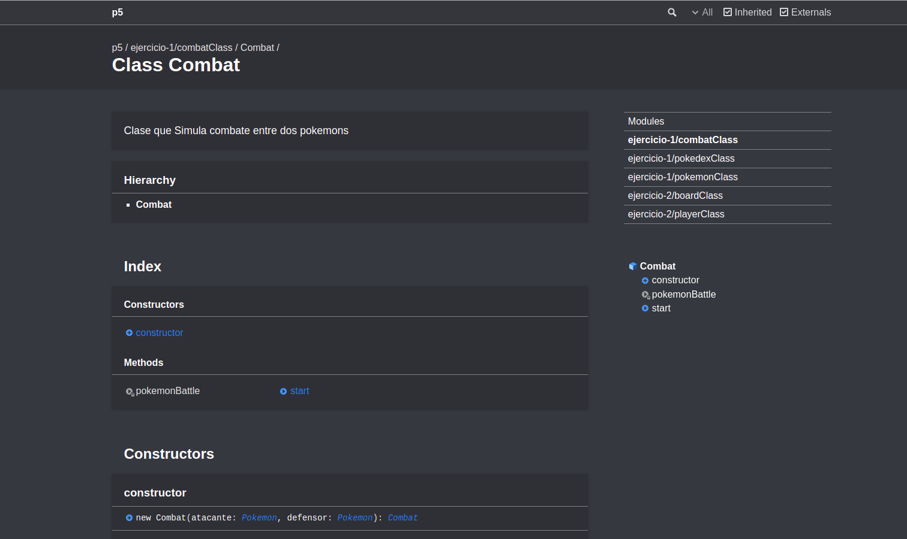
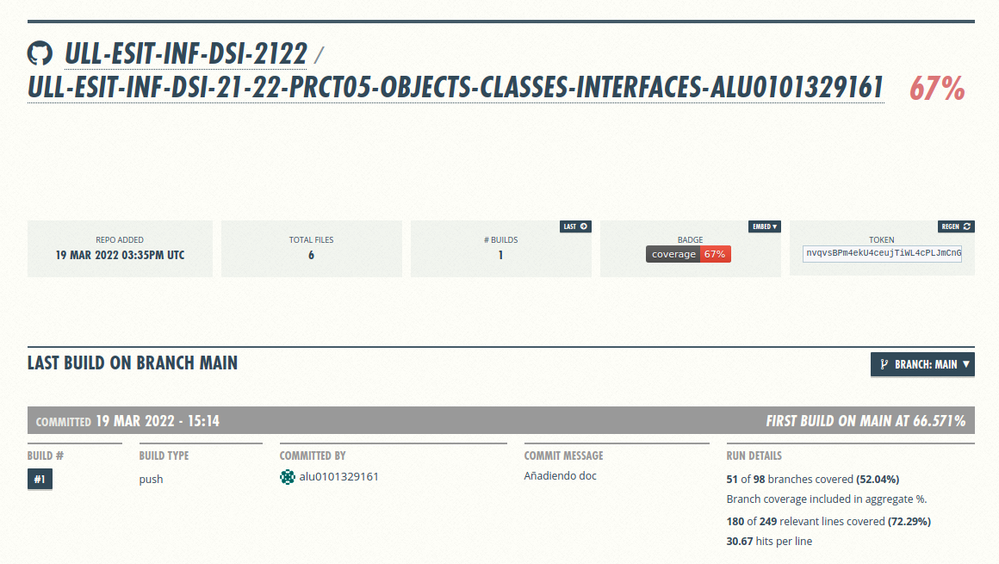

# Práctica 5: Objetos, clases e interfaces

[](https://coveralls.io/github/ULL-ESIT-INF-DSI-2122/ull-esit-inf-dsi-21-22-prct05-objects-classes-interfaces-alu0101329161?branch=main)

En esta práctica continuaremos utilizando herramientas como jsdoc, mocha, chai para generar documentacion y segui metodología TDD. Además incorporaremos nuevas herramientas para cubrimiento de código como Instanbul y Coveralls. Por útimo nos familizaremos con el uso de objetos, clases e interfaces en Typescript

## **Índice**
 * [Tareas Previas](#dv1)
 * [Ejercicio 1](#dv2)
 * [Ejercicio 2](#dv3)
 * [Autor](#dv4)


<div id='dv1'/>

## Tareas Previas

> Typedoc: nos permitira realizar la documentación de nuestro código de manera automática. Para instalarlo y configurarlo pinche [aqui](https://drive.google.com/file/d/19LLLCuWg7u0TjjKz9q8ZhOXgbrKtPUme/view)

> Chai y mocha para aplicar metodología TDD en nuestro proyecto. Para instalarlo y configurarlo pinche [aqui](https://drive.google.com/file/d/1-z1oNOZP70WBDyhaaUijjHvFtqd6eAmJ/view)

> [TDD](https://en.wikipedia.org/wiki/Test-driven_development) Iremos desarrollando primero las pruebas de la funcionalidad que queremos desarrollar y luego escribiremos el código necesario para ello por ello estableceremos primero el fichero `.spec.ts` y luego el `.ts`.

> [Instanbul y Coveralls](https://coveralls.io/) añadiremos nuestro repositorio a la página de coveralls para llevar un seguimiento en la realización y cubrimiento de pruebas de nuestro código.


---

<div id='dv2'/>

## Ejercicio 1

```typescript
/**
 * Posibilidades entre los tipos de pokemons
 */
type pokemonType = ("planta" | "fuego" | "agua" | "electrico");
/**
 * @class Clase que permite representar Pokemon
 * ```typescript
 * const pikachu = new Pokemon("Pikachu", 10, 2.3, "electrico", [2, 3, 5, 6]);
 * ```
 */
export class Pokemon {
  /**
   * COnstructor que recibe informacion básica del pokemon
   * @param  {string} publicreadonlynombre
   * @param  {number} publicreadonlypeso
   * @param  {number} publicreadonlyaltura
   * @param  {string} publicreadonlytipo
   * @param  {estadisticasType} publicestadisticas
   */
  constructor(private nombre: string, private peso: number,
    private altura: number, private tipo: pokemonType,
    private ataque: number, private defensa: number,
    private velocidad: number, private vida: number) {
    // Comporbamos que los valores han sido correctamente introducidos
    if (nombre === "") {
      this.nombre = "Defecto";
    }
    if (peso <= 0) {
      this.peso = 99;
    }
    if (altura <= 0) {
      this.peso == 99;
    }
    if (ataque <= 0) {
      this.ataque = 99;
    }
    if (defensa <= 0) {
      this.defensa = 99;
    }
    if (velocidad <= 0) {
      this.defensa = 99;
    }
    if (vida <= 0) {
      this.vida = 99;
    }
  }
  /**
   * @returns ataque del pokemon
   */
  public getAtaque() {
    return this.ataque;
  }
  /**
   * @returns defensa del pokemon
   */
  public getDefensa() {
    return this.defensa;
  }
  /**
   * @returns velocidad del pokemon
   */
  public getVelocidad() {
    return this.velocidad;
  }
  /**
   * @returns vida del pokemon
   */
  public getVida() {
    return Math.round(this.vida);
  }
  /**
   * @returns nombre del pokemon
   */
  public getNombre() {
    return this.nombre;
  }
  /**
   * @returns peso del pokemom
   */
  public getPeso() {
    return this.peso;
  }
  /**
   * @returns altura del pokemon
   */
  public getAltura() {
    return this.altura;
  }
  /**
   * @returns tipo del pokemon
   */
  public getTipo() {
    return this.tipo;
  }
  /**
  * Establecemos nueva vida del pokemon
  * @param  {number} valor
  */
  public setHp(valor: number) {
    this.vida = valor;
  }
  /**
   * Imprimiratributos básicos del pokemon
   * ```typescript
   * pikachu.printPokemon();
   * ```
   */
  public printPokemon(): string {
    const result = `El nombre del pokemon es ${this.nombre}, tiene un peso de ${this.peso}, una altura de ${this.altura}, es de tipo ${this.tipo} y sus estadisticas son:
    Ataque = ${this.ataque},
    Defensa = ${this.defensa},
    Velocidad = ${this.velocidad},
    Vida = ${this.vida}`;
    console.log(result);
    return result;
  }
}
```

Pruebas para dicho ejercicio

```typescript
describe('Test class Pokemon', () => {
  describe('Se puede instanciar un Pokemon', () => {
    it('expect(pikachu).not.be.equal(null);', () => {
      expect(pikachu).not.be.equal(null);
    });
    it('expect(bulbasur).not.be.equal(null);', () => {
      expect(bulbasur).not.be.equal(null);
    });
  });
  describe('Tiene atributos para almacenar informacion del pokemon', () => {
    it('expect(pikachu.getNombre()).to.be.equal Pikachu;', () => {
      expect(pikachu.getNombre()).to.be.equal("Pikachu");
    });
    it('expect(pidgeoto.getAtaque()).to.be.equal 2;', () => {
      expect(pidgeoto.getAtaque()).to.be.equal(2);
    });
    it('expect(pidgeoto.getDefensa()).to.be.equal 3;', () => {
      expect(pidgeoto.getDefensa()).to.be.equal(3);
    });
    it('expect(pidgeoto.getVelocidad()).to.be.equal 4;', () => {
      expect(pidgeoto.getVelocidad()).to.be.equal(4);
    });
    it('expect(pidgeoto.getVida()).to.be.equal 5;', () => {
      expect(pidgeoto.getVida()).to.be.equal(5);
    });
    it('expect(pidgeoto.getPeso()).to.be.equal 10;', () => {
      expect(pidgeoto.getPeso()).to.be.equal(10);
    });
    it('expect(pidgeoto.getAltura()).to.be.equal 2.3;', () => {
      expect(pidgeoto.getAltura()).to.be.equal(2.3);
    });
    it('expect(pidgeoto.getTipo()).to.be.equal "agua";', () => {
      expect(pidgeoto.getTipo()).to.be.equal("agua");
    });
    it('expect(pidgeoto.setHp()).to.be.equal 2', () => {
      pidgeoto.setHp(2);
      expect(pidgeoto.getVida()).to.be.equal(2);
    });
  });
  describe('Tiene las siguientes funcionalidades', () => {
    it('expect(pikachu.printPokemon())).to.be.equal cadena que muesta información del pokemon;', () => {
      expect(pikachu.printPokemon()).eql(`El nombre del pokemon es Pikachu, tiene un peso de 10, una altura de 2.3, es de tipo electrico y sus estadisticas son:
    Ataque = 2,
    Defensa = 3,
    Velocidad = 5,
    Vida = 6`);
    });
  });
});
```
Pruebas realizadas:

Test class Pokemon

    Se puede instanciar un Pokemon
      ✔ expect(pikachu).not.be.equal(null);
      ✔ expect(bulbasur).not.be.equal(null);
    Tiene atributos para almacenar informacion del pokemon
      ✔ expect(pikachu.getNombre()).to.be.equal Pikachu;
      ✔ expect(pidgeoto.getAtaque()).to.be.equal 2;
      ✔ expect(pidgeoto.getDefensa()).to.be.equal 3;
      ✔ expect(pidgeoto.getVelocidad()).to.be.equal 4;
      ✔ expect(pidgeoto.getVida()).to.be.equal 5;
      ✔ expect(pidgeoto.getPeso()).to.be.equal 10;
      ✔ expect(pidgeoto.getAltura()).to.be.equal 2.3;
      ✔ expect(pidgeoto.getTipo()).to.be.equal "agua";
      ✔ expect(pidgeoto.setHp()).to.be.equal 2
    Tiene las siguientes funcionalidades
    El nombre del pokemon es Pikachu, tiene un peso de 10, una altura de 2.3, es de tipo electrico y sus estadisticas son:
    Ataque = 2,
    Defensa = 3,
    Velocidad = 5,
    Vida = 6
      ✔ expect(pikachu.printPokemon())).to.be.equal cadena que muesta información del pokemon;

Se pide implementar una clase Pokemon que almacene los atributos básicos de los pokemons como el tipo de pokemon que es, su vida, ataque, defensa, velocidad y demás. Además el constructor realiza pruebas para comprobar que los parámetros intoducidos son validos por ejemplo que el nombre no este vacio o alguno de los parámetros sea negativo. Para esta clase los atributos será privados por ende tendremos que crear los respectivos getters y setters para los atributos en mi caso defini todos los getters pero los setter solo defini uno ya que la vida es el único parámetro que voy a modificar. Por último cree un método público que imprima toda la información del pokemon. Algunas cosas que me plantee al principio fue el uso de una interfaz que almacenara todos los atributos pero luego me di cuenta que la interfaces con públicas y eso rompería el principio de encapsulamiento por ello descarte esta opción, otra opción podría ser crear un nuevotipo de datos que sea una tupla de 4 números para almacenar las características básicas de ataque, defensa, velocidad y demás pero debido a que más adelante quería usar la funcionalidad de javascript console.table() no podía implementar este tipo ya que por pantalla saldía 2, 5 ... one more item> por ello decidi que se introdujera uno por uno en el constructor de dicha clase. Lo que si implemente fue un tipo que almacenara las posibilidades de los tipos de pokemon ed decir tipo planta, fuego, agua y eléctrico.

```typescript
interface InfoPokemon {
  nombre: string;
  peso: number;
  altura: number;
  tipo: string;
  estadisticas: estadisticasType;
} 
type estadisticasType = [number, number, number, number];
```
---

```typescript
/**
 * @class Estructura que almacena todos los pokemon que
 * queramos
 */
export class Pokedex {
  /**
   * Recibimos el array de pokemons
   * @param pokemons 
   */
  constructor(private pokemons: Pokemon[]) { }

  /**
   * Imprimos los pokemos de la pokedex
   */
  public printPokemons() {
    console.table(this.pokemons);
  }
  /**
   * Añadimos un pokemon a la pokedex
   * @param pokemon 
   */
  public añadirPokemon(pokemon: Pokemon) {
    this.pokemons.push(pokemon);
    return "Pokemon añadido";
  }
  /**
   * ELiminamos un pokemon de la pokedex
   * @param pokemon 
   */
  public eliminarPokemom(pokemon: Pokemon): string {
    let result= "";
    const indice: number = this.pokemons.indexOf(pokemon);
    if (indice === -1) {
      result = "EL pokemon que intenta eliminar no existe";
      console.log(result);
      return result;
    }
    this.pokemons.splice(indice, 1);
    return "Pokemon eliminado correctamente";
  }
}
```
```typescript
describe('Test class Pokedex', () => {
  const pokedex = new Pokedex([pikachu, bulbasur]);
  describe('Se puede instanciar una Pokedex', () => {
    it('expect(pokedex).not.be.equal(null);', () => {
      expect(pokedex).not.be.equal(null);
    });
  });
  describe('Tiene las siguientes funcionalidades', () => {
    it('expect(pokedex.eliminarPokemom(pikachu)).eql("Pokemon eliminado correctamente");', () => {
      expect(pokedex.eliminarPokemom(pikachu)).eql("Pokemon eliminado correctamente");
    });
    it('expect(pokedex.eliminarPokemom(pikachu)).eql("EL pokemon que intenta eliminar no existe");', () => {
      expect(pokedex.eliminarPokemom(pikachu)).eql("EL pokemon que intenta eliminar no existe");
    });
    it('expect(pokedex.añadirPokemon(bulbasur)).eql("Pokemon añadido");', () => {
      expect(pokedex.añadirPokemon(pidgeoto)).eql("Pokemon añadido");
    });
    it('expect(pokedex.añadirPokemon(bulbasur)).eql("Pokemon añadido");', () => {
      expect(pokedex.añadirPokemon(pidgeoto)).eql("Pokemon añadido");
    });
  });
});
```
Pruebas realizadas:

  Test class Pokedex

    Se puede instanciar una Pokedex
      ✔ expect(pokedex).not.be.equal(null);
    Tiene las siguientes funcionalidades
      ✔ expect(pokedex.eliminarPokemom(pikachu)).eql("Pokemon eliminado correctamente");
    EL pokemon que intenta eliminar no existe
      ✔ expect(pokedex.eliminarPokemom(pikachu)).eql("EL pokemon que intenta eliminar no existe");
      ✔ expect(pokedex.añadirPokemon(bulbasur)).eql("Pokemon añadido");
      ✔ expect(pokedex.añadirPokemon(bulbasur)).eql("Pokemon añadido");

Se nos pide implementar una clase Pokedex que reciba un array de pokemon y se pueden ejecutar funcionalidades pomo introducir nuevos pokemon gracias a `añadirPokemon`que realiza un push sobre el array orginal, tambíen podemos eliminar un pokemon gracias a `eliminarPokemon` ya que recibe una instancia de la clase Pokemon y gracías a indexOf comprobamos si el pokemon que quiere eliminar esta en el array en caso de no estarlo se indica con un string y si se realiza la operación correctamente usamos splice que eliminar dicho pokemon del array y retornamos un string indicando que ha sido eliminado exitosamente. Por último tambien se puede impirmir un pokemon gracias a console.table() que mencionamos anteriormente y como no creamos el tipo de datos que era una tupla pues se ve por pantalla la salida correctamente:
```console
┌─────────┬────────────┬──────┬────────┬─────────────┬────────┬─────────┬───────────┬──────┐
│ (index) │   nombre   │ peso │ altura │    tipo     │ ataque │ defensa │ velocidad │ vida │
├─────────┼────────────┼──────┼────────┼─────────────┼────────┼─────────┼───────────┼──────┤
│    0    │ 'Pikachu'  │  10  │  2.3   │ 'electrico' │   2    │    3    │     5     │  6   │
│    1    │ 'Bulbasur' │  10  │  2.3   │   'agua'    │   2    │    3    │     5     │  6   │
└─────────┴────────────┴──────┴────────┴─────────────┴────────┴─────────┴───────────┴──────┘

┌─────────┬────────────┬──────┬────────┬────────┬────────┬─────────┬───────────┬──────┐
│ (index) │   nombre   │ peso │ altura │  tipo  │ ataque │ defensa │ velocidad │ vida │
├─────────┼────────────┼──────┼────────┼────────┼────────┼─────────┼───────────┼──────┤
│    0    │ 'Bulbasur' │  10  │  2.3   │ 'agua' │   2    │    3    │     5     │  6   │
└─────────┴────────────┴──────┴────────┴────────┴────────┴─────────┴───────────┴──────┘
```

Si hubieramos usado una tupla ya no podríamos usar el console.table


```typescript
export class Combat {
  /**
   * Recibimos los dos pokemons que van a pelear
   * @param atacante 
   * @param defensor 
   */
  constructor(private atacante: Pokemon, private defensor: Pokemon) { }

  /**
   * Hacemos el caculo del daño segun las estadisticas de 
   * cada pokemon
   * @param type 
   * @param opponentType 
   * @param attack 
   * @param opponentDefense 
   * @returns 
   */
  private pokemonBattle(type: string, opponentType: string,
      attack: number, opponentDefense: number): number {
    let neutral: number = 0;
    let result: number = 0;

    if (type === "agua") {
      switch (opponentType) {
        case "agua":
          result = 0.5;
          break;
        case "fuego":
          result = 2;
          break;
        case "planta":
          result = 0.5;
          break;
        case "electrico":
          result = 0.5;
          break;
        default:
          result = -1;
      }
    }
    if (type === "fuego") {
      switch (opponentType) {
        case "fuego":
          result = 0.5;
          break;
        case "planta":
          result = 2;
          break;
        case "agua":
          result = 0.5;
          break;
        case "electrico":
          result = 1;
          break;
        default:
          result = -1;
      }
    }
    if (type === "electrico") {
      switch (opponentType) {
        case "electrico":
          result = 0.5;
          break;
        case "fuego":
          result = 1;
          break;
        case "agua":
          result = 2;
          break;
        case "planta":
          result = 1;
          break;
        default:
          result = -1;
      }
    }
    if (type === "planta") {
      switch (opponentType) {
        case "planta":
          result = 0.5;
          break;
        case "fuego":
          result = 0.5;
          break;
        case "agua":
          result = 2;
          break;
        case "electrico":
          result = 1;
          break;
        default:
          result - 1;
      }
    }
    neutral = 50 * (attack / opponentDefense);
    return result * neutral;
  }
  /**
   * Realizamos simulacion del combate hasta que la vida de alguno llegue
   * a cero
   * @returns string indicando el ganador de la batalla
   */
  public start(): string {
    let daño: number = 0;
    let quienAtaca: number = 0;
    let result: string = "";
    this.atacante.printPokemon();
    console.log("VS");
    this.defensor.printPokemon();
    while (true) {
      console.log(`Ataca ${this.atacante.getNombre()}`);
      daño = this.pokemonBattle(this.atacante.getTipo(), this.defensor.getTipo(),
          this.atacante.getAtaque(), this.defensor.getDefensa());
      if (this.defensor.getVida() - daño > 0) {
        this.defensor.setHp(this.defensor.getVida() - daño);
      } else {
        // Para no imprimir vida negativa
        this.defensor.setHp(0);
      }
      console.log(`La vida del ${this.defensor.getNombre()} es ${this.defensor.getVida()}`);
      if (this.defensor.getVida() === 0) {
        result =`EL ganador es ${this.atacante.getNombre()} !!!!!!!!!!`;
        console.log(result);
        return result;
        break;
      }
      console.log(`Ataca ${this.defensor.getNombre()}`);
      daño = this.pokemonBattle(this.defensor.getTipo(), this.atacante.getTipo(),
          this.defensor.getAtaque(), this.atacante.getDefensa());
      if (this.atacante.getVida() - daño > 0) {
        this.atacante.setHp(this.atacante.getVida() - daño);
      } else {
        // Para no imprimir vida negativa
        this.atacante.setHp(0);
      }
      console.log(`La vida del ${this.atacante.getNombre()} es ${this.atacante.getVida()}`);
      quienAtaca = 0;
      if (this.atacante.getVida() == 0) {
        result = `EL ganador es ${this.defensor.getNombre()} !!!!!!!!!!`;
        console.log(result);
        return result;
        break;
      }
    }
  }
}

```
```typescript
describe('Test class Combat', () => {
  const combate = new Combat(pikachu, bulbasur);
  const combate1 = new Combat(pikachu2, bulbasur2);
  it('expect(combate).not.be.equal(null);', () => {
    expect(combate).not.be.equal(null);
  });
  describe('Tiene las siguientes funcionalidades', () => {
    it('expect(pokedex.eliminarPokemom(pikachu)).eql("Pokemon eliminado correctamente");', () => {
      const result = combate.start();
      expect(result).eql("EL ganador es Pikachu !!!!!!!!!!");
    });
    it('expect(pokedex.eliminarPokemom(pikachu)).eql("Pokemon eliminado correctamente");', () => {
      const result = combate.start();
      expect(result).eql("EL ganador es Pikachu !!!!!!!!!!");
    });
  });
});
```
Un ejemplo sencillo de la salida podría ser el siguiente:
```typescript
El nombre del pokemon es Pikachu, tiene un peso de 10, una altura de 2.3, es de tipo electrico y sus estadisticas son:
    Ataque = 2,
    Defensa = 3,
    Velocidad = 5,
    Vida = 6
VS
El nombre del pokemon es Bulbasur, tiene un peso de 10, una altura de 2.3, es de tipo agua y sus estadisticas son:
    Ataque = 2,
    Defensa = 3,
    Velocidad = 5,
    Vida = 6
Ataca Pikachu
La vida del Bulbasur es 0
EL ganador es Pikachu !!!!!!!!!!
```
Para implementar la clase combate decidi que el constructor recibiera dos objetos de tipo pokemon y dicha clase realizará dos operaciones la primera `pokemonBattle` recibirá como en la práctica anterior los tipos de ambos y el ataque y defensa del atacante y defensor respectivamente, dentro lo único que se haría es dependiendo de los parámetros anteriores el atacante hará una cierta cantidad de daños al defensor en ese momento. Despues tenemos una funcion `start` que imprime quienes son los dos pokemon que van a pelear imprimiendo su respectiva informacion entramos en un bucle while y indicamos quien va a atacar para calcular ese daño nos apoyaremos en la funcion anterior. Restamos ese daño al defensor y dependiendo de su vida actual es decir si todavia esta vivo o su vida es negativa ponemos su valor de vida a cero o restamos el daño producido a su vida gracias al setter que indicamos anteriormente si el defensor sigue vivo pasará a atacar y el proceso se repetirá infinitamente hasta que alguno de los dos llegue a vida 0, en ese momento retornamos un string indicando quien es el ganador.


<div id='dv3'/>

## Ejercicio 2


```typescript
/**
 * Clase que representa a un jugador y su 
 * informacion
 */
export class Player {
  /**
   * COnstruimos el objeto player
   * @param  {string} privatename
   * @param  {number} privatetipo
   */
  constructor(private name: string,
    private tipo: number) {
    // Revisamos los parámetro introducidos por teclado 
    if (name === "") {
      this.name = "Manolo";
    }
    if (tipo !== 1 && tipo !== 2) {
      this.tipo = 1;
    }
  }
  /**
   * Jugador eligue columna de manera aleatoria
   * @param  {number} min
   * @param  {number} max
   */
  public random(min: number, max: number) {
    return Math.floor((Math.random() * (max - min + 1)) + min);
  }
  /**
   * @returns Acceder al nombre del jugador
   */
  public getName() {
    return this.name;
  }
  /**
   * @returns Accedemos a la ficha del jugador
   */
  public getTipo() {
    return this.tipo;
  }
  /**
   * Imprimmimos la informacion del jugador
   */
  public printPlayer(): string {
    const result = `El jugador ${this.name} de tipo ${this.tipo} procede a intoducir ficha: `; 
    console.log(result);
    return result;
  }
  /**
   * Imprimimos al jugador ganador
   */
  public printGanador(): string {
    const result = `EL ganador es ${this.name}`;
    console.log(result);
    return result;
  }
}
```

```typescript
const jugador1 = new Player("Manolo", 1);
const jugador2 = new Player("Paco", 2);
const jugador3 = new Player("", 3);
const board = new Board(6, 7);
describe('Test class Player', () => {
  describe('Se puede instanciar un Jugador', () => {
    it('expect(jugador1).not.be.equal(null);', () => {
      expect(jugador1).not.be.equal(null);
    });
    it('expect(jugador2).not.be.equal(null);', () => {
      expect(jugador2).not.be.equal(null);
    });
    it('expect(jugador3).not.be.equal(null);', () => {
      expect(jugador3).not.be.equal(null);
    });
  });
  describe('Tiene atributos para almacenar informacion del jugador', () => {
    it('expect(jugador1.getName()).to.be.equal Mnaolo;', () => {
      expect(jugador1.getName()).to.be.equal("Manolo");
    });
    it('expect(jugador2.getName()).to.be.equal Paco;', () => {
      expect(jugador2.getName()).to.be.equal("Paco");
    });
    it('expect(jugador1.getTipo()).to.be.equal 1;', () => {
      expect(jugador1.getTipo()).to.be.equal(1);
    });
    it('expect(jugador2.getTipo()).to.be.equal 2;', () => {
      expect(jugador2.getTipo()).to.be.equal(2);
    });
  });
  describe('Tiene las siguientes funcionalidades', () => {
    it('expect(jugador1.printGanador()).to.be.equal EL ganador es Manolo', () => {
      expect(jugador1.printGanador()).to.be.equal("EL ganador es Manolo");
    });
    it('expect(jugador2.printGanador()).to.be.equal EL ganador es Paco', () => {
      expect(jugador2.printGanador()).to.be.equal("EL ganador es Paco");
    });
    it('expect(jugador2.printPlayer()).to.be.equal El jugador Paco de tipo 2 procede a intoducir ficha: ', () => {
      expect(jugador2.printPlayer()).to.be.equal("El jugador Paco de tipo 2 procede a intoducir ficha: ");
    });
    it('expect(jugador2.random()).to.be.equal El jugador Paco de tipo 2 procede a intoducir ficha: ', () => {
      expect(jugador2.random(0, 0)).to.be.equal(0);
    });
  });
});
```

Pruebas realizadas:

  Test class Player

    Se puede instanciar un Jugador
      ✔ expect(jugador1).not.be.equal(null);
      ✔ expect(jugador2).not.be.equal(null);
      ✔ expect(jugador3).not.be.equal(null);
    Tiene atributos para almacenar informacion del jugador
      ✔ expect(jugador1.getName()).to.be.equal Mnaolo;
      ✔ expect(jugador2.getName()).to.be.equal Paco;
      ✔ expect(jugador1.getTipo()).to.be.equal 1;
      ✔ expect(jugador2.getTipo()).to.be.equal 2;
    Tiene las siguientes funcionalidades
    EL ganador es Manolo
      ✔ expect(jugador1.printGanador()).to.be.equal EL ganador es Manolo
    EL ganador es Paco
      ✔ expect(jugador2.printGanador()).to.be.equal EL ganador es Paco
    El jugador Paco de tipo 2 procede a intoducir ficha: 
      ✔ expect(jugador2.printPlayer()).to.be.equal El jugador Paco de tipo 2 procede a intoducir ficha: 
      ✔ expect(jugador2.random()).to.be.equal El jugador Paco de tipo 2 procede a intoducir ficha: 

Creamos una clase que nos permita almacenar la información del jugador que sería su nombre y la ficha con la que desea jugar hay varias funciones como `random` que permite que el usuario no tenga que introducir valores por teclado y que se realice todo automaticamente, tenemos getters de los nombres y el tipo además de las funciones para impirmir quien es el ganador y la informacion del jugador que unicamnete tiene un console.log y retornan un string indicando dicha informacion


```typescript
/**
 * Clase que representa al tablero 
 */
export class Board {
  tablero: number[][] = [];
  /**
   * Crear estructura del tablero
   * @param  {number} privatefilas
   * @param  {number} privatecolumnas
   */
  constructor(private filas: number, private columnas: number) {
    // Creamos el tablero de 6 filas y 7 columnas
    if (filas !== 6) {
      this.filas = 6;
    }
    if (columnas !== 7) {
      this.columnas = 7;
    }
    for (let i = 0; i < filas; i++) {
      this.tablero.push([]);
      for (let j = 0; j < columnas; j++) {
        this.tablero[i].push(0);
      }
    }
  };

  /**
   * Poder resetear el tablero
   */
  public vaciarTablero() {
    this.tablero = [];
    for (let i = 0; i < 6; i++) {
      this.tablero.push([]);
      for (let j = 0; j < 7; j++) {
        this.tablero[i].push(0);
      }
    }
  };

  /**
   * Jugador introduce en que columna quiere
   * introducir su ficha
   * @param  {Player} jugador
   * @param  {boolean} valor modo automatico
   */
  private usuarioIntroduceFicha(jugador: Player, automatic: boolean) {
    let columna;
    let primerafilavacia;
    jugador.printPlayer();
    do {
      if (automatic) {
        columna = jugador.random(0, 6); // Jugador eligue numero aleatorio
      } else {
        const readlineSync = require('readline-sync');
        columna = readlineSync.question("Introduzca la columna en la que quiere introducir ficha: ");
      } // Puede devolver valores nulo por ello controlamos las entrada
      if (columna !== null) {
        primerafilavacia = this.primeraFilaVacia(Number(columna));
        if (primerafilavacia === -1) {
          console.log("Esta columna esta completa pruebe otra");
          columna++;
        } else {
          this.tablero[primerafilavacia][Number(columna)] = jugador.getTipo();
        }
        primerafilavacia = 0;
      }
    } while (Number(columna) < 0 || Number(columna) > 6);
  }
  /**
   * Devuelve la posicion de la primera fila de la columna indicada
   * por pámetro en caso contrario devolvemos -1
   * @param  {number} columna
   * @returns number
   */
  private primeraFilaVacia(columna: number): number {
    for (let i = 5; i >= 0; i--) {
      if (this.tablero[i][columna] === 0) {
        return i;
      }
    }
    return -1;
  }
  /**
   * Indica si la partida ha acabado en empate
   * Recorremos hasta el final si encontramos
   * todo ceros retornamos false
   * @returns booleano
   */
  private empate(): boolean {
    for (let filas = 0; filas < this.filas; filas++) {
      for (let columnas = 0; columnas < this.columnas; columnas++) {
        if (this.tablero[filas][columnas] === 0)
          return false;
      }
    }
    return true;
  }

  /**
   * Simula el juego con dos jugadores
   * @param  {Player} jugador1
   * @param  {Player} jugador2
   * @param  {boolean} automatic // modo automatico o manual
   */
  public start(jugador1: Player, jugador2: Player, automatic: boolean) {
    let result = "";
    this.mostrarTablero();
    let ganador = 0;
    while (true) {
      // Primer jugador introduce la fica
      this.usuarioIntroduceFicha(jugador1, automatic);
      this.mostrarTablero();
      ganador = this.revisarPosibilidades();
      if (1 == ganador) {
        result = jugador1.printGanador();
        return result;
      }
      // Segundo jugador introduce ficha
      this.usuarioIntroduceFicha(jugador2, automatic);
      this.mostrarTablero();
      ganador = this.revisarPosibilidades();
      if (2 == ganador) {
        result = jugador2.printGanador();
        return result;
      }
      // En caso de empate
      if (this.empate()) {
        result = "La partida ha resultado en empate";
        console.log(result);
        return result;
      }
    }
  }
  /**
   * Comprobamos si las linea es conecta4 de un mismo
   * jugador
   * @param a primera posicion
   * @param b posicion en el tablero desplazada
   * @param c siguiente desplazamiento
   * @param d y ultimo desplazamiento
   * @returns 
   */
  private revisarLinea(actual: number, actual1: number, actual2: number, actual3: number) {
    return ((actual != 0) && (actual == actual1) && (actual == actual2) && (actual == actual3));
  }
  /**
   * Recorremos todas las posibilidades
   * @returns el valor del ganador
   */
  private revisarPosibilidades() {
    for (let fila = 0; fila < 3; fila++) {
      for (let columna = 0; columna < 7; columna++) {
        if (this.revisarLinea(this.tablero[fila][columna], this.tablero[fila + 1][columna], this.tablero[fila + 2][columna], this.tablero[fila + 3][columna])) {
          return this.tablero[fila][columna];
        }
      }
    }
    for (let fila = 0; fila < 6; fila++) {
      for (let columna = 0; columna < 4; columna++) {
        if (this.revisarLinea(this.tablero[fila][columna], this.tablero[fila][columna + 1], this.tablero[fila][columna + 2], this.tablero[fila][columna + 3])) {
          return this.tablero[fila][columna];
        }
      }
    }
    for (let r = 0; r < 3; r++) {
      for (let c = 0; c < 4; c++) {
        if (this.revisarLinea(this.tablero[r][c], this.tablero[r + 1][c + 1], this.tablero[r + 2][c + 2], this.tablero[r + 3][c + 3])) {
          return this.tablero[r][c];
        }
      }
    }
    for (let r = 3; r < 6; r++) {
      for (let c = 0; c < 4; c++) {
        if (this.revisarLinea(this.tablero[r][c], this.tablero[r - 1][c + 1], this.tablero[r - 2][c + 2], this.tablero[r - 3][c + 3])) {
          return this.tablero[r][c];
        }
      }
    }
    return 0;
  }
  /**
   * Monstramos tablero por consola
   */
  public mostrarTablero() {
    console.log('\x1b[33m%s\x1b[0m', "========== CONECTA 4 =======");
    console.table(this.tablero);
  }
}
```

```typescript
describe('Test class Board', () => {
  describe('Se puede instanciar un Jugador', () => {
    it('expect(board).not.be.equal(null);', () => {
      expect(board).not.be.equal(null);
    });
  });
  describe('Tiene las siguientes funcionalidades', () => {
    it('expect(board.start(jugador1, jugador2, true))).not.be.equal(null);', () => {
      expect(board.start(jugador1, jugador2, true)).not.be.equal(null);
    });
    it('expect(board.start(jugador1, jugador2, false))).not.be.equal(null);', () => {
      expect(board.start(jugador1, jugador2, true)).not.be.equal(null);
    });
    it('expect(board.vaciarTablero()).not.be.equal(null);', () => {
      expect(board.vaciarTablero()).not.be.equal(null);
    });
  });
});
```
El constructor recibe dos parámetro que serían las filas y las columnas por defecto sería 6 y 7 en caso contrario se revisa y se cambian los valores en caso de no ser asi es decir creamos un array de arrays y por cada fila hacemos un push y rellenamos con ceros hasta el limite de las columnas, lo que nos quedaría un arrays de arrays de 5 filas y cada fila 6 posiciones como podemos ver acontinuacion:
```typescript
┌─────────┬───┬───┬───┬───┬───┬───┬───┐
│ (index) │ 0 │ 1 │ 2 │ 3 │ 4 │ 5 │ 6 │
├─────────┼───┼───┼───┼───┼───┼───┼───┤
│    0    │ 0 │ 0 │ 0 │ 0 │ 0 │ 0 │ 0 │
│    1    │ 0 │ 0 │ 0 │ 0 │ 0 │ 0 │ 0 │
│    2    │ 0 │ 0 │ 0 │ 0 │ 0 │ 0 │ 0 │
│    3    │ 0 │ 0 │ 0 │ 0 │ 0 │ 0 │ 0 │
│    4    │ 0 │ 0 │ 0 │ 0 │ 0 │ 0 │ 0 │
│    5    │ 0 │ 0 │ 0 │ 0 │ 0 │ 0 │ 0 │
└─────────┴───┴───┴───┴───┴───┴───┴───┘
```
La siguiente funcion es `usuarioIntroduceFicha` que recibe al jugador que va a introducir ficha y el modo indicando si se esperan valores por teclado o nos apoyamos en la funcion random de Player por ello recogemos el valor y comprobamos si esa columna tiene espacio para introducir la ficha para ello usamos la funcion `primeraFilaVacia` que recibe la columna en la que el usuario quiere introducir la ficha y va recorriendo todas las filas de esa columna buscando si hay un hueco en caso de que no lo haya volvemos a la funcion principal y introducimos en el tablero la ficha del jugador que esta introduciento la ficha siempre comprobando que la columna sea accesible en caso de no serlo se indica por consola y deja introducir otro valor. Luego tenemos la funcion `empate` que recorre el tablero y comprueba si ya no hay huecos para introducir la ficha y nos permitira parar el juego en caso de que retorne true. Por último tenemos la funcion `start` que es la que simula el juego se muestra el tablero inicial es decir todo relleno a cero, entramos en un bucle y primero introduce ficha un jugador con su respectivo control gracias a las funciones anteriores y para comprobar si ese jugador es ganador tenemos la funcion `revisarPosibilidades` que comprueba desde la posicion actual todas las direcciones buscandos 3 posiciones vecinas a esa que tengan el mismo valor( es decir l mismo tipo de ficha que la del jugador que en ese moemnto esta introduciendo la ficha) en caso de cumplirse es que tenemos un CONECTA4 y ese jugador ha ganado, repetimos el proceso con el segundo jugador y volvemos a revisar los posibles ganadores del tablero tambien esta la opcion de empate que hemos explicado anteriormete de esta manera tendriamos contempladas todas las posibilidades. Un ejemplo con introduccion por teclado pordía ser la siguiente:
```typescript
========== CONECTA 4 =======
┌─────────┬───┬───┬───┬───┬───┬───┬───┐
│ (index) │ 0 │ 1 │ 2 │ 3 │ 4 │ 5 │ 6 │
├─────────┼───┼───┼───┼───┼───┼───┼───┤
│    0    │ 0 │ 0 │ 0 │ 0 │ 0 │ 0 │ 0 │
│    1    │ 0 │ 0 │ 0 │ 0 │ 0 │ 0 │ 0 │
│    2    │ 0 │ 0 │ 0 │ 0 │ 0 │ 0 │ 0 │
│    3    │ 0 │ 0 │ 0 │ 0 │ 0 │ 0 │ 0 │
│    4    │ 0 │ 0 │ 0 │ 0 │ 0 │ 0 │ 0 │
│    5    │ 0 │ 0 │ 0 │ 0 │ 0 │ 0 │ 0 │
└─────────┴───┴───┴───┴───┴───┴───┴───┘
El jugador Manolo de tipo 1 procede a intoducir ficha: 
Introduzca la columna en la que quiere introducir ficha: 0
========== CONECTA 4 =======
┌─────────┬───┬───┬───┬───┬───┬───┬───┐
│ (index) │ 0 │ 1 │ 2 │ 3 │ 4 │ 5 │ 6 │
├─────────┼───┼───┼───┼───┼───┼───┼───┤
│    0    │ 0 │ 0 │ 0 │ 0 │ 0 │ 0 │ 0 │
│    1    │ 0 │ 0 │ 0 │ 0 │ 0 │ 0 │ 0 │
│    2    │ 0 │ 0 │ 0 │ 0 │ 0 │ 0 │ 0 │
│    3    │ 0 │ 0 │ 0 │ 0 │ 0 │ 0 │ 0 │
│    4    │ 0 │ 0 │ 0 │ 0 │ 0 │ 0 │ 0 │
│    5    │ 1 │ 0 │ 0 │ 0 │ 0 │ 0 │ 0 │
└─────────┴───┴───┴───┴───┴───┴───┴───┘
El jugador Paco de tipo 2 procede a intoducir ficha: 
Introduzca la columna en la que quiere introducir ficha: 1
========== CONECTA 4 =======
┌─────────┬───┬───┬───┬───┬───┬───┬───┐
│ (index) │ 0 │ 1 │ 2 │ 3 │ 4 │ 5 │ 6 │
├─────────┼───┼───┼───┼───┼───┼───┼───┤
│    0    │ 0 │ 0 │ 0 │ 0 │ 0 │ 0 │ 0 │
│    1    │ 0 │ 0 │ 0 │ 0 │ 0 │ 0 │ 0 │
│    2    │ 0 │ 0 │ 0 │ 0 │ 0 │ 0 │ 0 │
│    3    │ 0 │ 0 │ 0 │ 0 │ 0 │ 0 │ 0 │
│    4    │ 0 │ 0 │ 0 │ 0 │ 0 │ 0 │ 0 │
│    5    │ 1 │ 2 │ 0 │ 0 │ 0 │ 0 │ 0 │
└─────────┴───┴───┴───┴───┴───┴───┴───┘
El jugador Manolo de tipo 1 procede a intoducir ficha: 
Introduzca la columna en la que quiere introducir ficha: 0
========== CONECTA 4 =======
┌─────────┬───┬───┬───┬───┬───┬───┬───┐
│ (index) │ 0 │ 1 │ 2 │ 3 │ 4 │ 5 │ 6 │
├─────────┼───┼───┼───┼───┼───┼───┼───┤
│    0    │ 0 │ 0 │ 0 │ 0 │ 0 │ 0 │ 0 │
│    1    │ 0 │ 0 │ 0 │ 0 │ 0 │ 0 │ 0 │
│    2    │ 0 │ 0 │ 0 │ 0 │ 0 │ 0 │ 0 │
│    3    │ 0 │ 0 │ 0 │ 0 │ 0 │ 0 │ 0 │
│    4    │ 1 │ 0 │ 0 │ 0 │ 0 │ 0 │ 0 │
│    5    │ 1 │ 2 │ 0 │ 0 │ 0 │ 0 │ 0 │
└─────────┴───┴───┴───┴───┴───┴───┴───┘
El jugador Paco de tipo 2 procede a intoducir ficha: 
Introduzca la columna en la que quiere introducir ficha: 1
========== CONECTA 4 =======
┌─────────┬───┬───┬───┬───┬───┬───┬───┐
│ (index) │ 0 │ 1 │ 2 │ 3 │ 4 │ 5 │ 6 │
├─────────┼───┼───┼───┼───┼───┼───┼───┤
│    0    │ 0 │ 0 │ 0 │ 0 │ 0 │ 0 │ 0 │
│    1    │ 0 │ 0 │ 0 │ 0 │ 0 │ 0 │ 0 │
│    2    │ 0 │ 0 │ 0 │ 0 │ 0 │ 0 │ 0 │
│    3    │ 0 │ 0 │ 0 │ 0 │ 0 │ 0 │ 0 │
│    4    │ 1 │ 2 │ 0 │ 0 │ 0 │ 0 │ 0 │
│    5    │ 1 │ 2 │ 0 │ 0 │ 0 │ 0 │ 0 │
└─────────┴───┴───┴───┴───┴───┴───┴───┘
El jugador Manolo de tipo 1 procede a intoducir ficha: 
Introduzca la columna en la que quiere introducir ficha: 0
========== CONECTA 4 =======
┌─────────┬───┬───┬───┬───┬───┬───┬───┐
│ (index) │ 0 │ 1 │ 2 │ 3 │ 4 │ 5 │ 6 │
├─────────┼───┼───┼───┼───┼───┼───┼───┤
│    0    │ 0 │ 0 │ 0 │ 0 │ 0 │ 0 │ 0 │
│    1    │ 0 │ 0 │ 0 │ 0 │ 0 │ 0 │ 0 │
│    2    │ 0 │ 0 │ 0 │ 0 │ 0 │ 0 │ 0 │
│    3    │ 1 │ 0 │ 0 │ 0 │ 0 │ 0 │ 0 │
│    4    │ 1 │ 2 │ 0 │ 0 │ 0 │ 0 │ 0 │
│    5    │ 1 │ 2 │ 0 │ 0 │ 0 │ 0 │ 0 │
└─────────┴───┴───┴───┴───┴───┴───┴───┘
El jugador Paco de tipo 2 procede a intoducir ficha: 
Introduzca la columna en la que quiere introducir ficha: 1
========== CONECTA 4 =======
┌─────────┬───┬───┬───┬───┬───┬───┬───┐
│ (index) │ 0 │ 1 │ 2 │ 3 │ 4 │ 5 │ 6 │
├─────────┼───┼───┼───┼───┼───┼───┼───┤
│    0    │ 0 │ 0 │ 0 │ 0 │ 0 │ 0 │ 0 │
│    1    │ 0 │ 0 │ 0 │ 0 │ 0 │ 0 │ 0 │
│    2    │ 0 │ 0 │ 0 │ 0 │ 0 │ 0 │ 0 │
│    3    │ 1 │ 2 │ 0 │ 0 │ 0 │ 0 │ 0 │
│    4    │ 1 │ 2 │ 0 │ 0 │ 0 │ 0 │ 0 │
│    5    │ 1 │ 2 │ 0 │ 0 │ 0 │ 0 │ 0 │
└─────────┴───┴───┴───┴───┴───┴───┴───┘
El jugador Manolo de tipo 1 procede a intoducir ficha: 
Introduzca la columna en la que quiere introducir ficha: 0
========== CONECTA 4 =======
┌─────────┬───┬───┬───┬───┬───┬───┬───┐
│ (index) │ 0 │ 1 │ 2 │ 3 │ 4 │ 5 │ 6 │
├─────────┼───┼───┼───┼───┼───┼───┼───┤
│    0    │ 0 │ 0 │ 0 │ 0 │ 0 │ 0 │ 0 │
│    1    │ 0 │ 0 │ 0 │ 0 │ 0 │ 0 │ 0 │
│    2    │ 1 │ 0 │ 0 │ 0 │ 0 │ 0 │ 0 │
│    3    │ 1 │ 2 │ 0 │ 0 │ 0 │ 0 │ 0 │
│    4    │ 1 │ 2 │ 0 │ 0 │ 0 │ 0 │ 0 │
│    5    │ 1 │ 2 │ 0 │ 0 │ 0 │ 0 │ 0 │
└─────────┴───┴───┴───┴───┴───┴───┴───┘
EL ganador es Manolo
```
En esta ejecución de revisarGanador pilla la posiion actual y prueba 4 posiciones por debajo es decir array[2][1] == array[2+1][1] == array[2+2][1] == array[2+3][1] En este caso el jugador de Tipo 1 manolo se corresponde con dicha ficha es decir 1=1=1=1 por tanto se cumplen las condiciones para elegir ganador. Si nos damos cuentas como este algorimto se ejecuta despues de cada iteracion si partimos de la ficha que ha puesto el jugador solo tendríamos que revisar las 4 posiones por debajo, cuatro posiciones a la derecha  y las diagonales inferior izquierda y inferior derecha. Como empezó el jugador 1 y ambos han ido introduciendo las mismas columnas pues el ganador es Manolo

---
<div id='dv4'/>

En conclusión
Hemos aprendido a usar clase, intefaces y objeto en Typscript además de algunas funciones como console.table que permite visualizar un objeto de manera muy sencilla además de hacer uso de dependecias para realizar la entrada por teclado en mi caso `readline-sync`
```typescript
    const readlineSync = require('readline-sync');
    columna = readlineSync.question("Introduzca la columna en la que quiere introducir ficha: ");
```
Imágenes de la documentacion generada por jsdoc:

Imágenes de coverage

## Autor

* [Joseph Gabino Rodríguez](https://github.com/alu0101329161)