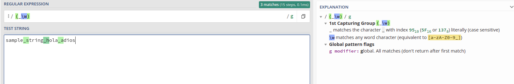
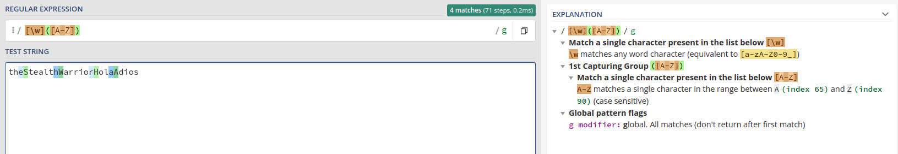

# Tipos de datos estáticos y funciones

En esta práctica aprenderemos a utilizar herramientas como jsdoc, mocha, chai y las diferentes funcionalidades del depurador de VScode además de trabajar con los tipos de datos y funciones en Typescript. También haremos uso de metodos del tipo string y uso de expresiones regulares en Javascript.

## **Índice**
 * [Tareas Previas](#dv1)
 * [Ejercicio 1](#dv2)
 * [Ejercicio 2](#dv3)
 * [Ejercicio 3](#dv4)
 * [Ejercicio 4](#dv5)
 * [Ejercicio 5](#dv6)
 * [Ejercicio 6](#dv7)
 * [Ejercicio 7](#dv8)
 * [Ejercicio 8](#dv9)
 * [Ejercicio 9](#dv10)
 * [Ejercicio 10](#dv11)
 * [Autor](#dv12)


<div id='dv1'/>

## Tareas Previas

> Typedoc: nos permitira realizar la documentación de nuestro código de manera automática. Para instalarlo y configurarlo pinche [aqui](https://drive.google.com/file/d/19LLLCuWg7u0TjjKz9q8ZhOXgbrKtPUme/view)

> Chai y mocha para aplicar metodología TDD en nuestro proyecto. Para instalarlo y configurarlo pinche [aqui](https://drive.google.com/file/d/1-z1oNOZP70WBDyhaaUijjHvFtqd6eAmJ/view)

> Debugger en Vscode: nos permitira establecer breakpoints, analizar la pila de llamadas, analizar variables y demás que facilitarán la resolución de errores. Para instalarlo y configurarlo pinche [aqui](https://drive.google.com/file/d/1u9sgHc0vIwDPAKpI2QmoRQbcMpi6XZMN/view)

> Metodos para trabajar con Strings en Javascript. Revisar [aqui](https://www.w3schools.com/js/js_string_methods.asp)

> Expresiones regulares en Javascript. Revisar [aqui](https://www.w3schools.com/js/js_regexp.asp)

---

<div id='dv2'/>

## Ejercicio 1

```typescript
/**
 * Said that a year is leap or not leap
 * @param year: number
 * @returns boolean
 */
export function isLeapYear(year: number) :boolean {
  if (year % 4 === 0 && year % 100 !== 0 || year % 400 === 0) {
    return true;
  } else {
    return false;
  }
}
```

Pruebas para dicho ejercicio

```typescript
describe('Test funcion isLeapYear', () => {
  it('isLeapYear(1997) should return false', () => {
    expect(isLeapYear(1997)).to.be.equal(false);
  });

  it('isLeapYear(1996) should return true', () => {
    expect(isLeapYear(1996)).to.be.equal(true);
  });

  it('isLeapYear(2000) should return true', () => {
    expect(isLeapYear(2000)).to.be.equal(true);
  });
});
```
  Test Leap Year

    ✔ isLeapYear(1997) should return false
    ✔ isLeapYear(1996) should return true
    ✔ isLeapYear(2000) should return true

Se pide implementar una función que reciba como parámetro un número en este caso el año y tenemos que devolver true o false indicando si el año pasado como parámetro es o no un año bisiesto para ello haremos el modulo y miraremos si el resto es cero teniendo en cuenta los siguientes casos:
    
* si es divisible por 4 y no por 100 devolvemos true
* si es divisible por 400 devolvemos true
* en caso contrario es decir que sea divisible por 100 devolvemos false

---

<div id='dv2'/>

## Ejercicio 2
Se nos piden 2 funciones la primera debe recibir un string en formato forádico y devolver un número en formato decimal y la segunda función debe pasar de nomenclatura factorial a decimal para ello recíbira un número forádico.

```typescript
/**
 * Convert factorial to decimal
 * @param str 
 * @returns number
 */
export function factorialToDecimal(str: string): number {
  let value: number = 0;
  let factorial: number = 0;
  for (let step = 0; step < str.length; step++) {
    value += parseInt(str.charAt(step)) *
      factRecursivo(str.length - 1 - factorial);
    factorial++;
  }
  return value;
}
```
Declaramos dos variables `value` que ira almacenando el valor en decimal y `factorial` almacena el numero por el cual se va multiplicando para ello recorremos con un blucle for hasta el tamaño del string recibido, vamos guardando en value la primera posicion del parámetro recibido por ejemplo `3` y lo multiplicamos por el factorial del size del parámetro a medida que vaya aumendando `step` el factorial se irá reduciendo teniendo la siguiente secuencia: Si el valor recibido es `341010`.

>  3 x 5! + 4 x 4! + 1 x 3! + 0 x 2! + 1 x 1! + 0 x 0!

Por último retornamos value que ya tiene el sumatorio de todas las multiplicaciones.Recalcar el metodo _parseInt_ que pasa a tipo number permitiéndonos multiplicar con el factorial, además importante usar el charAt en vez de [] ya que no es recomendable.
 
Necesitamos un método que calcule el factorial por ello. 
```typescript
/**
 * Calculate factorial number
 * @param n 
 * @returns number
 */
export function factRecursivo(n: number): number {
  if (n == 0) {
    return 1;
  }
  return n * factRecursivo(n - 1);
}
```
Es una funcion recursiva con el metodo base  donde `n == 0` y llamamos de manera recursiva con n - 1, calculado el factorial hasta llegar a dicho caso base.

La segunda función permite convertir de decimal a factorial para ello recibe como parámetro un number y devuelve un string.

```typescript
/**
 * Convert decimal to foradic
 * @param decimal 
 * @returns string
 */
export function decimalToFactorial(decimal: number): string {
  let n: number = 0;
  let fact: number = 0;
  let result: string = "";
  let numero: number = decimal;
  let count: number = 0;
  let val: boolean = true;
  while (fact <= numero) {
    n++;
    fact = factRecursivo(n);
  }
  n = n - 1;
  fact = 0;
  while (fact <= numero) {
    count++;
    if (val) {
      count = 0;
    }
    val = false;
    fact = factRecursivo(n) * count;
    if (fact > numero) {
      val = true;
      count--;
      numero = numero - (factRecursivo(n) * count);
      result += count.toString();
      count = 0;
      n--;
      if (n != 0) {
        fact = 0;
      }
    }
  }
  result += 0;
  return result;
}
```
Inicializamos las variales `n` que va a ir guardando cual es el factorial actual, `fact` irá almacenando el resultado de aplicar la factorización, `result` irá guardando el resultado de las operaciones que sean correctas, `numero` guardara el argumento recibido en la primera iteracion y luego irá estableciendo los nuevos límites en los bucles while, count irá guardando por quien hay que multiplicar y por último val permitira multiplicar por 0 en las primeras iteraciones de un `n` nuevo.

Primero hallamos el `n` que no sobrepase nuestro argumento recibido, luego vamos multiplicando ese `n` por un contador que empieza en cero hasta que lleguemos al nuevo limite del bucle por ejemplo si recibimos 463 el primer n será 5! Y POR COUNT = 3 dándonos 463 - 360 = 103, en caso de llegar a COUNT = 3 guardamos ese valor disminuimos `n` y volvemos a repetir hasta llegar a n = 0 que como inidica el algoritmo siempre será 0. Por ello añadimos un 0 a result al salir del while.

> 463 -> 5! * COUNT(3) =360  ==> 463-360 = 103

> 4! * COUNT(4) = 103 - 96 = 7 ...

Pruebas realizadas:
```typescript
describe('Test funcion factRecursivo', () => {
  it('factRescursivo(5) should return 120', () => {
    expect(factRecursivo(5)).to.be.equal(120);
  });
  it('factRescursivo(4) should return 24', () => {
    expect(factRecursivo(4)).to.be.equal(24);
  });
});

describe('Test funcion factorialToDecimal', () => {
  it('factorialToDecimal("341010") should return 463', () => {
    expect(factorialToDecimal("341010")).to.be.equal(463);
  });
  it('factorialToDecimal("540200") should return 700', () => {
    expect(factorialToDecimal("540200")).to.be.equal(700);
  });
});

describe('Test funcion decimalToFactorial', () => {
  it('decimalToFactorial(463) should return 342020', () => {
    expect(decimalToFactorial(463)).to.be.equal("341010");
  });
  it('decimalToFactorial(700) should return 540200', () => {
    expect(decimalToFactorial(700)).to.be.equal("540200");
  });
});

```
  Test funcion factRecursivo

    ✔ factRescursivo(5) should return 120
    ✔ factRescursivo(4) should return 24

  Test funcion factorialToDecimal

    ✔ factorialToDecimal("341010") should return 463
    ✔ factorialToDecimal("540200") should return 700

  Test funcion decimalToFactorial

    ✔ decimalToFactorial(463) should return 342020
    ✔ decimalToFactorial(700) should return 540200

---

<div id='dv4'/>

## Ejercicio 3

Se nos pide implementar dos funciones que pasen de CamelCase a SnakeCase y viceversa por ejemplo de `sampleString` a `sample_string`.

```typescript
/**
 * Transform Snake to CamelCase
 * Reemplaza los guiones y pone mayúsculas en la siguiente
 * posición
 * @param string 
 * @returns string
 */
eexport function fromSnakeToCamelCase(string: string): string {
  let newStr: string = "";
  const regex = /(_\w)/g;
  newStr = string.replace(regex,
      // accedemos a los match encontrados
      function apply(character: string) {
        const auxCharacter = character.charAt(1);
        return auxCharacter.toUpperCase();
      });
  return newStr;
}
```
Creamos un string vacio, usamos el metodo replace con la siguiente expresion 
  `/(_\w)/g`

>\w captura cualquier caracter (equivalente a[a-zA-Z0-9])

> Bangera global(g):Busca todas las coincidencias (no solo se queda con la primera que encuentre)

Creo que lo mejor es usar \w porque en caso contrario no contemplaríamos todos los casos.



A ese replace le añadimos una funcion que acceda a la posicion 1 y gracias a toUpperCase lo ponemos en mayúsculas. Retornando se esta manera el formato `_a` a `A` por poner un ejemplo.

```typescript
/**
 * Transform CamelCase to Snake
 * Añade guion en la posicion anterior a las mayúsculas
 * @param string 
 * @returns string
 */
export function fromCamelToSnake(string: string): string {
  let newStr: string = "";
  const regex = /[\w]([A-Z])/g;
  newStr = string.replace(regex,
      // accedemos a los match encontrados
      function apply(character: string): string {
        const auxCharacter = character.charAt(0) + "_" + character.charAt(1);
        return auxCharacter.toLowerCase();
      });
  return newStr;
}
```
Siguiendo la lógica anterior ahora tenemos que buscar un character al lado de una mayúscula de manera global, accedemos a la posicion 0 y 1 concatenando un guion en medio. Permitiendo pasar de `aA` a `a_a` por poner un ejemplo



```typescript
describe('Test funcion fromSnakeToCamelCase', () => {
  it('fromSnakeToCamelCase("sample_string") should return sampleString', () => {
    expect(fromSnakeToCamelCase("sample_string")).to.be.equal("sampleString");
  });
  it('fromSnakeToCamelCase("sample_string_a") should return sampleStringA', 
      () => {
        expect(fromSnakeToCamelCase("sample_string_A"))
            .to.be.equal("sampleStringA");
      });
});

describe('Test funcion fromCamelToSnake', () => {
  // eslint-disable-next-line max-len
  it('fromCamelToSnake("theStealthWarrior") should return the_steal_warrior', () => {
    // eslint-disable-next-line max-len
    expect(fromCamelToSnake("theStealthWarrior")).to.be.equal("the_stealth_warrior");
  });
});
```
  Test funcion fromSnakeToCamelCase

    ✔ fromSnakeToCamelCase("sample_string") should return sampleString
    ✔ fromSnakeToCamelCase("sample_string_a") should return sampleStringA

  Test funcion fromCamelToSnake

    ✔ fromCamelToSnake("theStealthWarrior") should return the_steal_warrior

---

<div id='dv5'/>

## Ejercicio 4

Se nos pide implementar una funcion que reciba un string y devuelva un boolean, verificando si el parámetro introducido tiene un ISBN-10 valido. 

```typescript
/**
 * Verifica si es un ISNB valido 
 * @param string 
 * @returns 
 */
export function isValidISBN(string: string): boolean {
  let value: number = 0;
  let count: number = 10;
  for (let step = 0; step < string.length; step++) {
    if (string.charAt(step) != '-') {
      if (string.charAt(step) == 'X') {
        value += 10 * count;
        count --;
      } else {
        value += parseInt(string.charAt(step)) * count;
        count--;
      }
    }
  }
  if (value % 11 == 0) {
    return true;
  }
  return false;
}
```
Para verificar el ISBN vamos a recorrer el string que se nos pasa y para cada posicion comprobamos si es distinto de un guion sino lo fuera avanazamos sin hacer nada, luego miramos si es una X o un numero si es una X guardamos en value 10 * COUNT sino guardamos en value el numero que estamos mirando por count. COUNT comenzará en 10 e irá bajando a 0, una vez hemos revisado todas las posiciones solo nos quedaría revisar si el sumatorio el divisible por 11 en caso de que si pues es un ISBN válido sino pues no lo es. Un ejemplo de la traza seguida será el siguiente: 

> (posicion(0) * 10 + posicion(1) * 9 ..) mod 11 == 0

```typescript
Pruebas realizadas
describe('Test funcion isValidISBN', () => {
  it('isValidISBN("3-598-21507-X") should return true', () => {
    expect(isValidISBN("3-598-21507-X")).to.be.equal(true);
  });
  it('isValidISBN("3-598-21508-8") should return true', () => {
    expect(isValidISBN("3-598-21508-8")).to.be.equal(true);
  });
  it('isValidISBN("3-598-21508-") should return false', () => {
    expect(isValidISBN("3-598-21508-")).to.be.equal(false);
  });
});
```
  Test funcion isValidISBN

    ✔ isValidISBN("3-598-21507-X") should return true
    ✔ isValidISBN("3-598-21508-8") should return true
    ✔ isValidISBN("3-598-21508-") should return false

---

<div id='dv6'/>

## Ejercicio 5

Se nos pide implementar una funcion que recibiendo un numero retorne otro numero y se tienen que retorna la combinacion más alta posible del número recibido.

```typescript
export function descendingOrder(numero: number): number {
  let temp: string = numero.toString();
  let size: number = temp.length;
  let result: string = "";
  let part1 :string; let part2: string;
  while (size != 0) {
    let max = parseInt(temp.charAt(0));
    let maxIndex = 0;
    for (let step = 0; step < temp.length; step++) {
      if (parseInt(temp.charAt(step)) >= max) {
        max = parseInt(temp.charAt(step));
        maxIndex = step;
      } else {
        max = max;
      }
    }
    part1 = temp.substring(0, maxIndex);
    part2 = temp.substring(maxIndex +1, temp.length);
    temp = part1 + part2;
    size--;
    result += max;
  }
  return parseInt(result);
}
```
La logica seguida es la siguiente, guardamos el numero en temp como un strig que se irá haciendo más pequeño a medida que saquemos elementos de dicho string, guardamos el tamaño inicial en size nos servirá para saber cuando salir del while, en result guardaremos la secuencia más alta posible y part1, part2 nos servira para eliminar la posicion que vamos a incluir en result, esto último se podría hacer en una única linea sin declarar variables pero creo que así queda más _claro_.

Vamos recorriendo suponemos un max y su posicion si es mayor que el maximo añadimos el nuevo máximo y su posicion sino no hacemos nada cuando hemos revisado todo el string eliminamos ese maximo y lo añadimos a result reducimos size porque hemos eliminado un elemento de la secuencia original. Cuando size sea cero hemos acabado y result tiene la secuencia más alta posible. Otra posible implementacion sería hacer uso de la funcion sort y luego un reverse dejando todo lo anterior realizado en una sola linea.

Pruebas realizadas 
```typescript
describe('Test funcion descendingOrder, () => {
  it('descendingOrder(42145) should return 54421', () => {
    expect(descendingOrder(42145)).to.be.equal(54421);
  });
  it('descendingOrder(145263) should return 654321', () => {
    expect(descendingOrder(145263)).to.be.equal(654321);
  });
  it('descendingOrder(123456789) should return 987654321', () => {
    expect(descendingOrder(123456789)).to.be.equal(987654321);
  });
});
```

  Test funcion descendingOrder

    ✔ descendingOrder(42145) should return 54421
    ✔ descendingOrder(145263) should return 654321
    ✔ descendingOrder(123456789) should return 987654321

---

<div id='dv7'/>

## Ejercicio 6

Se nos pide inplementar una funcion que reciba por parámetros dos string en formato ipv4 y devuelva un numero indicando el numero de ip disponibles en el rango de esas dos ip.

```typescript
/**
 * Convertir ip a number
 * @param str1 
 * @returns 
 */
export function ipToNumber(str1: string): number {
  const array: string[] = str1.split(".");

  return (parseInt(array[0]) * Math.pow(256, 3)) + 
         (parseInt(array[1]) * Math.pow(256, 2)) +
         (parseInt(array[2]) * Math.pow(256, 1)) + 
         (parseInt(array[3]));
}

/**
 * Rango entre 2 ip
 * @param str1 
 * @param str2 
 * @returns 
 */
export function ipsInRange(str1: string, str2: string): number {
  const ip1: number = ipToNumber(str1);
  const ip2: number = ipToNumber(str2);

  return Math.abs(ip2 - ip1);
}
```
Para ello haremos uso de la funcion ipToNumber que como sabemos las direcciones ip tienen 4 campos y en cada uno estan disponibles desde 0 -255 bit por tanto si ponemos un 1 en el primer campo y el resto lo dejamos a cero tendremos disponibles 256 ^ 3 en el segundo campo tendremos 256 ^ 2 y asi sucesivamente por tanto con el uso de la funcion split(".") indicamos que queremos un array donde cada elemento será la separacion del punto, asi que accediendo a la posicion de izquiera a derecha y haciendo uso de la librería math podemos aplicar la fórmula de antes.

>posicion(0) = 16777216 (256 ^ 3)

>posicion(1) = 65536 (256 ^ 2)

>posicion(2) = 256

>posicion(3) = 1

Por último restamos en valor absoluto los dos números y nos dará el rango entre las dos ip. Además en las siguientes pruebas podemos ver el valor 1 en los diferentes campos verificando lo anterior.
```typescript
describe('Test funcion ipToNumber', () => {
  it('ipToNumber("1.0.0.0") should return 16777216', () => {
    expect(ipToNumber("1.0.0.0")).to.be.equal(16777216);
  });
  it('ipToNumber("0.1.0.0") should return 65536', () => {
    expect(ipToNumber("0.1.0.0")).to.be.equal(65536);
  });
  it('ipToNumber("0.0.1.0") should return 256', () => {
    expect(ipToNumber("0.0.1.0")).to.be.equal(256);
  });
  it('ipToNumber("0.0.0.1") should return 1', () => {
    expect(ipToNumber("0.0.0.1")).to.be.equal(1);
  });
});

describe('Test funcion ipsInRange', () => {
  it('ipsInRange("10.0.0.0", "10.0.0.50") should return 50', () => {
    expect(ipsInRange("10.0.0.0", "10.0.0.50")).to.be.equal(50);
  });
  it('ipsInRange("10.0.0.0", "10.0.1.0") should return 256', () => {
    expect(ipsInRange("10.0.0.0", "10.0.1.0")).to.be.equal(256);
  });
  it('ipsInRange("20.0.0.10", "20.0.1.0") should return 246', () => {
    expect(ipsInRange("20.0.0.10", "20.0.1.0")).to.be.equal(246);
  });
});
```
  Test funcion ipToNumber

    ✔ ipToNumber("1.0.0.0") should return 16777216
    ✔ ipToNumber("0.1.0.0") should return 65536
    ✔ ipToNumber("0.0.1.0") should return 256
    ✔ ipToNumber("0.0.0.1") should return 1

  Test funcion ipsInRange

    ✔ ipsInRange("10.0.0.0", "10.0.0.50") should return 50
    ✔ ipsInRange("10.0.0.0", "10.0.1.0") should return 256
    ✔ ipsInRange("20.0.0.10", "20.0.1.0") should return 246

---

<div id='dv8'/>

## Ejercicio 7

La princesa Diana consiguió clavar su espada y cortar la cabeza de Cerberus (un lobo con muchas cabezas). Para su asombro, inmediatamente, aparecieron nuevas cabezas. Se nos pide implementar una funcion que reciba las cabezas iniciales de Cerberus, número de ataques de Diana y las cabezas que van a salir nuevas despues de cada ataque devolviendo al finalizar cuales son las cabezas de Cerberus despues de todos los ataques.

```typescript
/**
 * Permite conocer las cabezas de Cerberus despues de 
 * los ataques de Diana
 * @param initialHead 
 * @param numberOfAttacks 
 * @param newHead 
 * @returns FinalHead: number
 */
export function princessDiana(initialHead: number,
    newHead: number, numberOfAttacks: number): number {
  let actualHead: number = 0;
  for (let step = 0; step < numberOfAttacks; step++) {
    actualHead = initialHead - 1 + newHead * factRecursivo(step + 1);
    initialHead = actualHead;
  }
  return actualHead;
}
```
Vamos a realizar una iteracion por cada ataque asi que las cabezas actuales serán las cabezas inciales - 1 porque cada ataque corta una y le sumamos la capacidad de regeneración de Cerberus(newHead), importante ver que despues de cada ataque la regeneracion será más por ejemplo despues del segundo ataque tendra un * 2 por ello newHead * step!  siendo step el ataque en el que se encuentre Diana. Haremos uso de la funcion factorial que hemos implementado anteriormente.


```typescript
describe('Test funcion princessDiana', () => {
  it('princessDiana(2, 1, 1) should return 2', () => {
    expect(princessDiana(2, 1, 1)).to.be.equal(2);
  });
  it('princessDiana(5, 3, 10) should return 92', () => {
    expect(princessDiana(5, 3, 10)).to.be.equal(92);
  });
});

```
  Test funcion princessDiana

    ✔ princessDiana(2, 1, 1) should return 2
    ✔ princessDiana(5, 3, 10) should return 92

---

<div id='dv9'/>

## Ejercicio 8

Se nos pide implementar una función que reciba 4 parámetros el tipo de mi pokemon , el tipo del pokemon oponente, la cantidad de daño que hace mi ataque y la defensa que tiene mi oponente.

```typescript
/**
 * Daño que recibe el oponentes despues del ataque de mi pokemon
 * @param type 
 * @param opponentType 
 * @param attack 
 * @param opponentDefense 
 * @returns number
 */
export function pokemonBattle(type: string, opponentType: string,
    attack: number, opponentDefense: number): number {
  const neutral: number = 50 * (attack / opponentDefense);
  let result: number = 0;

  if (type == "agua") {
    switch (opponentType) {
      case "agua":
        result = 0.5;
        break;
      case "fuego":
        result = 2;
        break;
      case "planta":
        result = 0.5;
        break;
      case "electrico":
        result = 0.5;
        break;
      default:
        result = -1;
    }
  }

  if (type == "fuego") {
    switch (opponentType) {
      case "fuego":
        result = 0.5;
        break;
      case "planta":
        result = 2;
        break;
      case "agua":
        result = 0.5;
        break;
      case "electrico":
        result = 1;
        break;
      default:
        result = -1;
    }
  }

  if (type === "electrico") {
    if (opponentType === "electrico") {
      result = 0.5;
    } else if (opponentType === "fuego") {
      result = 1;
    } else if (opponentType === "agua") {
      result = 2;
    } else if (opponentType === "planta") {
      result = 1;
    }
  }

  if (type === 'planta') {
    if (opponentType === "planta") {
      result = 0.5;
    } else if (opponentType === "fuego") {
      result = 0.5;
    } else if (opponentType === "agua") {
      result = 2;
    } else if (opponentType === "electrico") {
      result = 1;
    }
  }

  return result * neutral;
}
```

Añadimos la fórmula que calcula el ataque recibido según el tipo, recibiendo el parámetro en un switch con los 4 tipos de pokemon o un if else. Nos  fijamos en la tabla de tipos del enunciado y dependiendo de eso pondremos las condiciones dentro del if almacenando un 2, 1, 0.5 dependiendo de la efectividad.

> Super efectivo = x2 de daño

> Neutral = x1 de daño

> No muy efectivo = x0.5 de daño

Pruebas desarrolladas:
```typescript
describe('Test funcion pokemonBattle', () => {
  it('pokemonBattle("fuego", "electrico", 80, 100) should return 40', () => {
    expect(pokemonBattle("fuego", "electrico", 80, 100)).to.be.equal(40);
  });
  it('pokemonBattle("agua", "planta", 100, 100) should return 25', () => {
    expect(pokemonBattle("agua", "planta", 100, 100)).to.be.equal(25);
  });
});
```
  Test funcion pokemonBattle

    ✔ pokemonBattle("fuego", "electrico", 80, 100) should return 40
    ✔ pokemonBattle("agua", "planta", 100, 100) should return 25

---

<div id='dv10'/>

## Ejercicio 9

Se nos pide implementar dos funciones que pase de numeros romanos a decimales y viceversa.

```typescript
/**
 * Convert character to decimal
 * @param character 
 * @returns number
 */
export function characterToDecimal(character: string): number {
  // Valores numericos asocidos a cada letra del alfabeto
  if (character == 'I') {
    return 1;
  } else if ((character == 'V')) {
    return 5;
  } else if (character == 'X') {
    return 10;
  } else if (character == 'L') {
    return 50;
  } else if (character == 'C') {
    return 100;
  } else if (character == 'D') {
    return 500;
  } else if (character == 'M') {
    return 1000;
  } else {
    return -1;
  }
}

/**
 * Convert roman to decimal
 * @param romanNumber 
 * @returns result: number
 */
export function romanToDecimal(romanNumber: string): number {
  // Recogemos el primer caracter recibido y su valor asociado
  let result: number = characterToDecimal(romanNumber.charAt(0));
  let lastPosition: number = 0;
  let actualPosition: number = 0;

  // Recorremos hasta el tamaño del argumento empezando en 1
  for (let step: number = 1; step < romanNumber.length; step++) {
    actualPosition = characterToDecimal(romanNumber.charAt(step));
    lastPosition = characterToDecimal(romanNumber.charAt(step - 1));
    // console.log(actualPosition, lastPosition);

    if (actualPosition <= lastPosition) {
      // Sumamos valor numerico actual 
      result = result + actualPosition;
    } else {
      // Sumamos digito con mayor peso
      result = result - lastPosition * 2 + actualPosition;
      // console.log(actualPosition, lastPosition);
    }
  }

  return result;
}
```
Tenemos nuestro almacen que según el caracter recibido devolveremos el numero que le pertenece por ejemplo I con valor = 1 hasta M con valor = 100.

Pasamos el primer character a su valor numerico y en bucle que recorre tanta iteraciones como el tamaño del string vamos guardando los valores de las posiciones actual y la anterior, en caso de que la actual sea <= que la anterior guardamos dicho valor pero sino se cumple eso:

```
En casos como IV o CD (es decir que aumente de derecha a izquierda)  tras la primera iteracion nos dara actual = 5 y last = 1 por tanto entramos en el else y sería quitarle a result dos veces lo que hemos añadido anteriomente
```
```
En casos como XX o CL(que aumente de izquieda a derecha) no tendriamos problemas ya que entraría en el primer if y acabaríamos retornando 20
```

Para pasar de decimal a romano

La primera forma que se me ocurrio de implemementar esta funcion es ir diviendo el numero entre 10 y coger el resto para ver cuanto nos cabría en las unidades( es decir el resto) luego las decenas habiendo antes dividido entre 10 para mover la coma y asi susesivamente con las centenas y millares teniendo en cuenta que I,X,C,M no se pueden escribir más de 3 veces .Puse un switch para cada tipo pero en este caso en el orden contrario porque tenemos que ir rellenando de mas a menos en result.

```
Por ejemplo si recibimos 35 le hacemos el modulo y  en unidades almacenara 5 que en romano quivale a "V" luego reducimos 35 / 10 = 3.5 hacemos el modulo nos da 3 truncando que en romano es XXX, luego reducimos ese 3.5 / 10 y de aquí en adelante nos dará cero si hubieramos hecho ese orden la salida sería "VXXX" por eso los switch están en oden inverso saliendo por consola "XXXV"
```
Una posible implementacion no tan visual ya que creo que sería obfuscar el código sería tener unidades, decenas etc en un mismo vector una forma de implementarlo sería:

```typescript
srtRoman: string[] = ['C', 'CC', 'CCC', 'CD', 'D', 'DC',
    'DCC', 'DCCC', 'CM','X', 'XX', 'XXX', 'XL', 'L', 'LX', 'LXX', 'LXXX', 'XC','I', 'II', 'III', 'IV', 'V', 'VI', 'VII', 'VIII', 'IX'];
// Con este almacen podríamos ir recorriendo y sacando primero las unidades luego decenas y porteriormente las centenas 
```
```typescript
/**
 * Convert decimal to Roman
 * @param numero 
 * @returns string
 * I,X,C,M no se pueden escribir mas de 3 veces
 */
export function decimalToRomanLast(numero: number): string {
  const units = Math.trunc(numero % 10); numero /= 10;
  // console.log(units);
  const tens = Math.trunc(numero % 10); numero /= 10;
  // console.log(tens);
  const hundreds = Math.trunc(numero % 10); numero /= 10;
  // console.log(hundreds);
  const thousands = Math.trunc(numero % 10); numero /= 10;
  // console.log(thousands);
  let result = "";

  switch (thousands) {
    case 1: result +="M"; break; // 1000
    case 2: result +="MM"; break; // 2000
    case 3: result +="MMM"; break; // 3000
  }

  switch (hundreds) {
    case 1: result +="C"; break; // 100
    case 2: result +="CC"; break; // 200
    case 3: result +="CCC"; break; // 300
    case 4: result +="CD"; break; // 400
    case 5: result +="D"; break;
    case 6: result +="DC"; break;
    case 7: result +="DCC"; break;
    case 8: result +="DCCC"; break;
    case 9: result +="CM"; break;
  }

  switch (tens) {
    case 1: result +="X"; break; // 10
    case 2: result +="XX"; break; // 20
    case 3: result +="XXX"; break; // 30
    case 4: result +="XL"; break; // 40
    case 5: result +="L"; break; // 50
    case 6: result +="LX"; break; // 60
    case 7: result +="LXX"; break; // 70
    case 8: result +="LXXX"; break; // 80
    case 9: result +="XC"; break; // 90
  }

  switch (units) {
    case 1: result +="I"; break; // 1
    case 2: result +="II"; break; // 2
    case 3: result +="III"; break; // 3
    case 4: result +="IV"; break; // 4
    case 5: result +="V"; break; // 5
    case 6: result +="VI"; break; // 6
    case 7: result +="VII"; break; // 7
    case 8: result +="VIII"; break; // 8
    case 9: result +="IX"; break; // 9
  }
  return result;
}
```
Pruebas realizadas:

```typescript
describe('Test funcion romanToDecimal', () => {
  it('romanToDecimal(MCMXCV) should return 1995', () => {
    expect(romanToDecimal("MCMXCV")).to.be.equal(1995);
  });
  it('romanToDecimal(MMXIV”) should return 2014', () => {
    expect(romanToDecimal("MMXIV")).to.be.equal(2014);
  });
});

describe('Test funcion decimalToRoman', () => {
  it('decimalToRoman(1995) should return MCMXCV', () => {
    expect(decimalToRomanLast(1995)).to.be.equal("MCMXCV");
  });
  it('decimalToRoman(2014) should return MMXIV', () => {
    expect(decimalToRomanLast(2014)).to.be.equal("MMXIV");
  });
});
```
  Test funcion romanToDecimal

    ✔ romanToDecimal(MCMXCV) should return 1995
    ✔ romanToDecimal(MMXIV”) should return 2014

  Test funcion decimalToRoman

    ✔ decimalToRoman(1995) should return MCMXCV
    ✔ decimalToRoman(2014) should return MMXIV

---

<div id='dv11'/>

## Ejercicio 10

Caculamos distancia de Manhattan entre dos puntos, la funcion debe recibir dos string que serían los dos puntos y devolver un number indicando la distancia

```typescript
/**
 * Calcula la distancia de Manhattan entre dos puntos
 * @param str1 
 * @param str2 
 * @returns value: number
 */
export function distanceOfManhattan(str1: string, str2:string) :number {
  const array: string[] = str1.split(",");
  const array1: string[] = str2.split(",");
  let value: number = 0;
  for (let step = 0; step < array.length; step++) {
    value += Math.abs(parseInt(array[step]) - parseInt(array1[step]));
  }
  return value;
}
```
Creamos dos arrays gracias al metodo split ya que los puntos vendrán separados por coma y recorremos ambos arrays aplicando la siguiente fórmula es decir la poscicion 0 del primer array menos la del segundo array en valor absoluto.
Vamos guardando en value el sumatorio de todas la iteraciones del bucle for y al salir tendríamos el valor de la distancia.

> d (i, j) = | xi-xj | + | yi-yj | ....

```typescript
describe('Test funcion distanceOfManhattan', () => {
  it('distanceOfManhattan("1,3", "4,10") should return 10', () => {
    expect(distanceOfManhattan("1,3", "4,10")).to.be.equal(10);
  });
  it('distanceOfManhattan("1,1", "1,1") should return 0', () => {
    expect(distanceOfManhattan("1,1", "1,1")).to.be.equal(0);
  });
  it('distanceOfManhattan("-1,3,7", "-5,8,7") should return 9', () => {
    expect(distanceOfManhattan("-1,3,7", "-5,8,7")).to.be.equal(9);
  });
});
```

  Test funcion distanceOfManhattan

    ✔ distanceOfManhattan("1,3", "4,10") should return 10
    ✔ distanceOfManhattan("1,1", "1,1") should return 0
    ✔ distanceOfManhattan("-1,3,7", "-5,8,7") should return 9

---
<div id='dv12'/>

En conclusión

He aprendido a usar alguno de los métodos de javascript para apñicar expresiones regulares o trabajar con el tipo de dato String además he usado la librería Math para no crear funiones de valor absoluto o trabajar con exponentes. Además me he ido acostumbrado a usar la herramienta typedoc para generar documentación y mocha, chai para generar pruebas sobre los métodos que estoy implementando.
## Autor

* [Joseph Gabino Rodríguez](https://github.com/alu0101329161)